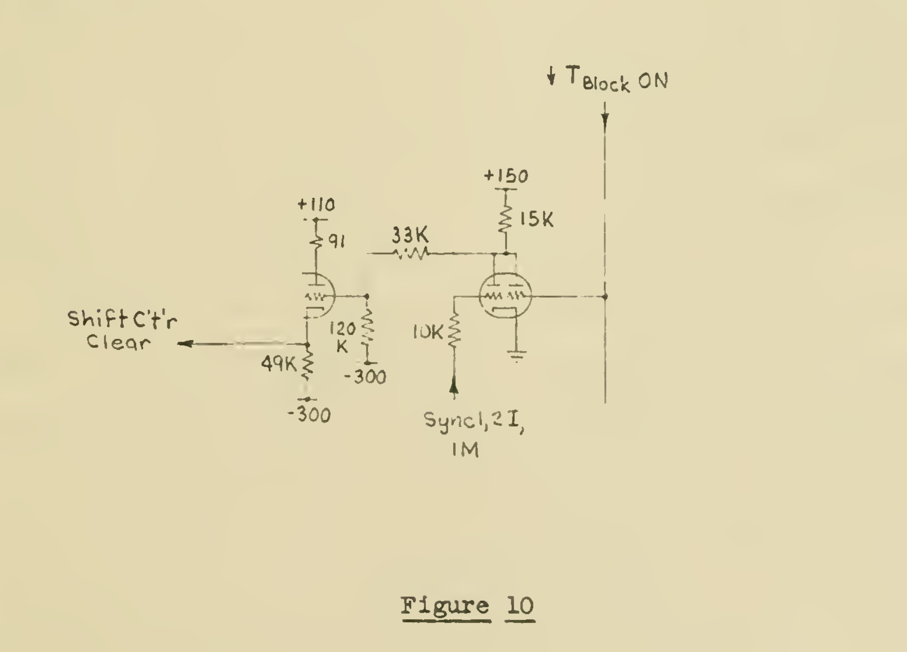

# Final Report on Contract No. DA-36-034-ORD-1023

**Institute for Advanced Study, Electronic Computer Project**

*Excerpt: PDF pages 39–46 (original document pagination I‑28 through I‑35)*

> This excerpt covers the latter portion of a numbered list of circuits describing the Magnetic Drum / IBM card read‑write control logic (items 9–18), followed by the opening of a new section, "C. Cathode Ray Tube Testing Program." The text below is a manually corrected transcription of the scanned original (the underlying OCR text layer was badly garbled, especially around subscripted signal names such as TSTT and TBLOCK). Subscripted circuit/signal designations are rendered with `` tags to match the original notation as closely as possible. One editorial note: the source consistently spells one toggle name "TBLOK" (missing a C) in several places (pp. I‑30, I‑31) where it otherwise uses "TBLOCK" elsewhere — this is reproduced faithfully rather than silently corrected, since it appears to be original to the document.

---

*(p. I‑28)*

twice per MD order, once to synchronize to the proper starting block, and following that, to count the number of blocks being handled.

### 10. Coincidence circuit

This circuit likewise is used twice per MD order; once to compare the output of the first five stages of the counter with the starting block number stored in the 10‑digit register (and issue a signal at coincidence), and secondly, to compare the counter with the second five‑digit number in the register (which specifies the number of blocks to be handled), and again to issue a signal at coincidence.

### 11. TSTT Toggle

The Recognition Circuit noted above is of a simple design which allows coincidence signals to be issued for many numbers after the first legitimate signal (but never before). On account of this feature we must insure that the counter always starts counting from zero, so that its count is always less than (or equal to) the desired number (in order not to get any false signals). After the completion of the Relay Delay time (signified by a point of the R5 relay operating in the TSTT turn‑on circuit) we know that we are ready to start operations at will, so that at the very next Sync 1, 2 signal (which states that the drum is at its zero position) we clear the counter to zero and turn on the TSTT toggle. This toggle in turn opens the path between the output of the coincidence circuit and the TBLOCK turn‑on circuit so that at the first coincidence signal (the drum at the proper starting block) we turn on the TBLOCK toggle.

### 12. TBLOCK Toggle

This toggle actually controls the digit information transfer circuitry. It comes on as indicated above and stays on until the second coincidence signal is obtained which

*(p. I‑29)*

indicates that we have completed the required information transfer.

### 13. TB0/3 Toggle

As indicated before, the Dispatch Counter in the machine controls the Williams addresses associated with the information transfers. The first Williams address to be handled comes to the Dispatch Counter from the address digits of the first phase order via a B3 gate signal. The next Williams address is obtained by adding a one to the first address via B0 signal operation. All following addresses are obtained in the same way, that is, for any external order there occurs one and only one B3 signal. By the time that the B3 signal is obtained the counter and recognition circuits have completed their first task (i.e. synchronizing to the proper starting block), so that this signal is piped over from the main machine to the drum and is used to clear the counter to zero and to turn on the TB0/3 toggle. This toggle has several functions, one of which is to "swap" the input of the Coincidence Circuit from the "left" five digits of the priming register to the other five digits of the register which specify the number of blocks to be handled. It also controls the routing path of the coincidence signal from the compare circuitry. That is, with the toggle OFF the coincidence signal, when it comes the first time, is used to turn on the TBLOCK toggle. With the toggle ON, however, the routing path is switched so that the second time a coincidence signal is obtained (at the completion of information transfer) it is used to turn off the TBLOCK toggle.

### 14. Null Order Gates

At the unique combination of TB0/3 ON and TBLOCK OFF a Null Order Gates signal is sent to the machine which kills the request for either the G2 or G4 order gates (which are used to

*(p. I‑30)*

read the first or second phase orders into the main control). This in turn kills the EX‑G2 signal requesting the external order, so that the six Delay Relays begin to fall back to normal. When the fifth relay has returned to its original state it turns off the TSTT toggle which in turn turns off the TB0/3 toggle. The turning‑off of this toggle kills the Null Order Gates signal, so that the main control in the machine can now read the second phase Transfer Order and carry on the rest of the problem. Note that during the Null Order Gates signal the main control internally "switched" the order request from the first to the second phase.

### 15. Reading into the Williams Memory

As described in a previous section, the digital information enters the machine at the Digit Resolver. It is arranged that at these times the digit resolver output is zero so that the input information overrides the resolver output. This information is then "accepted" into RI upper and zig‑zagged down to RI lower, from which place it is stored. As noted before, at Sync 2 time the digit‑information lines hold the proper information from the drum (voltage‑wise), so that to accept it into RI it is only necessary to turn on the TBLOK (in the main machine) toggle; this in turn, with the Summation = 1 digit of the Read‑in order, is enough to carry out automatically the normal arithmetic processes of addition. When the information has reached RI lower we are ready to request a storage of it at the proper Williams address. This is accomplished by piping over to the drum the shift counter satisfy signal (which signals the end of the arithmetic process) and using it to turn on the TYES toggle of the drum, which in turn issues a Williams request to the main

*(p. I‑31)*

machine. The memory Sync signal, which signals that the Williams request has been accepted by the Williams Local Control, is piped back to the drum to turn off the TYES toggle, so that only the one Williams request per word is obtained. The next Williams request comes when the next word is brought up from the Drum and is accepted into RI, etc.

To insure that the output of the digit resolver is zero (internally) it is necessary that RI lower be zero and that either RIII upper is zero or the complement gates are nulled. The same signal that is used to turn on the TBLOK toggle (at drum Sync 2 time) is used to pre‑clear RI lower, which wipes out from this register the previously‑read number. Note that this is an early enough time to clear RI since Green Gate (which accepts the information into RI) does not occur until about 15 microseconds after TBLOK turn‑on, because of the imposed Carry Delay. The RIII condition is taken care of by nulling the complement gates.

One other factor that must be taken care of in the read‑in process is the Shift Counter Clear. Every time the Memory is used the Sync Signal clears the Shift Counter to zero in preparation for the next arithmetic process. However, in the read‑in order, since an arithmetic process occurs before any memory process, we must separately insure that the Shift Counter starts out cleared to zero. This is accomplished by the separate circuit shown in Figure 10.

### 16. Writing Onto the Magnetic Drum

As noted previously, at Sync 2ML time the Pulsers write onto the drum whatever information is present on the digit‑information lines. During external orders that take information out of the machine the information wires hold whatever information is residing on the output of the Digit Resolver. The operation then

*(p. I‑32)*

is to place on the output of the digit resolver, at any instant, the correct word to be written onto the drum, call for a Sync 2ML signal, and at the completion of that to call for the next word to be brought out of the Williams memory and be made to reside at the output of the digit resolver in preparation for the next Sync 2ML signal. However, this case is slightly different from the case of reading from the drum, in that a machine operation must precede the first drum operation, i.e. the correct number is sitting at the digit resolver ready for the first Sync 2ML signal. In the case of reading from the drum, the first Sync 2IMS signal from the drum calls for the first main machine arithmetic operation. For writing on the drum then, as soon as TBLOCK comes on, we must ask for a Williams request (as indicated in the timing chart on the drawing), and from then on get Williams requests only at the end of each Sync 2ML signal.

<em>Figure 10</em>

*(p. I‑33)*

### 17. Special IBM circuitry

Operation of the IBM unit is not as flexible as the operation of the Drum in that one cannot synchronize at will on any card with which to start the operation (as one can call for any block with which to start a Drum operation). In view of this fact, after TSTT toggle comes on we turn TBLOCK toggle on immediately instead of waiting for the first counter‑satisfy signal (as we do for the Drum). This is accomplished by the extra diode which, via the ↓IBM signal, opens the path for the TSTT toggle to turn on the TBLOCK toggle as soon as TSTT comes on.

The Sync 1 and Sync 2 signals for the IBM are obtained from the Cam P3 and Emitter, respectively (their relative timing is shown in the Drawing No. O‑1544). Because the Sync 1 signal comes only after the 12 Sync 2 signals for a card, the 7‑digit block or card counter was arranged so that Sync 2 times the counter counts from the False to the True rank. Therefore after the very first Sync 2 signal of a card or block, the counter holds the proper count. This is important in the case of the IBM since, in order to stop the Reproducer on the right card, the STT relay must be dropped out before Cam P5 time. The Cam P5 timing and the STT relay circuit are also shown on the Drawing No. O‑1544.

The STT relay is "picked up" for every IBM operation by the IBM relay. It remains energized throughout the order by one of its own points and the 5687 tube. The grid of this tube is kept positive throughout the entire order until the very first time that the Cam P5 sensing signal is accompanied by a counter satisfy signal, at which time the holding triode grid goes negative, causing the STT relay to drop out, and no cards beyond the one in process are fed through the unit.

*(p. I‑34)*

### 18. Sync Signals

There are various sync signals used throughout the unit. The code used for the name of these signals is as follows:

- **I** stands for IBM
- **M** stands for Magnetic Drum
- **S** stands for Short pulse
- **L** stands for Long pulse

During a Drum or IBM order, Sync 1; Sync 1,2; and Sync 2 (long and short) pulses are generated. The lengths of these signals are approximately as follows:

| | Drum | IBM |
|---|---|---|
| Sync 1,2 | 20 microseconds | 20 milliseconds |
| Sync 1 | 20 microseconds | 20 milliseconds |
| Sync 2S | 2 microseconds | 2 microseconds |
| Sync 2L | 40 microseconds | 15 milliseconds |

In the Sync Chassis these signals are mixed to form the following composite signals:

- **Sync 1 IM** — This wire carries Drum sync 1 pulses during a Drum order, and IBM sync 1 pulses during an IBM order
- **Sync 2 IML** — Similarly for the long sync 2 pulses
- **Sync 2 IMS** — Similarly for the short sync 2 pulses
- **Sync 1,2 IM** — Similarly for the sync 1,2 pulses
- **Sync 1,2I;1M** — This wire carries Drum sync 1 pulses during a Drum order, and the IBM sync 1,2 pulse during an IBM order
- **Sync 2 ML** — This wire carries only the long Sync 2 Drum pulses during a Drum order

NOTE: It is proposed to build a graphing unit capable of transcribing

*(p. I‑35)*

from the magnetic drum to an external cathode ray tube for the purpose of plotting (graphing) computed information. This shall work automatically during machine computation, and shall be in spirit a pure accessory, not interfering with machine operation. Because the necessary equipment is neither built nor even completely designed as yet, it is impossible at this time to give an exhaustive report on it. However, at a very few places on the drawings references to a graphing function will be seen.

## C. Cathode Ray Tube Testing Program

### 1. [Untitled — tube selection]

The Williams memory uses standard 5CP1‑A cathode ray tubes selected from regular manufacturer's stock. This selection is done in our laboratory with the very helpful cooperation of both Allen B. DuMont Laboratories and the Radio Corporation of America. Such selection is made practical because the qualities tested for have no effect on ordinary usages.

All tubes received are first subjected to a "flaw" test. Flaws are local inhomogeneities in the phosphor surface, probably due to minute foreign particles, which reduce the dash signal available from the point.

#### Flaw Location

A flaw location test is used first to discover where on the phosphor surface the flaws, if any, are situated. Figure 11 shows a block diagram of this test. Note that the beam current of the tube under test is held constant and that the deflected spot will in general trace an ellipse. If the path of this ellipse changes very slowly between successive tracings and if the secondary emission properties of the phosphor struck by the beam are constant, we expect no A.C. signal

*(text continues on the following page, outside this excerpt — Figure 11 referenced above appears there and is not included in this excerpt)*
