# Final Progress Report on the Physical Realization of an Electronic Computing Instrument

**Herman H. Goldstine, James H. Pomerene, Charles V. L. Smith**

IAS Electronic Computer Project — January 1954

IAS ECP list of reports, 1946–57, no. 15

---

> **Note on this transcription.** This Markdown edition was produced from a scanned copy
> (via the Internet Archive) run through OCR. All diagrams, circuit schematics, and
> photographic plates are embedded as images (see the `images/` folder) rather than
> transcribed, since ASCII reproduction of circuit drawings is not reliable.
>
> The OCR text itself has been fully cleaned by hand: pages where the OCR failed outright
> or was too garbled to trust were retranscribed against the page images, and a full pass
> was then made through the remaining body text correcting scanno-level noise (misread
> characters, lost sub/superscripts) using context. Every mathematically or numerically
> dense passage — equations, order-code tables, and the many tube-by-tube voltage tables
> in the circuit descriptions — was additionally checked directly against the source page
> images rather than reconstructed by guesswork, since these are exactly the passages where
> a plausible-looking but wrong transcription would be worst. A handful of apparent typos
> in the original 1954 typescript itself (e.g. "we store the multiplication in RII" where
> "multiplier" is clearly meant) are preserved as printed, since they're artifacts of the
> source document rather than of the OCR.
>
> Figure/page cross-references in this document use the physical PDF page number, not the
> printed page number in the original document (see the Figures List below for both).

---

## Front Matter

Institute for Advanced Study
Math. & Nat. Sci. Library
Princeton, N. J. 08540

---

FINAL PROGRESS REPORT
ON THE PHYSICAL REALIZATION OF AN ELECTRONIC COMPUTING INSTRUMENT

by

Herman H. Goldstine
James H. Pomerene
Charles V. L. Smith

IAS ECP list of reports, 1946-57, no. 15.

THE INSTITUTE FOR ADVANCED STUDY
ELECTRONIC COMPUTER PROJECT
January 1954

---

This report has been prepared under the terms of Contracts
W-36-034-ORD-7481 and DA-36-034-ORD-19 (Project No. TB3-0007 E)
between the Research and Development Service, U. S. Army Ordnance
Corps and the Institute for Advanced Study. It is a final report on
the latter contract, covering the period up to 1 July 1952.

This report is issued in two parts: Part I (text) and Part
II (drawings). Part II is separate from this volume and comprises
the complete circuit drawings for the completed machine.

Certain accessory devices, notably a magnetic drum and an IBM
input-output system, were added in the period subsequent to 1 July
1952. These will be described in a following report.

John von Neumann
Project Director
Institute for Advanced Study

---

## Chassis List

| Chassis Designation | Principal Function | See Drawing |
|---|---|---|
| A | Adder | B-1465 |
| Ā | Wms. Ā Pulser | A-1216 |
| B | Wms. B pulser | A-1216 |
| Ch 1-5 | Clear-Gate Chain | C-1449 |
| CL | Wms. CL Pulser | A-1216 |
| CLK | Wms. Clock | A-1217 |
| Com GS (or CmGs) | Complement Gate Selector | O-1458a |
| CT1A | Disc. Toggle Clear → 0 Driver | A-1459 |
| CT1D | Disc. Toggle Clear → 1 Driver | A-1459 |
| DCt | Dispatch Counter | B-1471 |
| Del | Carry Delay timer | A-1455 |
| DR | Digit Resolver | B-1465 |
| HH | Wms. HH pulser | A-1216 |
| HT | Wms. HT pulser | A-1216 |
| LR | Left-Right selector | A-1451 |
| I | Wms. I pulser | A-1216 |
| M | Main Control | C-1422 |
| MD | Wms. address and "down" control for magnetic drum | — |
| M/# | Number or magnitude gates | O-1458a |
| P1-3 | Accept-Reject selection for division | O-1463 |
| QS | Control for Quick Sum | A-1469 |
| 2¹R¹ | Extra RI stage for shifts | A-1446 |
| RI | Accumulator register | C-1322 |
| RII | Arithmetic register | C-1322 |
| RIII | Memory register | C-1323 |
| RII CS | R2 clear selector | A-1453 |
| RII GD | RII Gate driver drivers | B-1456 |
| RI, II GS | RI and RII Gate selector | B-1456 |
| RII Op | Gates and clears for 2⁻³⁹ R2 | A-1457 |
| R2 to R3 | Control of non-Wms. orders | A-1485 |
| RIII CGDD | Wms. to RIII gates and clears | A-1462 |
| RI CS | R1 clear selector | A-1452 |
| RI GD | RI Gate driver drivers | B-1456 |
| BCR¹ | Clear R¹ to 0 driver | A-1459 |
| BCR² | Clear R² to 0 driver | A-1459 |
| BCR³ | Clear R³ to 0 driver | A-1459 |
| GrCR1 | Clear R1 to 1 driver | A-1459 |
| GrCR2 | Clear R2 to 1 driver | A-1459 |
| GrCR3 | Clear R3 to 1 driver | A-1459 |
| RCR1 | Clear R1 to 1 driver | A-1459 |
| RCR2 | Clear R2 to 1 driver | A-1459 |
| RCR3 | Clear R3 to 1 driver | A-1459 |
| SD | Wms. SD Pulser | A-1216 |
| SO A1-2 | Wms. pulse routine generator | O-1470 |
| St Ct | Shift counter | C-1467 |
| TD | Wms. TD pulser | A-1216 |
| TH | Wms. TH pulser | A-1216 |
| TT | Wms. TT pulser | A-1216 |
| W | Williams control | C-1474 |
| YCR1 | Clear R1 to 0 driver | A-1459 |
| YCR2 | Clear R2 to 0 driver | A-1459 |
| YCR3 | Clear R3 to 0 driver | A-1459 |
| UnX | End correction for multiplication | A-1446 |
| X1-2 | Multiplication control | B-1450 |
| 2⁰OB | — | A-1447 |
| 2⁻³⁹RIII 0 | — | A-1485 |
| CyIA | — | B-1450 |
| CyIB | — | B-1465 |
| Wms. Amplifier | — | A-1367 |
| Wms. Discriminator | — | A-1241 |

---

## Drawings List

| Drawing No. | Title |
|---|---|
| C-3-1161 | Memory High Voltage Supplies |
| C-3-1167 | Memory High Voltage Meter Box |
| C-3-1168 | Memory High Voltage Regulator |
| A-1216 | Williams Tube Pulser |
| A-1217 | Memory Clock |
| A-1241 | Discriminator |
| B-1284 | Deflection Input and Adder System |
| A-1295 | Deflection Driver System |
| A-1288 | Diode Bumper Strip for Digit Resolver Output |
| C-1289 | Shift Counter |
| C-1322 | Typical RII and RI Chassis Schematic |
| C-1323 | Complement Gates and RIII Schematic |
| C-1334 | Typical Adder Circuit |
| A-1367 | Williams Amplifier |
| C-1422 | Main Control |
| A-1426 | Manual Control |
| A-1446 | 2¹ RI Stage and Special X Chassis |
| A-1447 | 2⁰ End Outboard Chassis |
| C-1449 | Gate-Clear Sequencing Chain |
| B-1450 | Multiplication Terminate |
| A-1451 | Left-Right Selector |
| A-1452 | R1 Clear Selector |
| A-1453 | R2 Clear Selector |
| A-1454 | RI, RII End Around Circuits |
| A-1455 | Carry Delay Unit |
| B-1456 | RI, RII Gate Selector |
| A-1457 | 2⁻³⁹ R2 Input, Clear, and Gates |
| O-1458a | Complement Gate Selector and Magnitude/Number Ckt. |
| A-1459 | Typical Clear Driver Chassis |
| A-1462 | RIII Gate and Clear Drivers |
| O-1463 | Accept-Reject Selector |
| B-1465 | Adder and Digit Resolver |
| B-1466 | Instruction Synthesis – Main Control |
| C-1467 | Shift Counter and Recognition Circuit |
| A-1469 | Quick Sum Control |
| O-1470 | Routine Generator |
| B-1471 | Dispatch Counter |
| A-1472 | Williams Pulse Chain |
| A-1473 | Discriminator Pulse Routines |
| C-1474 | Williams Control |
| O-1477 | Register Side of Machine |
| O-1478 | Adder Side of Machine |
| B-1481 | Williams Tube Assembly |
| A-1485 | R2 to R3 Clear-Gate Chain and Artificial Sync |
| A-1486 | Multiplication Variants |

---

## Figures List

*(Figure number → printed page number, as given in the original Figures List. Note: physical PDF page numbers used elsewhere in this document differ — see each figure's caption.)*

| Figure | Page | | Figure | Page |
|---|---|---|---|---|
| I.1 | 6 | | 19 | 86 |
| I.2 | 6 | | 20 | 87a |
| I.3 | 12 | | 21 | 89 |
| I.4 | 13 | | 22 | 93 |
| I.5 | 14 | | 23 | 95 |
| I.6 | 14 | | 24 | 96 |
| 1 | 42 | | 25 | 97 |
| 2 | 43 | | 26 | 108 |
| 3 | 45 | | 27 | 111 |
| 4 | 45 | | 28 | 112 |
| 5 | 47 | | 29 | 115 |
| 6 | 47 | | 30 | 121 |
| 7 | 48 | | I | 145 |
| 8 | 51 | | II | 148 |
| 9 | 53 | | III | 150 |
| 10 | 56 | | IV | 151 |
| 11 | 57 | | V | 153 |
| 12 | 59 | | VI | 155 |
| 13 | 61 | | VII | 158 |
| 14 | 70 | | VIII | 160 |
| 15 | 71 | | IX | 161 |
| 16 | 73 | | X | 162 |
| 17 | 76 | | XI | 163 |
| 18 | 78 | | XII | 165 |

---

## Part I — Text

<!-- p. 11 -->
I. MATHEMATICAL ASPECTS

In the succeeding pages of this chapter we shall describe the
workings of the principal organs of the machine insofar as they con-
cern the preparation of codes. We assume the reader is familiar with
a previous report entitled, "Preliminary Discussion of the Logical De-
sign of an Electronic Computing Instrument" (1946) by Burks, Goldstine,
and von Neumann; in future references we indicate this report by PD.

In this chapter we discuss those features of the arithmetic part of
the machine which are relevant from a mathematical point of view.

In a consideration of the Arithmetic Organ one is naturally led
first to discuss the number system employed. In spite of a long stand-
ing tradition in favor of the decimal system we were led both by logical
and engineering considerations to employ the binary system. Since the
control portions of the machine are carrying out purely logical func-
tions and since logics are best expressed as binary operations the
reasons for a binary representation, at least, of the orders for the ma-
chine are evident. On the engineering side the components out of which
the machine is constructed are again binary in nature: The "flip-flop"
is fundamentally a binary device; the "gate" is also; and the process of
storing charge in the dielectric face or screen of the cathode ray tube
used in the Memory is again of this same character. Hence, if one con-
templates employing the decimal system, one is forced to a binary coding
of the decimal system, each decimal digit being represented by a tetrad
of binary digits. Thus a precision of 10 decimal digits would require

<!-- p. 12 -->
40 binary digits. But in a true binary representation about 33 digits
suffice to achieve a precision of 10⁻¹⁰. Thus one is led to use Memory
space -- recall that this is the most "expensive" portion of the instru-
ment -- wastefully. It will also be seen as the discussion proceeds
that the arithmetic portions of the machine are much simpler logically
and hence engineering-wise in the binary system than in the decimal one.

To illustrate this latter point consider the problem of multipli-
cation. In the binary system the product of a number x by a binary digit
is either x or null according as the digit is 1 or 0. In the decimal
system, on the other hand, there are ten possible values for the product
of a digit by x, 0·x, 1·x, ..., 9·x. Thus decimal multiplication is
fundamentally a more complex operation than is the binary one and this
will be expressed in a decimal instrument either by a circuit complica-
tion or by the multiplication being slower. Similar remarks can be made
about the other arithmetic processes.

It is often argued that not withstanding these complications the
decimal system is easier from the human point of view. Our machine,
however, is such that data may be introduced either binarily or decimally
and can be withdrawn in the same fashion if desired, and this without any
extra circuitry. The conversions are trivially handled by extremely simple
codes.

It is perhaps well to give at this point some details on the method
of introducing data into the machine to enable the reader to develop
gradually a feeling for the overall economy of our establishment. Each
piece of information is introduced as an aggregate of 10 quantities in

<!-- p. 13 -->
the hexadecimal system. In this number system there are 16 integers 0,
..., 9, 10, 11, 12, 13, 14, 15 which we call 0, ..., 9, A, B, C, D, E,
F. Thus the first 10 of these integers are exactly the decimal integers,
so that a decimal quantity introduced into the machine is given its
familiar and usual form. A binary number or order -- these are in binary
form as will be explained in the chapter on the code -- is expressed as
10 tetrads of binary digits, i.e. as 10 hexadecimal integers.

The decision as to whether a given quantity is to be treated by
the machine as the decimal representation of a given number or as the
hexadecimal representation of a binary number is left to the coder, i.e.,
he knows which of the data he has introduced is decimal and must be con-
verted by the machine into a binary form and which is already binary.
This decision places no more burden on the coder than does that one
which requires him to know which data are orders and which are numbers.
Indeed, the two problems are quite intimately related. Generally, in
coding a given problem it is the practice to place in a block of consecu-
tive positions the decimal information. This makes the conversion of
these numbers into their binary form a simple inductive procedure deter-
mined only by the number of places desired and the locations of the
initial and terminal quantities.

We leave this subject for the present and return to it later after
we have described the orders themselves.

The Arithmetic Organ is a 40-fold aggregate of binary units. We
use the first of these to record the sign digit of a number and the re-
maining 39 for digital information. Thus each "word", i.e. aggregate of

<!-- p. 14 -->
40 binary digits, viewed as a binary number has a precision of 2⁻³⁹
~ 10⁻¹¹·⁷. We have chosen to fix our binary point immediately to the
left of the first digit of numerical material, i.e. the binary point
is fixed immediately after the sign digit. Thus the digits -- apart
from the sign -- have positional values 2⁻¹, 2⁻², ..., 2⁻³⁹. As a mat-
ter of fact, as far as our Adder is concerned the sign is treated as a
binary digit with positional value 2⁰.

Before proceeding from this point it is well to discuss our
treatment of negative numbers in the machine since this has bearing on
the character of the Arithmetic Organ. To do this we say first a word
about our Adder. If one regards our numbers x = (x₀, x₁, ..., x₃₉) as
40-digit quantities x₀ · 2⁰ + x₁ · 2⁻¹ + ... + x₃₉ · 2⁻³⁹, then our
Adder as far as digit-adding and carrying mechanisms are concerned
functions identically in all places with one exception: If a carry
proceeds from the left-most digit, it is "lost" (cf., however, our dis-
cussion below of the division operation). This means clearly that the
augend and addend, both of which lie between 0 and 2, have produced a
sum greater than 2 will omit the 2. This is, of course, nothing other
than a statement that the Adder functions modulo 2.

In this sense all numbers represented in the machine can be viewed
as being modulo 2. We have used this fact to determine our representa-
tion of negative numbers. If x is an arbitrary real number, then there
is exactly one number x̄ between 0 and 2 with which it agrees modulo 2,
i.e. for each x there is a unique x̄ such that 0 ≤ x̄ < 2 and x ≡ x̄ (mod 2).
This fact fixes our representation of negative numbers.

<!-- p. 15 -->
We agree always to deal with numbers x for which -1 ≤ x < 1.
Now the x̄ associated with x is x̄ = x if x ≥ 0; thus, 0 ≤ x̄ < 1 in this
case we represent x by the digitalized form of x̄. It clearly has for
x₀, its sign digit +, i.e. 0. If x < 0, then x̄ = x + 2 and we have
1 ≤ x̄ < 2, i.e. the left-most digit of x̄ is 1, i.e. -. Thus we always
represent a number x by the digitalized form of x̄ and have the conven-
tion that + is 0 and - is 1 with the left-most digit being the sign.

In closing this discussion we mention the relation of our repre-
sentation of negative numbers with that of "complementation." Consider
a negative number x with -1 ≤ x < 0 and let y = -x. Then 0 < y ≤ 1.
As we said above we digitalize x by representing it as x + 2 = 2 - y =
1 + (1 - y). Then the left-most digit of this representation is, cor-
rectly, 1 and the remaining digits are those of the complement of y =
|x|. This is what is frequently called the representation by comple-
mentation of negative numbers.

The Arithmetic Organ proper contains the following principal
units: 3 Registers of 40 digits each (cf. however, below for an excep-
tion to this), an Adder, various sets of gates whose functions will be
made clear in what follows, and a Control Unit to supervise the perform-
ance of the various Arithmetic orders. In the accompanying figure
we show schematically the interrelations between some of these and in
later figures we show more details.

<!-- p. 16 -->

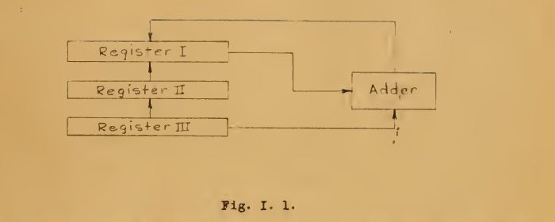
*Fig. I.1 — Register I/II/III and Adder*

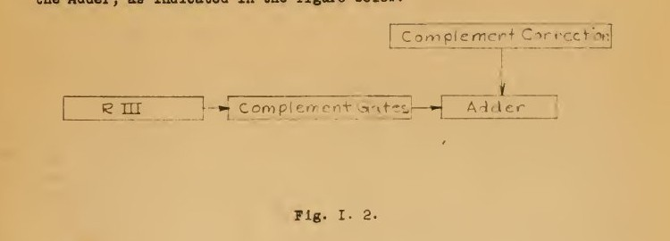
*Fig. I.2 — Complement Gates between RIII and the Adder*

As indicated in the figure the inputs (40-fold in each case) to the Adder
are from Registers I and III -- we shall use the symbols RI and RIII in
the future -- and the output of this unit is stored back in RI. Again
information in RIII can be communicated to RII and hence to RI without
proceeding through the Adder. In an addition the augend is originally
in RI and the addend in RIII, the sum being placed in RI at the comple-
tion of the operation.

To make clear the subtraction we must make mention of a unit
called the Complement Gate Chassis which intervenes between RIII and
the Adder, as indicated in the figure below.

<!-- p. 17 -->
This chassis permits one of three modes of communication between
RIII and the Adder. If a number x is stored in RIII, then either the
Complement Gates permit x, the complement of x, or 0 to enter the Adder;
or, to be more precise, if x = (x₀, x₁, ..., x₃₉), then either x or
x̄ = (1 - x₀, 1 - x₁, ..., 1 - x₃₉) or 0 = (0, 0, ..., 0) is permitted to enter
the Adder from RIII. If it is the middle case, then the Arithmetic
Control also "injects" a digit 2⁻³⁹ into the Adder. This, as we shall
see, correctly handles the operation of subtraction.

To form x - y we proceed as follows: the Arithmetic Organ has
x in RI, y in RIII and has been instructed to form the difference. It
forms, apart from the "complement correction" just mentioned,

  Σ₍ᵢ₌₀₎³⁹ (xᵢ + (1 - yᵢ)) · 2⁻ⁱ = x + (2 - y) - 2⁻³⁹.

The complement correction then has the effect of removing this last 2⁻³⁹
and yielding the correct difference.

We leave this discussion of the separate units of the Arithmetic
Organ for the moment but with the intention of returning to it shortly.

The multiplication operation is somewhat more delicate in a cer-
tain sense than are the addition and subtraction because the procedure
based on the modulo 2 fails completely. If one changes one factor, say
x, of a product xy by a two, then the new product differs from xy by 2y
which is not generally an integer multiple of 2 since -1 ≤ y < +1.

To effect a multiplication we store the multiplier in RII
and the multiplicand in RIII. We carry out the process by seriatim
multiplying the entire multiplicand by the digits of the multiplier
starting with the least significant one.

<!-- p. 18 -->
The multiplication proper takes place in 39 steps, corresponding
to the 39 non-sign digits of the multiplier, together with several "clean-
up" operations in addition. We describe all this below. For simplicity
we first consider the case in which both the multiplier x = (x₀, x₁, ...,
x₃₉) and the multiplicand y = (y₀, y₁, ..., y₃₉), i.e. x₀ = y₀ = 0 and
hence 0 ≤ x < 1, 0 ≤ y < 1.

Assume we have already performed the first i - 1 steps of the
multiplication involving the multiplication of the multiplicand by the
last i - 1 digits of the multiplier, x₃₉, x₃₈, ..., x₄₁₋ᵢ. We describe
now the multiplication with the i-th digit, i.e. with x₄₀₋ᵢ. Assume
that RI contains the partial product after the last step, pᵢ₋₁ (for
i = 1, p₀ = 0). We form

  2pᵢ = pᵢ₋₁ + yₖ  with  yₖ = 0 for x₄₀₋ᵢ = 0, y for x₄₀₋ᵢ = 1.

I.e. if x₄₀₋ᵢ = 0 we define pᵢ as 1/2 of pᵢ₋₁ and if x₄₀₋ᵢ = 1 as 1/2
of (pᵢ₋₁ + y). Consider now the sizes of the quantities 2pᵢ. For i = 0,
0 ≤ 2pᵢ < 2 (since p₀ = 0); now if this is true for i - 1, then our dis-
played definition above makes it also true for i. Thus 2pᵢ lies in the
interval 0 ≤ 2p < 2 and no carry can arise beyond the 2⁰-position.

Thus pᵢ is formed from 2pᵢ by a right shift with the sign digit
made 0. Finally we have

  p₃₉ = 2⁻¹(2⁻¹(2⁻¹(...(2⁻¹x₃₉y + x₃₈y)...) + x₁y =
      = Σ₍ᵢ₌₁₎³⁹ 2⁻ⁱ xᵢ y = xy,

i.e. we have our correct product. We describe later how we achieve this
in the Arithmetic Organ. At the moment, however, we turn instead to the

<!-- p. 19 -->
other possible cases, namely: x < 0, y ≥ 0, x < 0, y < 0, x ≥ 0, y < 0.

We pass now to these cases and describe how they are performed.
If x < 0, then it is represented in the machine as x + 2. Thus for x < 0,
y ≥ 0 the procedure we have just described would form not xy but xy + 2y;
for x < 0, y < 0 it would form xy + 2x + 2y + 4; for x ≥ 0, y < 0 it would
form xy + 2x. Hence, correction terms 2x, 2y or both would be needed. As
we shall see later these corrections would be quite awkward for us to per-
form, particularly the correction 2x since we in fact lose the digits of
the multiplier as they are no longer needed. The reason for this will
become apparent in the next section.

Our procedure is this: First let us assume that the corrections
necessitated by y < 0 have been disposed of and permit y to be either ≤ 0
or > 0. We focus attention now on x < 0.

We disregard the sign digit of x and act as if it were 0. Then x is
replaced by x¹ = x - 1 but since -1 ≤ x < 0, x¹ will act as if it were (x - 1)
+ 2. Hence our procedure for multiplication will produce x¹y = (x + 1) y =
xy + y. We therefore need a final correction in this case of -y at the
end of the process. Thus in the cases x < 0 we proceed through the 39
steps described earlier and thereby form xy + y and then we must perform
another step to subtract out the multiplicand y.

Having disposed of the difficulties that arise when x < 0, we may
now assume x ≥ 0 and consider the one remaining case, namely y < 0.

Suppose this time that we ignore completely the sign digit of y,
or rather that we replace it by 0. Then if y¹ = y - 1, we have as before
xy¹ = x(y + 1) = xy + x and a correction -x is needed. Since, however,

<!-- p. 20 -->
we do not have x, the multiplier, available at the end of the multiplica-
tion we must find a means of applying this correction as the first 39
steps proceed.

We proceed in this fashion: when we examine the digit x₃₉₋ᵢ of
the multiplier, we normally add into the partial product pᵢ the number
y if x₃₉₋ᵢ = 1 and 0 otherwise. Let us now modify this procedure as
follows:

  2pᵢ = pᵢ₋₁ + ŷᵢ  with  ŷᵢ = 1 for x₄₀₋ᵢ = 0, y¹ for x₄₀₋ᵢ = 1.

As before 0 ≤ 2pᵢ < 2 and no carries can proceed beyond the 2⁰-
position. Let us see now what result we have produced by this procedure.

  p₃₉ = 2⁻¹(2⁻¹(2⁻¹(...(2⁻¹x₃₉y¹ + 2⁻¹(1-x₃₉) + x₃₈y¹ + (1-x₃₈))...) +
       + x₂y¹ + (1-x₂)) + x₁y¹ + (1-x₁) =
      = Σᵢ₌₁³⁹ 2⁻¹xᵢy¹ + Σᵢ₌₁³⁹ 2⁻¹(1 - xᵢ) = xy¹ + 1 - 2⁻³⁹ - x =
      = x(y+1) + 1 - 2⁻³⁹ - x = xy + (1 - 2⁻³⁹).

Thus a final correction of -1 + 2⁻³⁹ is necessary. But this correction
which is done at the end can be effected modulo 2 and we can correct it
by 1 + 2⁻³⁹.

We summarize now in a general description covering all four cases.

We return now to our schematic discussion of the Arithmetic Organ.
Since we wish to retain the full 78 digits of a product, we have estab-
lished certain interconnections between RI and RII not yet shown in
Figure I.1. Before describing them we must indicate another feature of
RI and RII. Each of them is capable not only of receiving 40 digit

<!-- p. 21 -->
numbers and of transmitting them, but also of translating either to the
right or left whatever information is stored in them. We discuss the
logical implications of these shift facilities later. At the moment we
prefer to indicate how this is accomplished, at least in a crude way.

Each of RI and RII is in reality not one but two registers suit-
ably interconnected. Let us consider RI first. It consists of two
registers and four sets of 40-fold gates. Let the two registers be
denoted by Rᴵ and Rᴵ. One set of gates intervenes between the Adder
and Rᴵ. Thus the output of the Adder is stored at least initially in
Rᴵ. Two sets of gates allow communication from Rᴵ to Rᴵ and a fourth
set allows communication from Rᴵ to Rᴵ.

The set which controls the communication between the Adder and
Rᴵ, the so-called Green Gates, is so wired that it makes digital posi-
tion 2⁻ⁱ of the Adder correspond to 2⁻ⁱ of Rᴵ. One of the two sets con-
trolling the route from Rᴵ to Rᴵ, the so-called Red Gates, makes posi-
tion 2⁻ⁱ of Rᴵ correspond to 2⁻⁽ⁱ⁻¹⁾ of Rᴵ; the other set, the so-called
Black Gate, makes 2⁻ⁱ of Rᴵ correspond to 2⁻⁽ⁱ⁺¹⁾ of Rᴵ. The fourth
set, the so-called Yellow Gate, from Rᴵ to Rᴵ makes 2⁻ⁱ of Rᴵ correspond
to 2⁻ⁱ of Rᴵ. We indicate this below in Figure I.3.

A similar arrangement obtains with respect to RII. The structure
of RIII is, however, simpler since it is not called upon to perform
shifting functions as are RI and RII.

*(Note: the OCR here loses the distinction between the two half-registers
of RI, printed as "Rᴵ" (superscript I) and "R_I" (subscript I) — see
Figure I.3 below, which shows the actual gate layout unambiguously.)*

<!-- p. 22 -->

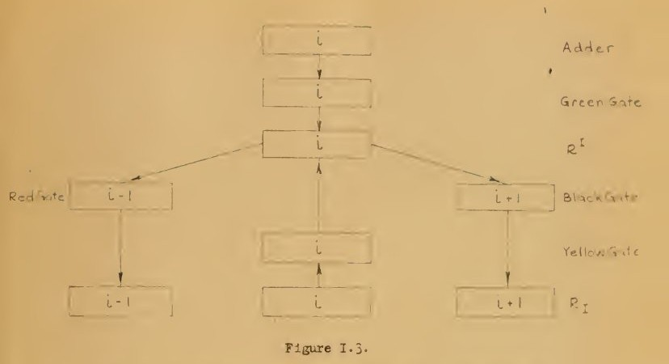
*Figure I.3 — Gate sets (Red/Black/Green/Yellow) between RI and RII*

We can now describe in somewhat more detail the operations
previously alluded to such as the right and left shifts, the transfer
into RI, the addition, the subtraction, and at least part of the multi-
plication.

Consider first a number in Rᴵ -- in both RI and RII the units Rᴵ,
Rᴵ serve only as transient storage positions; all storage for more
than a few microseconds is in Rᴵ, Rᴵ -- which we desire to shift right
(left). The Arithmetic Control routes the information first to Rᴵ via
the Yellow Gate set, then back to Rᴵ via the Black (Red) Gate set. (We
must describe later treatment of the sign digit.)

Next consider a number arriving in RI from the Adder. It is
transferred to Rᴵ via the Green Gate set, then to Rᴵ via the Red set --
note this apparently causes the information in 2⁰-position of the Adder

<!-- p. 23 -->

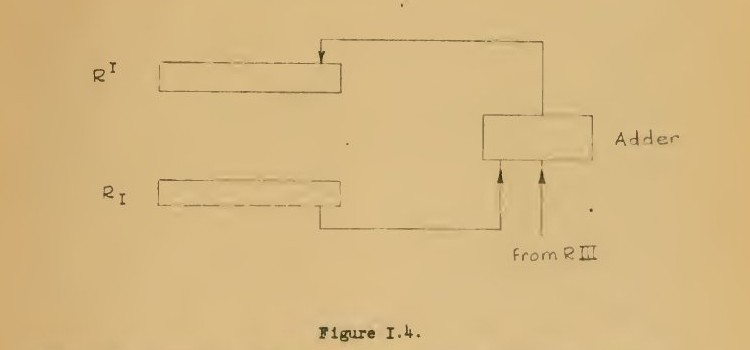
*Figure I.4 — Connections between RI and the Adder*

to be lost. Actually it does not because RI has a 2⁺¹ position for
precisely this reason; it is then sent back to Rᴵ via the Yellow set
and finally back to Rᴵ via the Black set. Note that it is now cor-
rectly positioned, i.e. the content of 2⁻¹-position of Rᴵ is that of
2⁻¹-position of the Adder.

In the next figure we indicate the connections between RI and
the Adder, suppressing the gate sets.

<!-- p. 24 -->

*Figure I.5 — Right-shift connection, RI to RII*

*Figure I.6 — Left-shift connection, RI to RII*

from RI to RII but not back again. This connection is provided so
that whenever a right shift occurs the digits being shifted out of RI
are stored in RII. We make this connection quite specific in Figure
I.5 below.

To provide for the comparable situation when a left shift occurs the
2⁰ stage of RI is connected to the 2⁻³⁹ stage of RII, as in Figure I.6
below.

We are now able to proceed further with the details of the
multiplication. The multiplier is initially placed in RII. (This
must be done prior to the multiplication order, cf. 0.9 below.) Then
when the multiplication is initiated the multiplicand is in RIII. An
observation post exists at stage 39 of RII which examines whether the
digit therein is 0 or 1 and acts accordingly, i.e. it does or does

<!-- p. 25 -->
add the multiplicand into RI in case both multiplier and multiplicand
are positive. We discuss below the exact details in all cases. Then
a right shift of one is performed. Thus three things occur of relevance:
first, the partial product in RI is properly positioned for the next step;
second, the digit of the multiplier last examined has been lost and the
next relevant, i.e. the now currently relevant, is available at the
inspection station; third, the least significant digit of the partial
product has now been shifted into RII, into the leading stage. This pro-
cedure is carried on for the 39 steps required at which time the 39 most
significant digits of the product appear in RI and the 39 least signifi-
cant ones in RII.

The addition operation is performed in this fashion: We assume
the augend is now in RI, specifically in Rᴵ, and the addend is in RIII.
The Complement Gates are set to pass the addend out and the sum is then
stored temporarily in Rᴵ. This sum is then put into Rᴵ displaced one to
the left with the sign digit in 2⁺¹. Next, the number is transferred
back to Rᴵ and thence down to Rᴵ in the correct position. In terms of
the various gating operations this means the following: The Green Gates
were opened to admit the sum to Rᴵ; the Red Gates sent it to Rᴵ; the
Yellow Gates sent it back to Rᴵ; and finally it arrived correctly posi-
tioned in Rᴵ via the Black Gates.

The situation for the subtraction differs in one point only; the
Complement Gates are opened to pass the complement of the addend and
the complement correction is carried out.

In both cases the sign of the sum is now both in 2⁺¹ and 2⁰.

<!-- p. 26 -->
The possible addition and subtraction operations performable by
the machine are these:

1. The addition (subtraction) of the contents of RIII and of Rᴵ.

2. The addition (subtraction) of the contents of RIII and of Rᴵ
pre-cleared to 0. I.e. the transfer of a number (or its complement)
into Rᴵ.

3. The addition (subtraction) of the absolute value of the con-
tents of RIII and of Rᴵ.

4. The addition (subtraction) of the absolute value of the con-
tents of RIII and of Rᴵ pre-cleared to 0. I.e. the transfer of the modu-
lus of a number (or its complement) into Rᴵ.

To perform the operations involving absolute values the Arithmetic
Control is provided with a monitor which decides whether the Complement
Gates are to pass the number in RIII or its complement according as the
instruction requires.

The left shift is performed analogously to that for the right shift
but the right-most stage of Rᴵ is made 0.

This is the correct convention to ensure that the left shift is
exactly a multiplication by 2 (provided that the result is still in
"scale", i.e. is not outside the interval -1 < x < 1).

The left shift operation can be performed n times (1 ≤ n ≤ 47) by
means of a single order.

The right shift operation is performed in this fashion: The num-
ber in Rᴵ is transferred into Rᴵ and is then sent back into Rᴵ displaced
one position to the right. Exactly the same procedure is followed in RII.

<!-- p. 27 -->
Thus both RI and RII shift together. (There is one exception to this
principle in one of the terminal steps of a multiplication but this
need not concern us here.)

The information stored in 2⁺¹ of RI is therefore shifted into
2⁰. It is also retained in 2⁺¹. If this digit is a 0, the sign of the
resulting quantity is 0 and if it is a 1, the sign is 1. But this is
exactly the correct convention to ensure that the right shift is exactly
a division by 2.

The right shift operation can be performed n times (1 ≤ n ≤ 47)
by means of a single order.

This amounts only to an iteration n times of what is described
above.

Since RI and RII are interconnected as shown in Figure I.5 above,
the information shifted out of RI is transferred into RII; but the material
shifted out of RII is lost.

We next discuss the division operation. To make precise what fol-
lows we agree that the dividend is x, the divisor is y with -1 ≤ x < 1,
-1 ≤ y < 1, |x| < y.

To describe the process we assume that the first i-1 steps of the
division have been completed and that the first i-1 digits q₀, q₁, ...,
qᵢ₋₂ of the quotient Q are in positions 40-i, 41-i, ..., 39, respectively.
We also assume that y, the divisor, is in R³ and that the remainder rᵢ₋₁
is in R₁. We proceed inductively in this fashion:

(1)   rᵢ = 2rᵢ₋₁ - (sgn xy) y pᵢ₋₁,   r₀ = x/2,

where

<!-- p. 28 -->
(2)   pᵢ₋₁ = { 0   sgn rᵢ₋₁ ≠ sgn (2rᵢ₋₁ - (sgn xy) y)
              { 1   sgn rᵢ₋₁ = sgn (2rᵢ₋₁ - (sgn xy) y).
      p₀ = 0

We next define qᵢ as

(3)   qᵢ = { pᵢ           sgn xy = +1
            { 1 - pᵢ       sgn xy = -1

We now show that

   sgn rᵢ = sgn x,   |rᵢ| < |y|.

We prove these inductively. They are evidently true for i = 1. We
show they are true for i + 1 assuming they are true for i. If

   sgn rᵢ = sgn (2rᵢ - (sgn xy) · y)

then

   rᵢ₊₁ = 2rᵢ - (sgn xy) · y

and

   sgn rᵢ₊₁ = sgn rᵢ = sgn x.

Next,

   2rᵢ - (sgn xy) · y = 2 sgn rᵢ · |rᵢ| - sgn x · sgn y · y =
   = 2 sgn x · |rᵢ| - sgn x · |y| = sgn x (2|rᵢ| - |y|).

Thus

   rᵢ₊₁ = sgn rᵢ₊₁ · |rᵢ₊₁| = sgn x · |rᵢ₊₁| = sgn x (2|rᵢ| - |y|)

and

   |rᵢ₊₁| = |2rᵢ| - |y| < 2|y| - |y| = |y|,

which completes the induction in this case. In the contrary case

   rᵢ₊₁ = 2rᵢ,

<!-- p. 29 -->
and

   sgn x = sgn rᵢ ≠ sgn (2rᵢ - (sgn xy) · y) = sgn x · sgn (2|rᵢ| - |y|).

Thus

   sgn (2|rᵢ| - |y|) = -1,

i.e.

   |rᵢ₊₁| = 2|rᵢ| < |y|,

and sgn rᵢ₊₁ = sgn 2rᵢ = sgn rᵢ = sgn x, since 2rᵢ is in the machine's
number range. Hence we have proved our induction.

We multiply both sides of (1) by 2⁻ⁱ⁺¹ and sum for i = 1, 2, ...,
n. We find

   2⁻⁽ⁿ⁻¹⁾ rₙ = 2¹r₀ - (sgn xy) · y P,

where

   P = Σᵢ₌₀ⁿ⁻¹ 2⁻ⁱ pᵢ.

Thus

(4)   x = (sgn xy) P · y + R

where

   R = 2⁻ⁿ⁺¹ rₙ

since 2¹r₀ = x.

If sgn xy = +1, (4) becomes with the help of (3)

   x = Q y + R,

where

   Q = Σᵢ₌₀ⁿ⁻¹ 2⁻ⁱ qᵢ = P.

If sgn xy = -1, then

   Q = Σᵢ₌₀ⁿ⁻¹ 2⁻ⁱ qᵢ = Σᵢ₌₀ⁿ⁻¹ 2⁻ⁱ(1-pᵢ) = 2 - P - 2⁻ⁿ⁺¹,

<!-- p. 30 -->
i.e. apart from the term 2⁻⁽ⁿ⁻¹⁾, Q is the complement of P. Thus our
quotient is wrong in the last place.

Up to this point we have made no mention of "rounding" procedures.
We do not wish in this place to discuss the theoretical background of
such procedures. Instead we merely call the reader's attention to such
a discussion in a previous report¹⁾ and state the rules we have adopted.
In the multiplication operation a digit is added to 2⁻⁴⁰ and the result
truncated after 39 digits after all carries have been completed. In the
division operation we perform 39 steps determining the sign and 38 informa-
tion digits. The 39th such digit is automatically made 1.

We complete our discussion with a discussion of the roles of RI,
RII, RIII during the division operation.

At the start of this operation the dividend is in RI, the divisor
is in RIII. Although left shifts are to be performed the channel from
RI to RII which normally transmits for a left shift is suppressed. In-
stead the quotient digits are inserted seriatim into position 38 of RII
and shifted left. The operation continues until the sign digit of the
quotient reaches position 0 of RII. At this time the remainder is in RI.

It remains only to explain how the machine makes the discrimina-
tions indicated in (2), (3) above. First we note that in (2) the expres-
sion "sgn rᵢ₋₁" can be replaced by sgn x. Thus (2) becomes

---
1) Preliminary Discussion of the Logical Design of an Electronic Comput-
   ing Instrument, Burks, Goldstine and von Neumann, Pt. I, Vol. I,
   1946, pp. 19, ff.

<!-- p. 31 -->
(2')   pᵢ₋₁ = { 0   sgn x ≠ sgn (2rᵢ₋₁ - (sgn xy) y)
                { 1   sgn x = sgn (2rᵢ₋₁ - (sgn xy) y).

It was not convenient engineering-wise to detect the signum of
2rᵢ₋₁ - (sgn xy) y and therefore a somewhat different quantity was ob-
served. To explain this we suppose for the moment that

   s = 2rᵢ₋₁ - (sgn xy) y

is expressed not as

   s = σ₀ + σ₁/2 + σ₁/2² + ... + σₙ₋₁/2ⁿ⁻¹

but as

   s = σ₋₁ + σ₀/2 + σ₁/2² + ... + σₙ₋₁/2ⁿ⁻².

I.e. we regard σ₀ not as a sign digit but as an arithmetic digit and
σ₋₁ as the sign digit. The convention adopted is now this:

(2")   pᵢ₋₁ = { 0   (1 - sgn x)/2 = σ₋₁
              { 1   (1 - sgn x)/2 ≠ σ₋₁.

It is not difficult to see that conventions (2') and (2") are equivalent.

<!-- p. 32 -->
II. THE ORDERS

We proceed now to an explanation of each order in terms of the
contents of RI, RII, RIII and of certain other facts relevant to the
coder. It is desirable first, however, to mention the digital structure
of the orders.

Each order consists of 20 binary digits, the first 10 of which
usually specify a Memory location and the second 10 of which specify
the operation to be performed. Two orders are grouped together into a
single 40 digit word. The Control is so arranged that it first executes
the left-hand one of the pair and then the right-hand one. These are
referred to as the first and second phases of the order-word, respec-
tively. In what follows we number the digits of an order 0 through 9
for the Memory location and 10 through 19 for the operation.

We now describe the orders.

0.1. THE PLUS CLEAR ORDER.

a) This order may be in either the first or second phase
of an order-word.

b) The digits 0-9 (20-29) express the Memory location
from which operand is to come.

c) The so-called step-digit, digit 11, may be a 0 or a 1.
In either case the order is executed. In the former case the Control is
prevented from proceeding to the next order and the machine stops. If
after the stop the step digit is changed to a 1, the order is re-done
and the machine proceeds normally.

<!-- p. 33 -->
d) At the start of the order the contents of the
registers are:

  R₁    irrelevant
  R₂    irrelevant
  R³    irrelevant
  x     b, the addend

e) At the end of the order the contents of the regis-
ters and of memory location x are:

  R₁    b
  R₂    unchanged
  R³    b
  x     b

0.2. THE PLUS HOLD ORDER.

a), b), c) The same as for 0.1.

d) At the start of the order the contents of the
registers and x are:

  R₁    a, the augend
  R₂    irrelevant
  R³    irrelevant
  x     b, the addend.

e) At the end of the order the contents of the regis-
ters and x are:

  R₁    a + b
  R₂    unchanged
  R³    b
  x     b

<!-- p. 34 -->
0.3. THE MINUS CLEAR ORDER.

a), b), c) The same as for 0.1.

d) At the start of the order the contents of the
registers and x are:

  R₁    irrelevant
  R₂    irrelevant
  R³    irrelevant
  x     b, the subtrahend

e) At the end of the order the contents of the regis-
ters and x are:

  R₁    2 - b
  R₂    irrelevant
  R³    b
  x     b

0.4. THE MINUS HOLD ORDER.

a), b), c) The same as for 0.1.

d) At the start of the order the contents of the
registers and x are:

  R₁    a, the minuend
  R₂    irrelevant
  R³    irrelevant
  x     b, the subtrahend

e) At the end of the order the contents of the regis-
ters and x are:

  R₁    a - b
  R₂    unchanged
  x     b

0.5. THE PLUS ABSOLUTE CLEAR ORDER.

a), b), c) The same as for 0.1.

d) At the start of the order the contents of the
registers and x are:

  R₁    irrelevant
  R₂    irrelevant
  R³    irrelevant
  x     b, the addend

e) At the end of the order the contents of the regis-
ters and x are:

  R₁    |b|
  R₂    unchanged
  R³    b
  x     b.

0.6. THE PLUS ABSOLUTE HOLD ORDER.

a), b), c) The same as for 0.1.

d) At the start of the order the contents of the
registers and x are:

  R₁    a, the augend
  R₂    irrelevant
  R³    irrelevant
  x     b, the addend

<!-- p. 35 -->
0.5. THE PLUS ABSOLUTE CLEAR ORDER.

a), b), c) The same as for 0.1.

d) At the start of the order the contents of the
registers and x are:

  R₁    irrelevant
  R₂    irrelevant
  R³    irrelevant
  x     b, the addend

e) At the end of the order the contents of the regis-
ters and x are:

  R₁    |b|
  R₂    unchanged
  R³    b
  x     b.

0.6. THE PLUS ABSOLUTE HOLD ORDER.

a), b), c) The same as for 0.1.

d) At the start of the order the contents of the
registers and x are:

  R₁    a, the augend
  R₂    irrelevant
  R³    irrelevant
  x     b, the addend

<!-- p. 36 -->
e) At the end of the order the contents of the regis-
ters and x are:

  R₁    a + |b|
  R₂    unchanged
  R³    b
  x     b.

0.7. THE MINUS ABSOLUTE CLEAR ORDER.

a), b), c) The same as for 0.1.

d) At the start of the order the contents of the regis-
ters and x are:

  R₁    irrelevant
  R₂    irrelevant
  R³    irrelevant
  x     b, the subtrahend

e) At the end of the order the contents of the regis-
ters and x are:

  R₁    2 - |b|
  R₂    unchanged
  R³    b
  x     b.

0.8. THE MINUS ABSOLUTE HOLD ORDER.

a), b), c) The same as for 0.1.

d) At the start of the order the contents of the
registers and x are:

<!-- p. 37 -->
  R₁    a, the minuend
  R₂    irrelevant
  R³    irrelevant
  x     b, the subtrahend

e) At the end of the order the contents of the registers
and x are:

  R₁    a - b
  R₂    unchanged
  R³    b
  x     b.

0.9. THE MULTIPLY NO-ROUND OFF ORDER.

a) The same as for 0.1.

b) The digits 0-9 (20-29) express the memory location
from which the multiplicand is to come.

c) The step digit is as in 0.1. The clear digit 18(38)
may be a 0 or a 1. In the former case the contents of RI at the start
of the order will be added to the first partial product. I.e., if c is
in RI at the start and if the desired product is a b, then what is pro-
duced in this case is ab + 2⁻³⁹d. In the latter case the contents of
RI are cleared to 0 at the start of the multiplication.

d) At the start of the order the contents of the regis-
ters and x are:

  R₁    irrelevant if "clear"
  R₂    a, the multiplier
  R³    irrelevant
  x     b, the multiplicand.

<!-- p. 38 -->
e) At the end of the order the contents of the regis-
ters and x are:

  R₁    c₀, c₁, ..., c₃₉
  R₂    (1-b₀), c₄₀, ..., c₇₈; where ab =
        = c₀, c₁, ..., c₃₉, c₄₀, ..., c₇₈ and b₀ is
        the sign digit of b. (We assume the "clear"
        case.)
  R³    b
  x     b.

0.10. THE MULTIPLY ROUND-OFF ORDER.

a), b), c) The same as for 0.9.

d) The same as for 0.9.

e) At the end of the order the contents of the regis-
ters and x are:

  R₁    γ₀, γ₁, γ₂, ..., γ₃₉
  R₂    (1-b₀), c₄₀+1, c₄₁, ..., c₇₈; where γ₀,
        γ₁, ..., γ₃₉, c₄₀+1, ..., c₇₈ - (c₀, c₁,
        ..., c₃₉, c₄₀, c₄₁, ..., c₇₈) = 2⁻⁴⁰.
  R³    b
  x     b.

0.11. THE DIVISION ORDER.

a) The same as for 0.1.

b) The digits 0-9 (20-29) express the memory location
from which the divisor is to come.

c) The same as for 0.1.

<!-- p. 39 -->
d) At the start of the order the contents of the regis-
ters and x are:

  R₁    N, the dividend
  R₂    irrelevant
  R³    irrelevant
  x     D, the divisor.

e) At the end of the order the contents of the regis-
ters and x are:

  R₁    2R, twice the remainder
  R₂    q₀, q₁, ..., q₃₈, 1, cf. Chapter I
  R³    D
  x     D

0.12. THE LOAD RII ORDER.

a), b) The same as for 0.1.

c) The same as for 0.1. If the clear digit is a 1,
   then R₁ is pre-cleared to 0.

d) At the start of the order the contents of the regis-
ters and x are:

  R₁    irrelevant
  R₂    irrelevant
  R³    irrelevant
  x     b

e) At the end of the order the contents of the regis-
ters and x are:

  R₁    unchanged if clear digit is 0; 0 if clear
        digit is 1.

<!-- p. 40 -->
  R₂    b
  R³    b
  x     b.

0.13. THE STORE ORDER.

a) The same as for 0.1.

b) The digits 0-9 (20-29) express the memory location
into which the contents of RI are to be placed.

c) The step digit must always be a 1. Thus the store
order cannot be used as a stop order.

d) At the start of the order the contents of the regis-
ters and x are:

  R₁    b, the word to be stored
  R₂    irrelevant
  R³    irrelevant
  x     irrelevant

e) At the end of the order the contents of the regis-
ters and x are:

  R₁    b
  R₂    unchanged
  R³    0
  x     b

0.14. THE STORE CLEAR ORDER.

a), b), c) The same as for 0.13.

d) At the start of the order the contents of the regis-
ters and x are:

<!-- p. 41 -->
  R₁    irrelevant
  R₂    irrelevant
  R³    irrelevant
  x     irrelevant

e) At the end of the order the contents of the regis-
ters and x are:

  R₁    0
  R₂    unchanged
  R³    0
  x     0

0.15. and 0.16. THE UNCONDITIONAL TRANSFER ORDERS.

a) The same as for 0.1.

b) The digits 0-9 (20-29) express the memory location
to which the control is to be transferred. I.e., the location where
the next order is to be found.

c) If the step digit is a 0, the control transfer takes
place to the same phase of the new order-word as that of the order in
question. If the step digit is a 1, the transfer takes places to the
opposite phase.

d) At the start of the order the contents of the regis-
ters and x are:

  R₁    irrelevant
  R₂    irrelevant
  R³    irrelevant
  x     b, the next order-word

<!-- p. 42 -->
e) At the end of the order the contents of the registers
and x are:

  R₁    unchanged
  R₂    unchanged
  R³    b
  R₃    b
  x     b.

0.17. and 0.18. THE CONDITIONAL TRANSFER ORDERS.

a), b), c) The same as for 0.15 - 16.

d) At the start of the order the contents of the regis-
ters and x are:

                 Case A                        Case B
  R₁             a ≥ 0                         a < 0
  R₂             irrelevant                    irrelevant
  R³             irrelevant                    irrelevant
  x              b, the next order-word        b, irrelevant

e) At the end of the order the contents of the registers
and x are:

                 Case A                        Case B
  R₁             unchanged                     unchanged
  R₂             unchanged                     unchanged
  R³             0                              b
  R₃             b                              unchanged
  x              b                              b

<!-- p. 43 -->
0.19. THE QUICK-SUM ORDER.

a) The order may be only in the first phase of an order-
word.

b) The digits 0-9 express the memory location x from
which the first operand is to come. It is obtained from the orders
0.1. - 0.8., inclusive, by setting digit 19 to 1. In this case the
order specified without this digit being 1, i.e. one of the set 0.1 -
0.8, is performed first at the location x and then serially at each fol-
lowing location through 1023 after which the order terminates. The sec-
ond phase order must be a transfer of the control to the location of the
next order-word. This is due to the fact that the order counter no
longer stores the location of the next order-word.

c) The step digit must be a 1.

d) At the start of the order the contents of the registers
and x are:

  R₁      a
  R₂      Irrelevant
  R³      Irrelevant
  x + i   bᵢ    i = 0, 1, ..., 1023 - x

e) At the end of the order the contents of the registers
and x are:

  R₁      b₁₀₂₃                  if 0.1, 3, 5 or 7
          a + Σ f(bₓ₊ᵢ)          if 0.2, 4, 6, 8
  R₂      Unchanged
  R³      b₁₀₂₃
  x + i   bᵢ,

<!-- p. 44 -->
where

    f(b) =  b       if 0.2
           -b       if 0.4
           |b|      if 0.6
          -|b|      if 0.8

0.20. RIGHT SHIFT, NO-ROUND OFF ORDER.

a) The same as for 0.1.

b) The digits 4-9 (24-29) express the number of shifts to be executed.
This number n is expressed as an integer times 2^-9 (2^-29). The digits
0 - 3 are irrelevant. The number stated in digits 4 - 9 (24-29) must not
exceed 47 and must not be 0. (A shift by 0 is executed as a shift by 1.)

c) The same as for 0.1.

d) At the start of the order the contents of the registers are:

    R1   a0, a1, a2, ..., a38, a39
    R2   b0, b1, b2, ..., b38, b39
    R3   Irrelevant

e) At the end of the order for a shift of 1 the contents of the registers are:

    R1   a0, a0, a1, a2, ..., a38
    R2   a39, b0, b1, b2, ..., b38
    R3   b0, b1, b2, ..., b39

For a shift of n this is iterated n times.

f) This order may be given with the clear digit, digit 18

<!-- p. 45 -->
(38), a 0 or a 1. The situation above shows the case of this digit = 0.
We show below the case when it is 1.

e') At the end, for a shift of 1, the contents of the
registers are:

  R₁    a₀, 0, 0, 0, ..., 0
  R₂    0, b₀, b₁, b₂, ..., b₃₈
  R³    b₀, b₁, b₂, ..., b₃₉

We note that even though R₁ has been cleared to 0 before the shift
starts the sign of the number that was there is propagated by the shift.

0.21. RIGHT SHIFT, ROUND OFF ORDER.

This order is not yet available.

0.22. LEFT SHIFT ORDER.

a), b), c) The same as for 0.20.

d) At the start of the order the contents of the regis-
ters are:

  R₁    a₀, a₁, a₂, ..., a₃₈, a₃₉
  R₂    b₀, b₁, b₂, ..., b₃₈, b₃₉
  R³    Irrelevant

e) At the end, for a shift of 1, the contents of the
registers are:

  R₁    a₁, a₂, ..., a₃₈, a₃₉, a₀
  R₂    b₁, b₂, ..., b₃₈, b₃₉, a₀
  R³    b₀, b₁, ..., b₃₈, b₃₉

For a shift of n this is iterated n times.

f) This order may be given with the clear digit a 0 or a 1.

<!-- p. 46 -->
The situation above shows the case of this digit = 0. We show below
the case when it is 1.

e') At the end, for a shift of 1, the contents of the
registers are:

  R₁    0, 0, ..., 0, 0, 0
  R₂    b₁, b₂, ..., b₃₈, b₃₉, 0
  R³    b₀, b₁, ..., b₃₇, b₃₈, b₃₉

g) We indicate next what occurs when a left-shift (of 1)
is followed by a right shift (of 1).

e") At the end of the order the contents of the regis-
ters are:

  R₁    a₀, a₁, a₂, ..., a₃₈, a₃₉
  R₂    0, b₁, b₂, ..., b₃₈, b₃₉
  R³    b₁, b₂, ..., b₃₉, a₀

0.23. THE R₂ TO R₁ ORDER.

a) The same as for 0.1.

b) This order is actually not one but a set of eight dif-
ferent ones. These are essentially the orders 0.1. - 0.8. except that
the operand comes not from a memory location x but rather from RII. One
other feature is available in connection with this order. To describe
this we consider the digits 0-9 (20-29). Of these 0 - 3 (20-23) are ir-
relevant. The digits 4 - 9 (24-29) are as indicated in b) of 0.20. They
express an integer times 2⁻⁹ (2⁻²⁹) which is > 0 and ≤ 47.

c) The same as for 0.1.

d) At the start of the order the contents of the regis-
ters are:

<!-- p. 47 -->
  R₁    a
  R₂    b
  R³    Irrelevant

e) At the end of the order the contents of the regis-
ters are:

  R₁    { 2g(a) + (n+1) f(b)     if n is odd
        { g(a) + nf(b)/2         if n is even,

where f is defined in the discussion of Order 19 and

  g(a) = { a    if 0.2, 4, 6, 8
         { 0    if 0.1, 3, 5, 7

  R₂    b
  R³    b.

0.24. and 0.25. IBM AND DRUM PRIMING ORDER.

a) These orders must be second phase ones. Their use is
to specify the number of cards to be read or punched by the IBM repro-
ducer or the starting word block number and the number of such blocks to
be loaded or unloaded on or from the drum.

There are 12 words on an IBM card occupying the columns 1-4, 6-9,
11-14, 16-19, 21-24, 26-29, 31-34, 36-39, 41-44, 46-49. The columns 5,
10, 15, 20, 25, 30, 35, 40, 45 are never used. Columns 66-80 are used
for identifying information for the human operator. Each word occupies
a row on the card, a hole indicating a 1, no hole a 0.

The Magnetic Drum contains 2048 words divided into two main
groups of 1024 each. Each of these is composed of 32 blocks of 32
words each.

<!-- p. 48 -->
b) The address portion of the order is used to specify
the number of cards in the case of IBM operation or the starting block
number and the number of blocks in the case of drum operation. In the
former case, the IBM one, the digits 20-22 are irrelevant; 23-29 express
as an integer times 2⁻²⁹ the number of cards to be processed. In the
latter case, the drum one, the digits 20-24 are used to express the start-
ing block number as an integer times 2⁻²⁴; the digits 25-29 the number of
blocks to be processed, the number being an integer times 2⁻²⁹. It is
important to note that the blocks and the number of blocks are counted
1, 2, ..., 32. Thus 00000 means block 32 if it appears in positions 20-
24 and means 32 blocks if in 25-29.

c) It is best always to put a step-digit, digit 30, into
this order.

In principle this is not one but a set of 18 orders, 0.1 - 0.18;
it differs from these only in that the address portion does two things:
it is not only the operand for the order 0.1 - 0.18 but is also sent to
a special register in the IBM-Drum Control. It remains there permanently
until altered by another such order.

Since the analogous 0.1 - 0.18 order will be executed using the
given address as operand it will bring an irrelevant quantity into the
Arithmetic Unit. Thus if the contents of RI are relevant and it is
desired to prime, it is best to use a load R type of order, whereas
if the contents of RII are relevant, one of the type 0.1 - 0.8. The
priming order differs from 0.1 - 0.18 only in that digit 31 is a 0.

0.26. IBM INPUT TO MEMORY ORDER.

<!-- p. 49 -->
a) This must be first phase. The second phase of the
order-word must be a transfer of the control to the next order-word.

b) The digits 0-9 are used to specify the memory loca-
tion x for which the order is first executed. The order is then executed
for x + 1, x + 2, ... until the number of cards previously set by the
prior priming order has been reached.

c) The step digit must be a 1.

d) The only register that is unchanged is RII.

0.27. IBM OUTPUT TO MEMORY ORDER.

a), b), c) The same as for 0.26.

d) All registers are altered.

0.28. DRUM INPUT TO MEMORY ORDER.

a) The same as for 0.26.

b) The digits 0-9 are used to specify the memory loca-
tion x for which the order is first executed. The order is then exe-
cuted for x + 1, x + 2, ... until the number of blocks previously set
by the prior priming order has been reached.

c) The same as for 0.26.

d) The same as for 0.26.

e) The drum stores 1024 bits per track and has 80 tracks.
These 80 are divided into 2 sets of 40 each which constitute the major
groups mentioned above in the discussion of order 24. The selection of
the proper group is controlled by digit 15. If it is a 0, group A is
selected; if it is a 1, group B is selected.

<!-- p. 50 -->
ko.
0.29. DRUM OUTPUT FROM MEMORY ORDER.
a), b), c) The same as for 0.26.
d) The same as for 0.27.
e) The same as for 0.28.

<!-- p. 51 -->

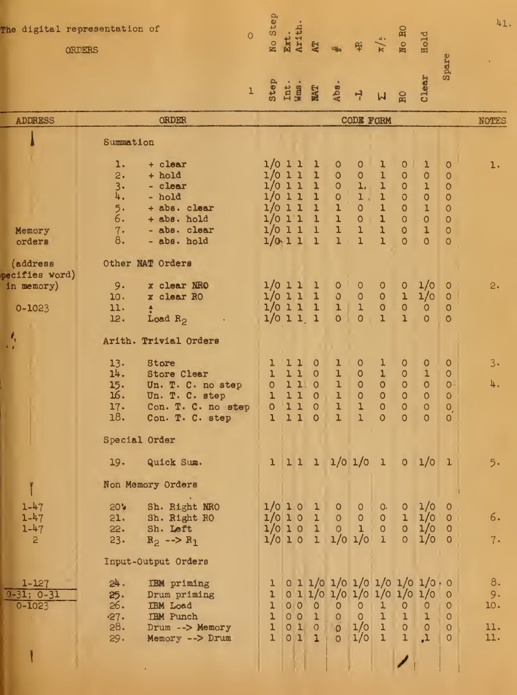
*Digital representation of Orders — order code table*

The digital representation of St
Arlth
ORDERS No Ext.

<!-- p. 52 -->

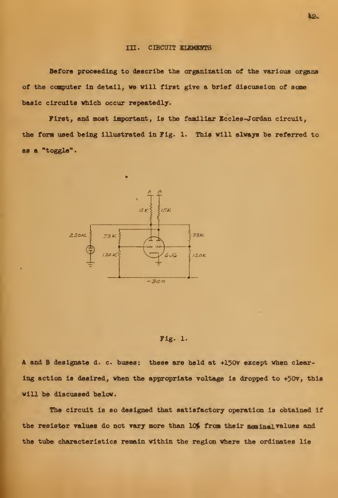
*Fig. 1 — Eccles-Jordan toggle circuit*

III. CIRCUIT ELEMENTS

Before proceeding to describe the organization of the various organs
of the computer in detail, we will first give a brief discussion of some
basic circuits which occur repeatedly.

First, and most important, is the familiar Eccles-Jordan circuit,
the form used being illustrated in Fig. 1. This will always be referred to
as a "toggle".

A and B designate d. c. buses: these are held at +150v except when clear-
ing action is desired, when the appropriate voltage is dropped to +50v, this
will be discussed below.

The circuit is so designed that satisfactory operation is obtained if
the resistor values do not vary more than 10% from their nominal values and
the tube characteristics remain within the region where the ordinates lie

<!-- p. 53 -->

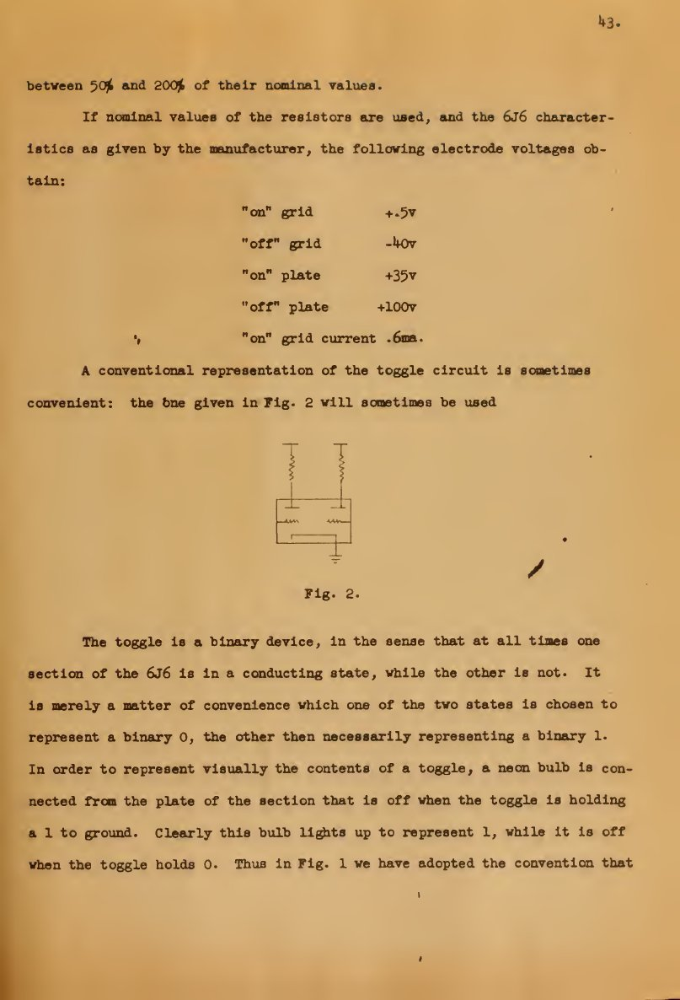
*Fig. 2 — Conventional toggle symbol*

between 50% and 200% of their nominal values.

If nominal values of the resistors are used, and the 6J6 character-
istics as given by the manufacturer, the following electrode voltages ob-
tain:

  "on" grid          +.5v
  "off" grid         -40v
  "on" plate         +35v
  "off" plate        +100v
  "on" grid current  .6ma.

A conventional representation of the toggle circuit is sometimes
convenient: the one given in Fig. 2 will sometimes be used.

The toggle is a binary device, in the sense that at all times one
section of the 6J6 is in a conducting state, while the other is not. It
is merely a matter of convenience which one of the two states is chosen to
represent a binary 0, the other then necessarily representing a binary 1.
In order to represent visually the contents of a toggle, a neon bulb is con-
nected from the plate of the section that is off when the toggle is holding
a 1 to ground. Clearly this bulb lights up to represent 1, while it is off
when the toggle holds 0. Thus in Fig. 1 we have adopted the convention that

<!-- p. 54 -->
the toggle holds a 1 when the left-hand section is non-conducting.

We now consider the "clearing" action, assuming the given convention
as to the contents of the toggle. Suppose the toggle to hold a 0, and let
bus A drop to +50v, while B remains at +150v. The grid voltage of the right
section is merely reduced still further. Hence that section remains cut off,
the grid voltage of this left section is held up, and the state of the tog-
gle does not change. On the other hand, if bus B is dropped to +50v, while
A is maintained at +150v, the grid voltage of the left-hand section is re-
duced below cut-off, and the toggle is changed to its other state. Similarly,
if a 1 is held, dropping B to +50v while holding A at +150v has no effect,
while dropping A to +50v while holding B at +150v changes the state of the
toggle.

Putting this differently, the operation of dropping A to +50v while
holding B at +150v guarantees that the toggle will subsequently hold a 0,
while holding A at +150v and dropping B to +50v guarantees that it will
subsequently hold a 1. Thus these operations are respectively referred to
as "clearing to 0" and "clearing to 1". The clearing action is produced by
pulsing the appropriate bus. With the present toggles, it is necessary that
the bus voltage should remain below +70v for approximately one microsecond
to produce the desired clearing.

In a few places in the computer, it is desired to use a toggle which
requires a shorter time to change from one state to the other. In these ap-
plications a so-called "super-toggle" is used, which changes its state in
half the time required by the ordinary toggle. The circuit is given in
Fig. 3.

<!-- p. 55 -->

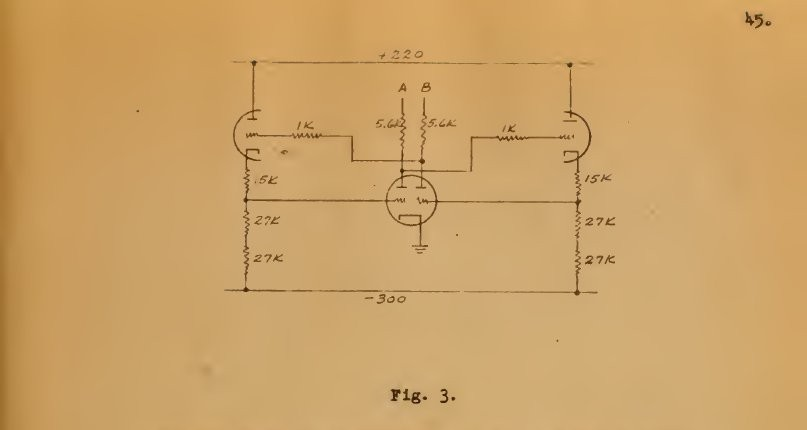
*Fig. 3 — Toggle-setting circuit*

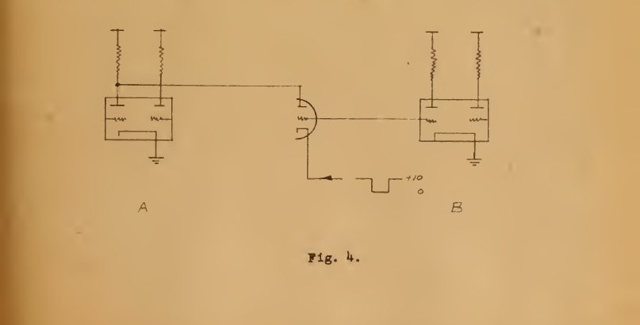
*Fig. 4 — Gate circuit for setting toggle A to match toggle B*

It has been shown how a toggle may be set in a desired state, or
"cleared". It is also necessary to be able to set a toggle into the same
state as another toggle: that is, given toggles A and B, it is necessary to
provide a mechanism which guarantees that, after some definite time, the
contents of A are identical with those of B. This is readily accomplished
by means of a gate circuit as shown in Fig. 4.

<!-- p. 56 -->
The tube used here is one section of a 6J6, with cathode normally
maintained at +10v. When it is desired to transfer information from B to
A (note that the given circuit permits a transfer to be made only in this
direction), the cathode of the gate is dropped to 0v. The gate cannot
conduct while its cathode is held at +10v, as its grid cannot be above
about +.5v. Let us use our earlier convention as to the representation
of binary 0's and 1's by states of the toggle. If B holds a 1, clearly
nothing can happen when the gating signal arrives at the cathode of the
gate, as this tube must remain cut off. If, on the other hand, B holds
a 0, conduction takes place when the cathode of the gate falls to 0v, and
plate current, flowing through the plate load resistor of the left section
of A, will cause A to assume the state representing 0. The gate thus
guarantees that if B holds a 0 at the time the gating signal is applied,
A will be caused to hold a 0. Suppose now that before the arrival of the
gating signal, A is cleared to 1. Then if B holds a 0, the gate causes A
to assume the 0 state, while if B holds a 1, the gate has no effect, and
A continues to hold a 1. Thus the sequence of signals "clear A to 1" and
"open gate into A", results in A holding the same information as B.

We also note that if the gating signal were made sufficiently nega-
tive, enough grid current could be drawn by the gate to cause a change of
state in B. This effect is not used in the present design, but could con-
ceivably be useful.

The gate circuit as described is a coincidence device, equivalent to
the formation of a logical product. Other methods are used in parts of the
machine; for example, consider the circuit of Fig. 5 where the signals ap-
plied to the grids assume the levels of +10v or -10v. This is a cathode

<!-- p. 57 -->

*Fig. 5 — Cathode follower*

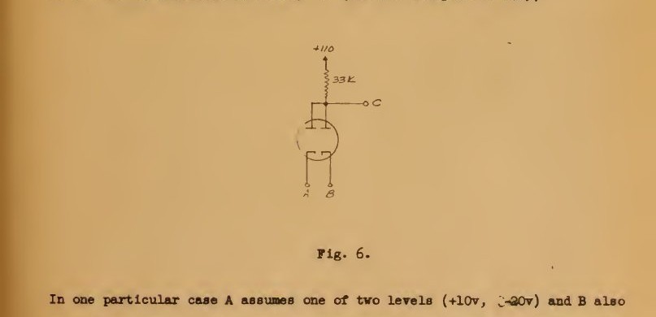
*Fig. 6 — Two-diode gate circuit*

follower, and the cathode will follow the highest grid. Thus the cathode
voltage will assume the lower level if and only if both grid voltages assume
their lower levels.

Another gate circuit which will be found in the computer makes use
of two diodes connected as in Fig. 6. (see for example DWG 1325).

In one particular case A assumes one of two levels (+10v, -20v) and B also
one of two levels (+10v, -10v). The voltage at C will always be slightly
above that of the lower cathode, and hence will assume a high value (slightly
above +10v) only if both A and B simultaneously attain their higher values.

<!-- p. 58 -->

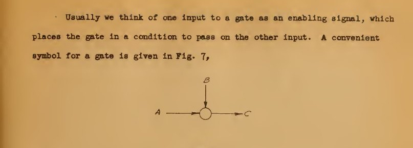
*Fig. 7 — Gate symbol*

Usually we think of one input to a gate as an enabling signal, which
places the gate in a condition to pass on the other input. A convenient
symbol for a gate is given in Fig. 7,

Where A and B are the inputs and C the output; the enabling signal is B.
Sometimes it is convenient to use a solid arrowhead for a static voltage,
and reserve the open arrowhead for a voltage pulse.

Cathode followers are found in considerable numbers. These are used,
for example, to drive a number of gates of the type illustrated in Fig. 4,
and in other places where it is necessary to supply a considerable amount
of current from a low impedance source. The cathode followers are ordinar-
ily operated in that region of the characteristics, where sufficient plate
current is drawn to cause the cathode voltage to rise slightly above the
grid voltage, so that no grid current flows. For purposes of ordinary anal-
ysis, we shall commonly assume that the cathode voltage is exactly the same
as that of the grid, the cathode rise being neglected. This will ordinarily
not lead to any difficulties.

<!-- p. 59 -->
IV. THE ARITHMETIC ORGAN

THE REGISTERS

A Register is essentially merely a device which serves as the reposi-
tory of a single word of machine language. The term is usually used to
designate a storage device the contents of which are directly available
with very slight delay. Thus in a machine whose language consists of forty
bit words, a set of forty toggles forms a convenient Register. However,
mere storage of information does not suffice, as the Registers which are to
serve as the Accumulator and the AR and BR Registers of the machine must be
capable of other functions. These devices must be able to transmit and re-
ceive information, and to perform shifts (at least for certain purposes) of
the information to the left or to the right.

The transmission of information into or out of a Register consisting
of toggles is readily accomplished by the gating circuits that have already
been discussed, while the simple means by which toggles can be cleared to 1
or to 0 have also been described.

In performing the shifting operation, it is desired that the informa-
tion should never exist as merely transitory electric or magnetic fields,
but should rather at all times exist in static form. An effective method
of accomplishing this is as follows: two rows of toggles are provided -- in
the Registers of the machine the two rows (upper and lower) in Register RI
are called Rᴵ and Rᴵ, and similarly for the other two Registers -- and gates
are arranged whereby the information held in a toggle of the lower row is
transmitted to the left or right in two steps: first, up to the correspond-
ing toggle of the upper row, then second, from this toggle down to the left

<!-- p. 60 -->
or to the right. Fig. 8 shows how this is done: it represents the columns
n-1, n, and n+1 of the Register.

Two gates lead up from each toggle of the lower row to the toggle in
the corresponding position of the upper row, while from each toggle in the
upper row a gate leads down to the toggles in adjacent columns of the lower
row. The Green gate can transmit a 0, while Yellow can transmit a 1.
Hence to ensure the transmission of the number in the lower row of toggles
to the upper row, two alternative procedures are at our disposal: the top
row may first be cleared to 0 and then the Yellow gates opened, or the top
row may be first cleared to 1 and then the Green gates opened.

To shift the number now standing in the top row of toggles back down
to the lower row, in such a way that the resulting contents of the lower row
will be the number that originally resided in that row, but shifted one place
to the right or to the left, is the function of the gates Red and Black.
For the right shift, the Black gates alone are available: from the diagram,
it is clear that these can transmit only 1's, so that it is necessary first
to clear the lower row to 0's before opening the Black gates. For the left
shift, the Red gates can transmit only 0's, so it is necessary first to
clear the lower row to 1's.

It was shown in the discussion of gates, that it is quite possible
to cause a gate tube to clear the toggle from which it transmits information.
Thus the Green gates could be used to clear the toggles of the bottom row to
1's, while the Yellow gates could be used to clear these toggles to 0's.
Similarly, the Red gates could be used to clear the toggles of the upper
row to 1's, while the Black gates could be used to clear these toggles to
0's. Although this property of the gate tubes is not exploited in the

<!-- p. 61 -->

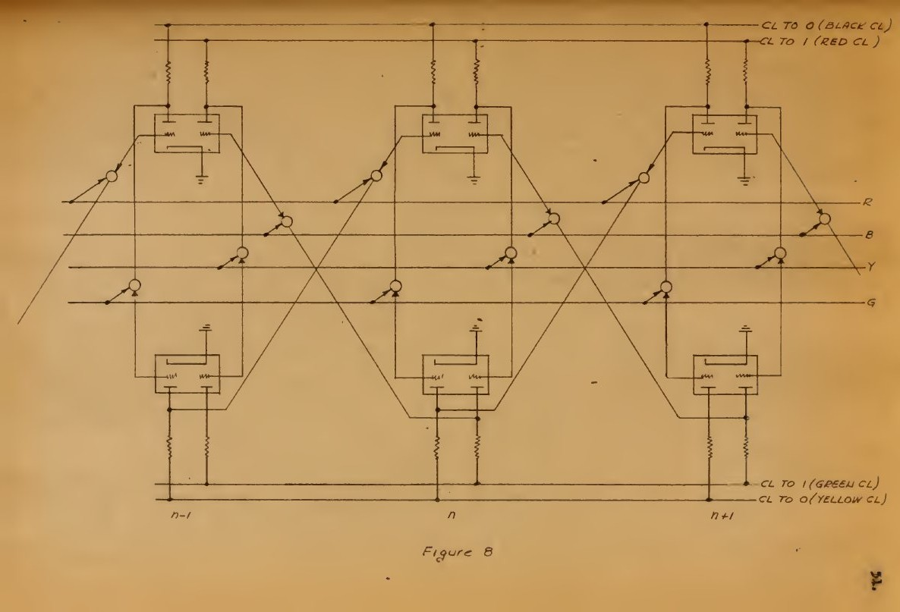
*Figure 8 — Clear-gate chassis interconnections*

*(This page is the full-page circuit diagram, Figure 8 -- see image above; the
page carries no additional body text beyond the figure and its caption.)*

<!-- p. 62 -->
present machine, it nevertheless provides a convenient manner of designating
the various clear operations. Thus a clear will be described by the color
used to designate that gate which could be used to perform the clear. The
following table shows how the color code is used to describe the various
shift and clear operations:

  Red:    Shift left, down zero.       Clear top to one.
  Green:  Shift up zero.               Clear bottom to one.
  Yellow: Shift up one.                Clear bottom to zero.
  Black:  Shift right, down one.       Clear top to zero.

In this terminology, the process of shifting right one place consists of
the following operations: Black clear, Yellow gate, Yellow clear, Black
gate. The left shift is described by: Black clear, Yellow gate, Green
clear, Red gate. In each case, of course, there is an alternative process
available which makes use of the Green shift up.

The structure of a forty stage Shifting Register follows directly
from the diagram of the three stages which has been discussed. The actual
Shifting Registers in the machine all differ in certain details from the
one described, which may be thought of as an archetype. It is clear that
means must be provided by which information can be inserted in or extracted
from the Registers. This is done by changing certain of the connections to
the gates. Registers RI and RII remain Shifting Registers with these special
connections. RIII, on the other hand, should not be thought of as a Shifting
Register at all. The two rows of toggles in RIII actually form two independ-
ent Registers, which form part of the means of communication between the

<!-- p. 63 -->

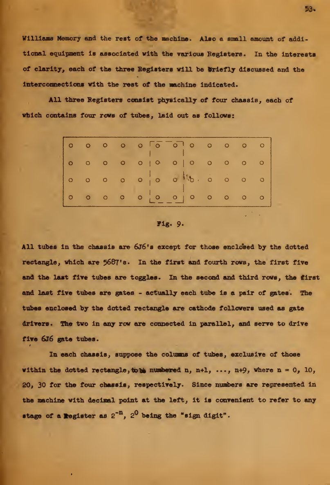
*Fig. 9 — Register chassis tube layout*

Williams Memory and the rest of the machine. Also a small amount of addi-
tional equipment is associated with the various Registers. In the interests
of clarity, each of the three Registers will be briefly discussed and the
interconnections with the rest of the machine indicated.

All three Registers consist physically of four chassis, each of
which contains four rows of tubes, laid out as follows:

<!-- p. 64 -->
RI and RII are identical except for certain circuits exterior to the
Register Chassis: these will be described later. A schematic is given in
DWG No. 1322. It has already been observed that RIII is not a Shifting
Register at all. It actually consists of two Registers and associated gate
tubes by means of which information can be inserted in Rᴵᴵᴵ and R³: for a
schematic, see DWG No. 1323, in which the top row of tubes shown are the
Complement Gates used to read out to the Adder, and are not actually mounted
on the Register Chassis. Despite these differences, it is convenient to use
the same nomenclature for the gate tubes of all three Registers. In all
cases, the row of tubes directly below the toggles of the upper row are alternately
from the left end of the chassis Red and Black gates, while those of the row
below are alternately Yellow and Green gates. Each gate tube, being a 6J6,
contains two gates. (Note that the two center columns in each schematic are
occupied by Gate Drivers. Note also that in each top row of toggles the con-
vention is that 0 is signified by conduction of the left section, while in
the bottom row the opposite is true.) As to the physical arrangement of the
gates, the Red gate from column n to column n-1 is in column n, while the
Black gate to column n from column n-1 is in column n-1, n signifying as before
the first column in any Register Chassis. Furthermore, the Yellow gate between
the toggles of column n-1 is physically located in column n. Thus in a com-
plete forty stage Register, it is necessary to provide a Yellow gate for the
39th column, while half of the Yellow and Red gate tubes of column 0, and
half of the Black gate tube of the 39th column are not actually used within
the 40 Register stages, and hence are free for other uses: we shall see
what advantages are taken of these circumstances when we examine the "end-
around" circuits.

<!-- p. 65 -->
Now let us examine the actual uses of the gate tubes. In RI and
RII the Red, Black, and Yellow gates are connected and used exactly as in
the archetypal Shifting Register already described. The Green gates are,
however, used to transmit information into Rᴵ and Rᴵ from other sources:
into Rᴵ from the Digit Resolver, and into Rᴵ from RIII. In RIII the case
is quite different, all gates being used for communication between the
Register toggles and other parts of the machine, according to the follow-
ing scheme:

  (a) Yellow: into Rᴵᴵᴵ from the Discriminator in the Williams
      Memory.
  (b) Green: into R³ from Rᴵᴵᴵ.
  (c) Black: into Rᴵᴵᴵ from the Discriminator in the Williams
      Memory.
  (d) Red: to Dispatch Counter and Control from R³.

We have seen how information is inserted in the Register toggles.
Outputs are taken as follows:

  (a) RI: from right-hand grids of Rᴵ toggles to Adder;
  (b) RII: from right-hand grids of Rᴵ toggles to RIII
      Green Gates;
  (c) RIII: (i) from grids of R³ toggles to Adder via the
      Complement Gates;
      (ii) from left-hand grids of R³ toggles to RII
      Green Gates;
      (iii) from RIII Red Gates to Dispatch Counter and
      Control (already noted in the preceding

<!-- p. 66 -->
paragraph).

RI has certain other circuits associated with it. One of these
is an extra column to the left of the 0-th, in which the digit held in
the 0-th can be

<!-- p. 67 -->

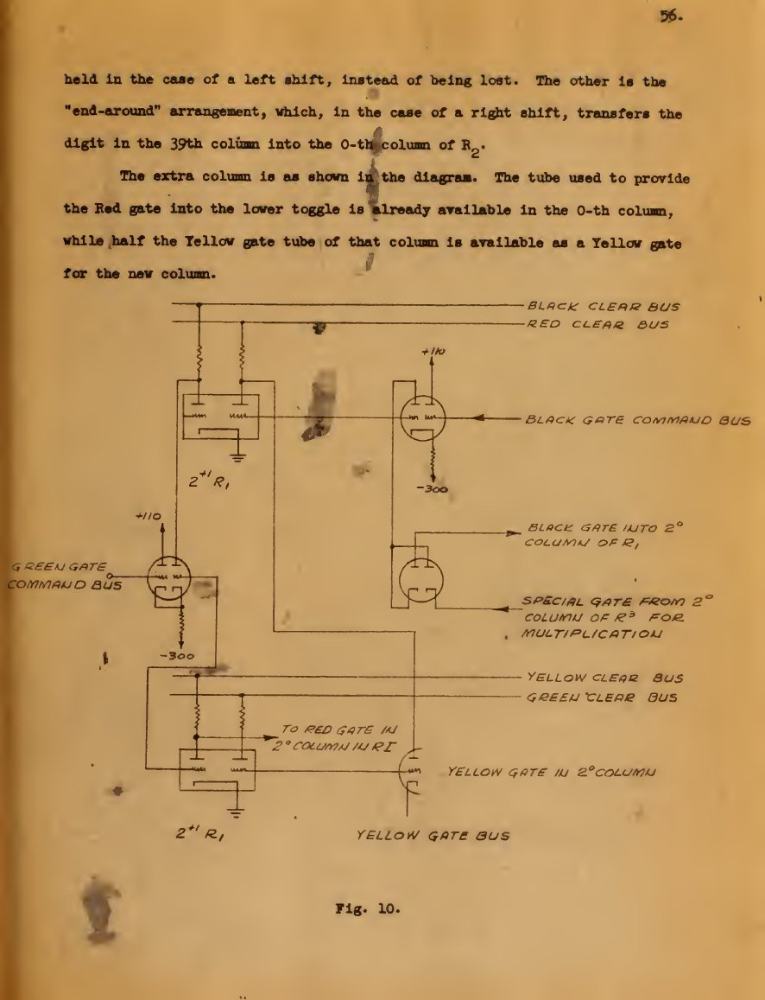
*Fig. 10 — Extra column (end-around) gating*

held in the case of a left shift, instead of being lost. The other is the
"end-around" arrangement, which, in the case of a right shift, transfers the
digit in the 39th column into the 0-th column of R₂.

The extra column is as shown in the diagram. The tube used to provide
the Red gate into the lower toggle is already available in the 0-th column,
while half the Yellow gate tube of that column is available as a Yellow gate
for the new column.

<!-- p. 68 -->

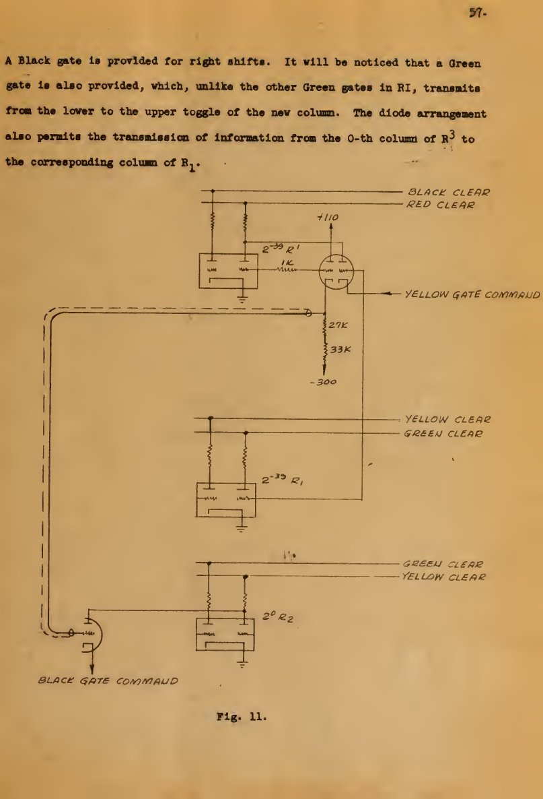
*Fig. 11 — Black/Green gate diode arrangement*

A Black gate is provided for right shifts. It will be noticed that a Green
gate is also provided, which, unlike the other Green gates in RI, transmits
from the lower to the upper toggle of the new column. The diode arrangement
also permits the transmission of information from the 0-th column of R³ to
the corresponding column of R₁.

<!-- p. 69 -->
The transmission of the overflow from the 39th column of RI to
the 0-th column of RII is simply taken care of by two additional tubes:
one of these is a 2C51 mounted just beyond the extreme right end of RI:
one section of this is used as a Yellow Gate for the 39th column of RI,
while the other is a cathode follower driven from one grid of the upper
toggle of the 39th column, and driving a wire which runs back to the ex-
treme left end of RII, as shown in Fig. 11. If right shifts are ordered
in both RI and RII, the toggle in the 0-th position in R₂ will have been
cleared to 0 before the Black Gate is opened. The opening of the Black
Gate will put into the 0-th stage of R₂ a 1 if a 1 was held in the upper
toggle of the 39th stage of RI, otherwise there will be no change. Thus
in any case the contents of 2⁻³⁹R₁ is shifted into the 0-th stage of R₂.
See Fig. 11.

The performance of the clearing operations in RI and RII is the
function of the Clear Selector and Clear Driver Chassis: for each Regis-
ter there is one Clear Selector Chassis and four Clear Driver Chassis, one
for each of the types of clear operation used.

As the term indicates the Clear Selector Chassis determines which
clear is to be performed. Fig. 12 shows half the tubes in the R₁ Clear
Selector -- those which determine whether a Yellow or a Green clear is to
be performed. This circuit consists of a 6J6 twin triode and a 6AL5 diode.
Note that the cathode of the 6J6 is either at +10v or at -10v, determined
by the Logical Control Organ of the machine, while the grids are at either
0 or -40v. Thus as long as the cathode of the 6J6 is maintained at +10v, both
sections of the tube will remain cut off, while the plate voltage will be
maintained at +150v by the 6AL5 diode shown in the drawing. This is in turn
applied to the grids of a 6J6 Clear Driver cathode follower, whose

<!-- p. 70 -->

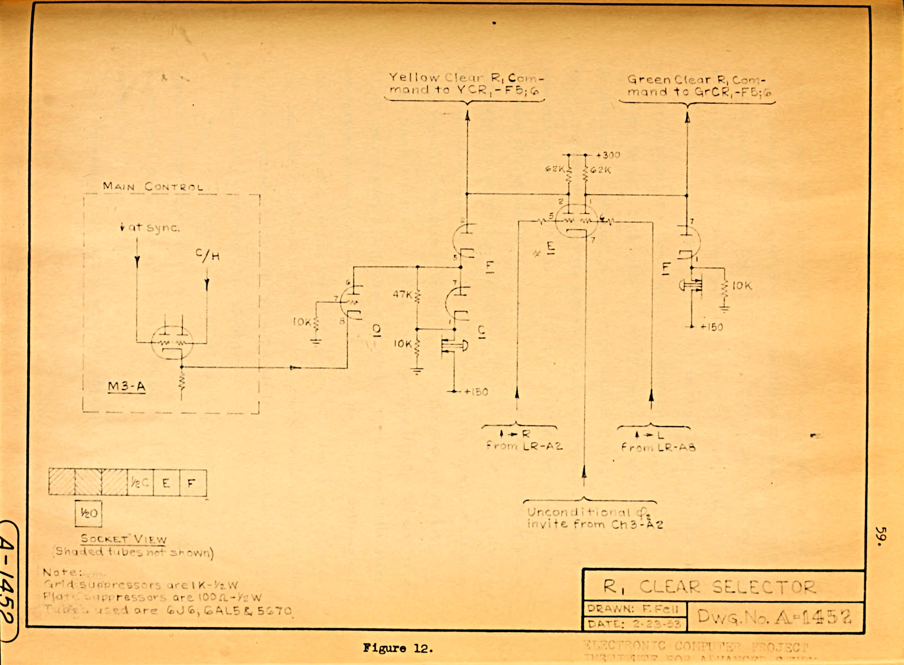
*Figure 12 — R1 Clear Selector (Dwg. A-1452)*

*(This page is the full-page circuit diagram, Figure 12 (R₁ Clear Selector,
Dwg. A-1452) -- see image above; the page carries no additional body text.)*

<!-- p. 71 -->
cathode in turn drives the grids of five 5687 tubes connected in paral-
lel. The cathodes of these tubes are connected to the clear bus, which
supplies plate voltage to the toggles of R₁. These tubes, therefore, again
merely form a cathode follower of large current handling capacity. We,
therefore, see that as long as the 6J6 in the Clear Selector remains in a
cut off condition, the clear bus will be maintained at +150v.

Now let one of the grids of the 6J6 Clear Selector rise to 0v: to
be explicit, the left-hand one, the right-hand one remaining at -40v.
Nothing happens as long as the cathode is maintained at +10v, because the
tube will remain cut off. Now let the cathode be switched to -10v. The
left-hand side of the 6J6 will conduct, and the cathode will follow the
left-hand grid to 0v, thus holding the right half in a cut off condition.
Hence the right-hand plate of the 6J6 will remain at +150v, and the Green
clear bus will be maintained at this voltage. The plate of the left half
of the tube will, however, because of the plate current flowing through the
39,000 ohm resistor, fall to about 50v, which will cause the Yellow clear
bus voltage to swing down to this value also. Reversing the voltages at
the two grids of the 6J6 in the Clear Selector will clearly cause the Yel-
low clear bus to remain at +150v, while the Green clear bus will swing down
to +50v. Another set of two 6AL5's and a 6J6 in the Clear Selector permit
the choice of Red or Black clear operations.

The voltages driving the grids of the Clear Selector are in this
example supplied from the Left-Right (LR) Chassis since the choosing of
the Yellow or Green clear determines the concomitant right or left gating
operation.

The example discussed concerned the choice of the down path (diagonal)

<!-- p. 72 -->

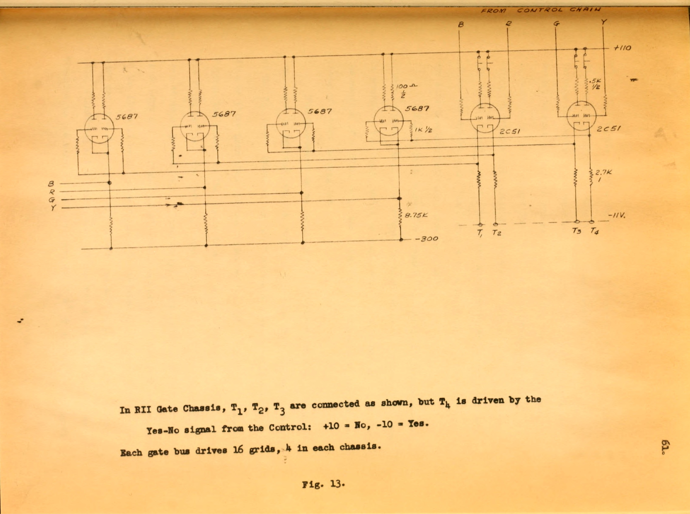
*Fig. 13 — RII Gate Chassis*

*(This page is the full-page circuit diagram, Fig. 13 -- see image above;
the page carries no additional body text beyond the figure and its caption.)*

<!-- p. 73 -->
R₁ → RIII → R₁. Such a choice is always preceded by an up transfer
(R₁ --> Rᴵ) which may be direct, i.e. Black clear-Yellow gate; or
through the Adder, i.e. Red clear-Green gate. This choice is funda-
mental to most arithmetic orders; in particular, the division scheme
is based on a trial subtraction in each step which is accepted if no
overdraft results and rejected if it does. From this order has come
the terms: Accept meaning choose the Adder path, and Reject meaning
choose the direct path. This choice is determined for all orders by
the Accept-Reject Selector, drawing O-1463.

In Figure 13 is shown the schematic of the Gate Drivers and Gate
Driver-Drivers. Each gate command is supplied by two cathode followers
in cascade: the first, which we shall call the Gate Driver-Driver, is
one section of a 2C51, while the driver itself consists of the two sec-
tions of a 5687 in parallel.

The Complement Gates permit either the number in Rᴵᴵᴵ or its one's
complement to be read into the Adder. These are shown in the top row
of DWG No. 1323. There is one 6J6 Complement Gate for each stage; every
five of these have their plates driven by two 5687's connected as shown.
Suppose the number in the toggle is a 0, the left grid being high, while
the right is low. The left and right grids of the 6J6 gate tube will be
then at about 0v and -40v, respectively. If the left grid of the 5687
is at +90v and the right one at -30v, then certainly the cathode voltage
of the 6J6 will be 0v, signifying 0 to the Adder. If these grid volt-
ages are interchanged, the 6J6 cathode voltage falls to a level of about
-40v, signifying a 1 to the Adder. Thus, this arrangement permits us to
transmit to the Adder either the contents of R³ or its one's complement.

<!-- p. 74 -->
ADDER AND THE DIGIT RESOLVER

The performance of the operation of addition is the function of
the Adder and the Digit Resolver. Two numbers to be added are presented
each as a set of forty voltages, 0v representing 0 and -40v representing
1, as inputs to the forty stages of the Adder. The Adder contains an
analogue feature, in that voltages are added, in part, by the addition
of currents in

<!-- p. 75 -->
a resistor. The output of each stage of the Adder is one of four possible
voltages, corresponding to the four possible cases, in which the result of
an addition is a 0 or a 1 with or without carry into the next column. The
Digit Resolver is designed to discriminate between these four possible out-
puts, and to give as its output one of two different voltages, which are
interpreted as 0 or a 1.

Each stage of the Adder has three inputs -- two representing digits
of the number to be added, and one the carry from the stage which adds digits
of the next lower column of the binary numbers to be added -- and two outputs,
one representing a carry to the next higher stage, the other being the one
which the Digit Resolver must interpret as the appropriate digit of the sum.

The physical layout of the Adder closely resembles that of the Regis-
ters. The Adder thus consists of four chassis, each containing ten columns
of four tubes each, one for each digit column of a forty binary digit number.
The inputs are taken from R₁ (Resident digit) and from R³ (Incident digit).
In DWG No. 1334 will be found a schematic of one of the chassis, the other
four being identical: only the first two and the last two columns of the
chassis are shown in the drawing, as the rest are merely repetitions. It
should be noticed that the left column of the extreme left chassis operates
upon the lowest order digits of the numbers to be added -- that is, upon
the digits in the column 2⁻³⁹ -- and the order increases as we go to the
right.

Consider the first two columns, which will be numbered n and n+1, in
the Adder: reference should be made to the schematic, DWG No. 1334. For
simplicity in reference, the tubes of column n will be labelled T₁,ₙ, T₂,ₙ,
T₃,ₙ, T₄,ₙ, while those of column n+1 will be T₁,ₙ₊₁, etc. The inputs are:

<!-- p. 76 -->
from R1 (Resident digit) to grids 6 of T2,n and T2,n+1; from R3 (Incident
digit) to cathodes 8 and 2 of T3,n+1; carry from column n-1 to grid 6 of
T4,n, and carry from the n-th column to grid 6 of T4,n+1. Thus tubes T1,n,
T2,n, T4,n, and the left halves of T3,n and T3,n+1 perform the addition in
the n-th column while T1,n+1, T2,n+1, T4,n+1 and the right halves of T3,n
and T3,n+1 perform that in the n+1-th column. The following names for the
tubes are descriptive of their functions: T1,n - "carry gate"; T2,n -
"resident digit gate"; T3,n - "summing resistor driver"; T3,n+1 - "incident
digit gate"; T4,n - "summing resistor driver driver".

In the interests of clarity we will consider the possible cases, and
observe the action of the circuit in each case. These cases are:

| | (1) | (2) | (3) | (4) | (5) | (6) | (7) | (8) |
|---|---|---|---|---|---|---|---|---|
| Resident digit | 0 | 0 | 0 | 0 | 1 | 1 | 1 | 1 |
| Incident digit | 0 | 0 | 1 | 1 | 0 | 0 | 1 | 1 |
| Carry from next lower stage | 0 | 1 | 0 | 1 | 0 | 1 | 0 | 1 |
| Sum | 0 | 1 | 1 | 0 | 1 | 0 | 0 | 1 |
| Carry to next stage | 0 | 0 | 0 | 1 | 0 | 1 | 1 | 1 |

First consider case (1). Here the Incident and Resident digits (i.e.,
inputs to cathode 8 of T3,n+1 and to grid 6 of T2,n) are both 0v, and we can
consider the carry digit connection as cut -- it will appear as we go on that
this is correct, as no current flows through this wire except when there is a
carry from the preceding column. Under these conditions the cathode of the
Summing Resistor Driver Driver is slightly above +211v. Hence the cathode
of the left half of the Summing Resistor Driver is slightly higher than this,

<!-- p. 77 -->
so that the voltage at the grid of the Summing Resistor Driver, which is
directly connected to this cathode is 215v. Furthermore, the left half of
the Resident digit gate will be in a conducting state, so that by cathode fol-
lower action the cathode will be nominally at the grid potential, or 0v, and
the right half will, therefore, be cut off, since its grid is maintained at
-9v. The left half of the Incident digit gate will also be cut off, since
its grid is at -9v and its cathode at 0v. Thus no current will be drawn
through the Summing Resistor (connected between the Summing Point and the cath-
ode of the Summing Resistor Driver) by either of these gate tubes. The cath-
ode of the carry gate will follow the more positive grid and, therefore, rise
to 215v, so that the left half of this tube will be in a conducting state and
the right half cut off. Hence the voltage at point S will be +215v, as no cur-
rent flows through the Summing Resistor, and no current flows through the carry
connection to the next stage, showing the correctness of our original assumption.

In cases (3) and (5), we still consider the carry into the n-th stage
as disconnected. In case (2) the Incident digit input drops to -40v, which
permits conduction by the Incident digit gate; the cathode of this tube will,
of course, only drop to slightly above -9v. Thus the plate current drawn
will be very nearly 165/32 ma = 5.15 ma, which flowing through the Summing
Resistor will cause a drop in voltage across this resistor of very slightly
more than 54 volts. As the right half of the Resident digit gate is cut off,
the output voltage to the Digit Resolver is +161v. In case (4), the Incident
digit gate is cut off, but the right half of the Resident digit gate is now
conducting; again the plate current of 165/32 ma causes a drop of 54 volts in
the Summing Resistor, so that the output voltage is again +161v. In both
cases (2) and (4) we see that the left grid (6) of the carry gate tube (T₁,ₙ)

<!-- p. 78 -->
being at +157v, the cathode of this tube will be slightly more positive, and
the right half will remain cut off. Thus we have shown that the condition of
"no carry" implies that no current will flow through the "carry" connection
to the next stage, which is the assumption that has been used all along in
the analysis.

It has now been shown that if the Incident or Resident digit is a 1,
the circuit will cause the corresponding gate to draw 5.15 ma through the
Summing Resistor. Hence in case (7) a total of 10.3 ma will flow through
this resistor, and the output voltage to the Digit Resolver will drop to
+107v. Thus grid 6 of the carry gate will drop below grid 5, which means
that the right half section of this tube will now conduct, the cathode will
rise to slightly more than +136v, the left section will be cut off and the
right section will draw very nearly 436/90 = 4.85 ma. This state, which
indicates a carry into the next stage, causes the grid of T₄,ₙ₊₁ to drop to
approximately +124v.

Now consider case (2). Here grid 6 of the Summing Resistor Driver
Driver (T₄,ₙ) is held at +124v; the diode-connected right half has its plate
maintained at +161v; hence this section will conduct, and the cathode volt-
age will rise to slightly below +161v. This will, therefore, fix the volt-
age of the cathode of the Summing Resistor Driver. (At slightly below this
level; there is, however, a slight rise in voltage from grid to cathode of
the Summing Resistor Driver, so that the voltage at this point turns out to
be very close to +161v.) Since no current is drawn through the Summing Resis-
tor, the Summing Point voltage (Vₛ) is +161v. This is also sufficient to
raise the cathode of the carry gate to +161v, and to keep the right half of
this tube in a non-conducting state.

<!-- p. 79 -->
The remaining cases can now be discussed. In cases (4) and (6) the
action of the carry from the preceding stage is to lower the cathode voltage
of the Summing Resistor Driver to +161v, while the effect of the Incident or
Resident one, as the case may be, is to cause a voltage drop of 54 volts
across the Summing Resistor. Thus the output Vs = 161 - 54 = 107v. Hence
the right half of the carry gate will conduct, and so a carry will be in-
dicated to the next stage.

Only case (8) now remains. Here the Summing Resistor Driver cathode
voltage is +161v because of the carry from the preceding stage, while the
current drawn by the Incident and Resident gates through the Summing Resis-
tor causes a drop of 108 volts across the Summing Resistor, so that
Vs = 161 - 108 = 53v.

To sum up, there are four possible results to the addition in the
n-th column: the table gives these, and the corresponding Vs.

| Sum | Carry | Vs | Vs (average measured values) |
|---|---|---|---|
| 0 | 0 | 215 volts | 215.3 volts |
| 1 | 0 | 161 volts | 161.0 volts |
| 0 | 1 | 108 volts | 108.4 volts |
| 1 | 1 | 53 volts | 55.9 volts |

It is now necessary to provide a means by which these output voltages
are interpreted; the result of this interpretation must be that Vs = 215 or
108v ultimately set a toggle in the 0 position, while Vs = 161 or 53v set it
in the 1 position. We need not worry about carries, as we have seen that
these are all automatically taken care of in the Adder. The task of interpre-
tation is assigned to the Digit Resolver, which will now be described.

<!-- p. 80 -->
Physically the Digit Resolver consists of four chassis similar to
those used in the Adder and located directly above them. Each column of
tubes in the Digit Resolver is assigned to interpret the output of one col-
umn of tubes in the Adder. Thus the columns of tubes in the Digit Resolver
are independent of each other, accepting a single input (Vₛ) from the Adder,
and giving a single output to Rᴵ. A schematic of a single column of tubes
in the Digit Resolver is shown in DWG No. C-3-1107. For convenience these
will be labelled T₁, ..., T₄ in order from the top downward.

We shall consider in order the four possible cases. First let Vₛ =
+215v, which being applied to grid 5 of T₃ causes the cathode to rise
slightly higher, thus cutting off the right section of T₃ and the left sec-
tion of T₄. Furthermore, the cathode of T₁ is raised above +215v, cutting
off the right section of that tube. Now consider T₂. If the plate and
grid of the left section were disconnected, grid 3 would assume a potential
of approximately +163v. Actually, of course, grid current flows, so that
the grid is only slightly positive with respect to the cathode. Plate cur-
rent amounts to about 4 ma which is more than sufficient to hold grid 7
below cut off. Thus the output voltage is determined by the voltage divider
consisting of the 43.16K, 128.7K, and 188.1K resistors to be +32v.

In the second case, Vₛ = +161v. This is still sufficient to hold the
right section of T₃ in a non-conducting state, but not enough to do the
same for the left section of T₄, which accordingly conducts, while the right
section is cut off. Again the voltage of grid 6 of T₁ (+161v) is more
than enough to assure that the right section is cut off. As the left sec-
tion of T₄ draws approximately 488/139 ≈ 3.5 ma, the voltage of grid 3 of
T₂ falls to about +86v, and the left section of the tube is, therefore, cut

<!-- p. 81 -->
off. The voltage of grid 7 of T₂ would now become +116v but for the flow of
grid current, which holds it down to but little above +82v (the voltage of
cathode 8), and the output voltage falls to about -58v.

In the third case, Vₛ = +108v. Again the left sections of T₃ and T₄
conduct, while the right sections are cut off. Hence as in the second case
the grid voltage of the left section of T₂ is well below cut off. However,
the voltage of grid 6 of T₁ is now but slightly above +108v, while that of
grid 5 is +136v: the cathode follows the more positive grid, the left sec-
tion is cut off, and the right section draws a plate current of very nearly
4 ma. As in the first case, this holds the voltage of grid 7 of T₂ safely
below cut off, and again the output voltage is approximately +32v.

Finally, in the fourth case Vₛ = +56v (to use the average measured
value). Hence in T₃ the right section conducts, while the left section is
cut off. The right section of T₄ and the left section of T₁ are cut off,
while the other sections conduct, and consequently, as in the third case,
both sections of T₂ are cut off. Now, however, the plate current drawn by
the right section of T₂ through the 43.16K resistor causes the output volt-
age to fall to about -48v.

To sum up, the Digit Resolver output is +32v in both cases where the
sum digit is 0, while it is far negative in both cases where the sum digit is
1. These voltages are actually considerably larger than needed to operate
the RI Green gates. Hence a diode "bumper" is provided at the output of each
stage: the circuit is shown in DWG No. 1288. In stages 2⁰ to 2⁻³⁵, the diode
cathodes are returned to ground, while in the remaining stages they are re-
turned to ground except during the read-in of information from the Input.
Thus during ordinary operation, the Digit Resolver output never swings above
0v, while the negative excursion is not limited.

<!-- p. 82 -->

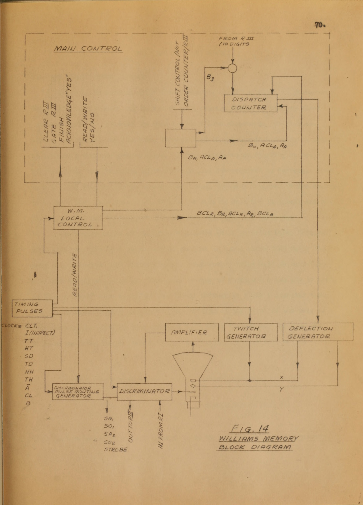
*Fig. 14 — Williams Memory Block Diagram*

*(This page is the full-page block diagram, Fig. 14 — Williams Memory Block
Diagram — see image above; the page carries no additional body text.)*

<!-- p. 83 -->

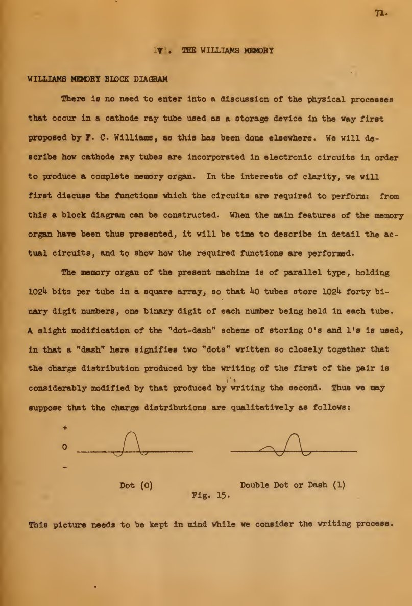
*Fig. 15 — Dot / Double-dot (dash) charge distributions*

V. THE WILLIAMS MEMORY

WILLIAMS MEMORY BLOCK DIAGRAM

There is no need to enter into a discussion of the physical processes
that occur in a cathode ray tube used as a storage device in the way first
proposed by F. C. Williams, as this has been done elsewhere. We will de-
scribe how cathode ray tubes are incorporated in electronic circuits in order
to produce a complete memory organ. In the interests of clarity, we will
first discuss the functions which the circuits are required to perform: from
this a block diagram can be constructed. When the main features of the memory
organ have been thus presented, it will be time to describe in detail the ac-
tual circuits, and to show how the required functions are performed.

The memory organ of the present machine is of parallel type, holding
1024 bits per tube in a square array, so that 40 tubes store 1024 forty bi-
nary digit numbers, one binary digit of each number being held in each tube.
A slight modification of the "dot-dash" scheme of storing 0's and 1's is used,
in that a "dash" here signifies two "dots" written so closely together that
the charge distribution produced by the writing of the first of the pair is
considerably modified by that produced by writing the second. Thus we may
suppose that the charge distributions are qualitatively as follows:

This picture needs to be kept in mind while we consider the writing process.

<!-- p. 84 -->
To write a dot, we must first generate the deflection voltages which guaran-
tee that the beam will be directed to the desired location and then turn on
the electron beam for a short time. In writing a dash, we must do more:
first a dot must be written, then, after the electron beam has been turned
off, the beam position must be moved slightly to one side ("twitched"), then
the electron beam must be turned on again for a short time. Thus we have
for each memory location two positions: one for the first peak of charge, a
second for the second peak of charge; these will be referred to for conveni-
ence as the A and B positions.

In either writing new information or in regenerating what already ex-
ists, it is clear that logically we need be able to make only a choice
between the two states of charge that are used to represent 1's and 0's, and
hence between two routines for turning on the electron beam. However, the
physical processes of writing a dash where a dot exists, or a dot where a
dash exists, are certainly somewhat different from those of merely "re-
storing" a dot or a dash. Consider the writing of a dot on a dot: we merely
have to build up the charge in the A position to its equilibrium position.
On the other hand, if a dash already exists and we wish to write a dot over
it, it is clearly desirable to leave the beam on in the A position for a
longer time, so that more secondary electrons will be permitted to return
to the screen to nullify the concentration of positive charge in the B posi-
tion.

If a dash is to be written where a dash already exists, it is clearly
sufficient to turn on the beam in the A position only very briefly, while in
the B position it must stay on long enough to bring the charge up to the
equilibrium value. On the other hand, in writing a dash over a dot, it is

<!-- p. 85 -->

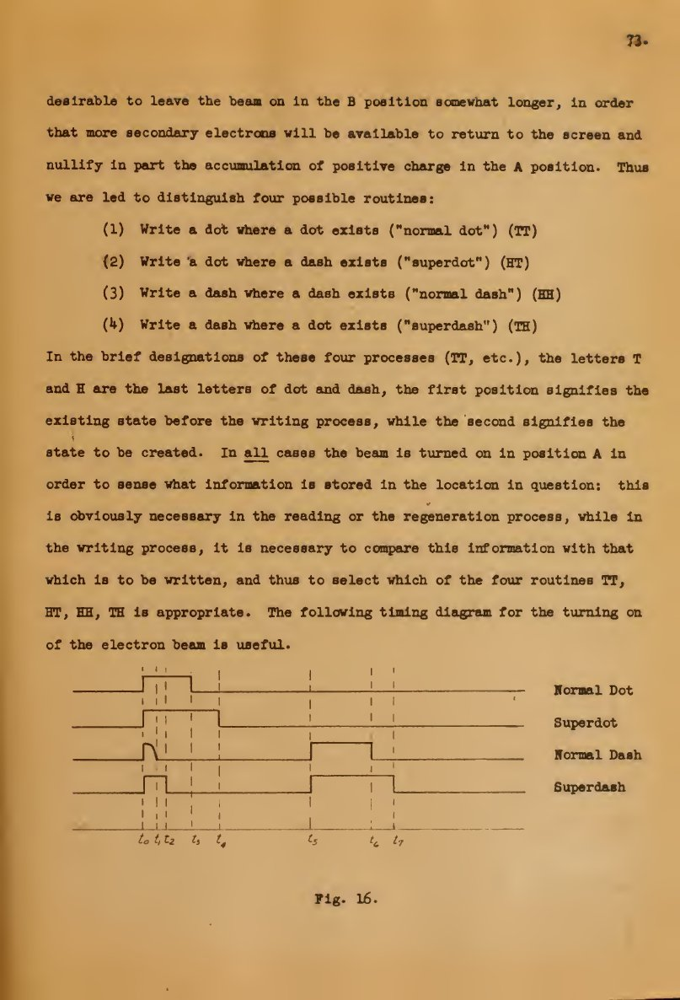
*Fig. 16 — Beam turn-on timing for the four write/read routines*

desirable to leave the beam on in the B position somewhat longer, in order
that more secondary electrons will be available to return to the screen and
nullify in part the accumulation of positive charge in the A position. Thus
we are led to distinguish four possible routines:

(1) Write a dot where a dot exists ("normal dot") (TT)
(2) Write a dot where a dash exists ("superdot") (HT)
(3) Write a dash where a dash exists ("normal dash") (HH)
(4) Write a dash where a dot exists ("superdash") (TH)

In the brief designations of these four processes (TT, etc.), the letters T
and H are the last letters of dot and dash, the first position signifies the
existing state before the writing process, while the second signifies the
state to be created. In all cases the beam is turned on in position A in
order to sense what information is stored in the location in question: this
is obviously necessary in the reading or the regeneration process, while in
the writing process, it is necessary to compare this information with that
which is to be written, and thus to select which of the four routines TT,
HT, HH, TH is appropriate. The following timing diagram for the turning on
of the electron beam is useful.

<!-- p. 86 -->
In all cases the electron beam is turned on at t₀, while between t₄ and t₅,
a period during which in all cases the beam is turned off, the "twitch" takes
place; thus in t₀t₄ the beam is directed toward the A position, while in the
t₅t₇ it is in the B position. We note that in the Normal Dash routine the
beam is on in the A position for a shorter time than it is in the Superdash
routine: here an automatic turn-off of the beam occurs, which will be ex-
plained when we describe the operation of the Discriminator circuitry.

We have seen what beam-turn-on routines are needed for performing
the read-regenerate and the write functions. To carry out these routines,
properly timed sequences of pulses are needed in each case. Hence it is nec-
essary to provide not only these pulses, but also means of selecting the
required sequence, means of "reading" what is stored in any given memory loca-
tion, and means of deflecting the cathode ray tube beam to the desired memory
location. Furthermore, since the contents of the memory must be periodically
regenerated, it is clear that a fundamental repetition rate must be provided.

In the following discussion we shall illustrate, with reference to
the block diagram, how the functions outlined above are accomplished. It is
simplest to start with the cathode ray tube-amplifier-discriminator loop.
It should be noted that each of the forty CRT's in the memory organ has its
own output Amplifier and Discriminator; all the equipment represented by
other blocks in the diagram is common to the forty CRT's. At the beginning
of each read-regenerate or write cycle the Discriminator turns on the electron
beam in the CRT by raising the potential of the control grid. The Amplifier
merely raises the CRT output signal to the required level, which calls for a
gain of about 2 x 10⁴, its output being used to set to 0 or 1 a toggle in the
Discriminator, which has previously been cleared to 0. The Discriminator inputs

<!-- p. 87 -->
are, in addition to that from the Amplifier: (1) pulses to clear the toggle
and initiate the beam turn on routine -- these are the same no matter what
routine is performed; (2) four pulse trains SO₁, SA₁, SO₂, SA₂ which differ
according as reading, regenerating, or writing is required; (3) the digit to
be written from R₁, this being via a gate which is enabled only when writing
is called for. In addition to the beam-turn-on output, there is one from the
Discriminator toggle to RIII, which is via a gate enabled only when reading
is required.

A block labelled "Timing Pulses" appears in the diagram. Physically
this contains a "Memory Clock" which provides the basic repetition rate, and
"Pulsers" which generate pulses beginning at various times in the cycle:
these pulses are of different lengths as required, and each is immediately
followed by a standard "termination" pulse. These are: Inspect, TT, HT,
Twitch Delay (TD), HH, TH, and three others; A, CL, and B, which are needed
to step the Dispatch Counter in the Main Control. Termination pulses are
designated by a small "t" subscript: as SDₜ, etc. The time sequence is il-
lustrated in Fig. 17, where the "termination" pulses are omitted. The clock
pulse is also used to clear the Discriminator toggle to 0, and so is usually
designated by the abbreviation "Cl T₁".

It has been remarked that it is necessary to provide the Discriminator
with four trains of pulses, SO₁, SA₁, SO₂, SA₂ to enable it to carry out the
read-regenerate-process, and a different set of four trains to carry out the
write process. These trains are formed from the timing pulses just discussed
in the block labelled "Discriminator Pulse Routine Generator"; it will be
noticed that there is an input to this block labelled "Read/Write": this
signal determines which set of pulse trains SO₁, ..., SA₂ will be transmitted

<!-- p. 88 -->

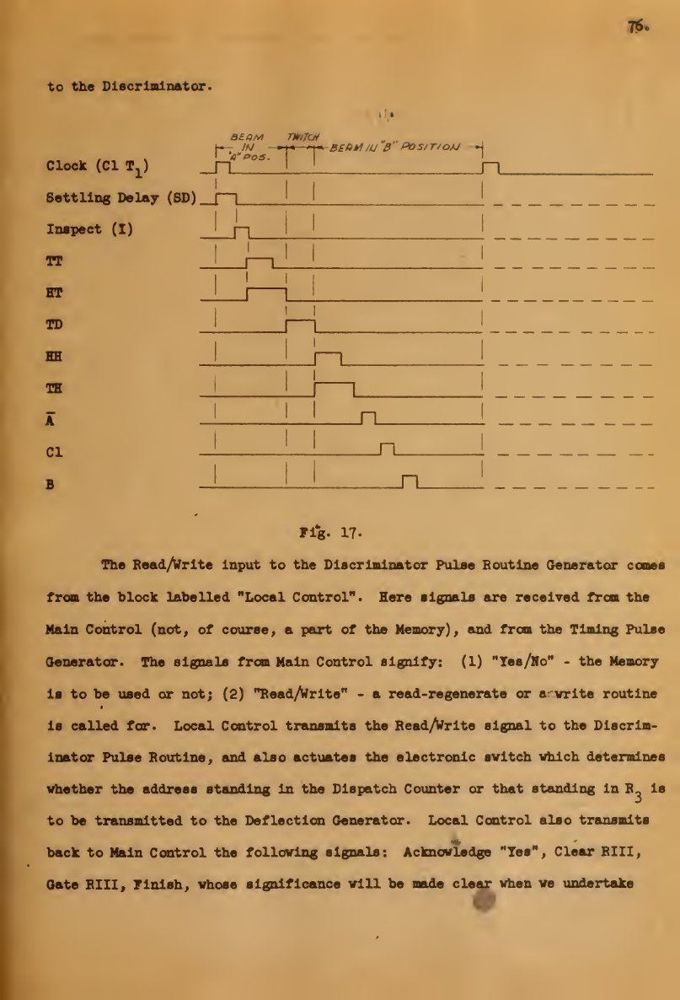
*Fig. 17 — Discriminator Pulse Routine Generator timing*

to the Discriminator.

The Read/Write input to the Discriminator Pulse Routine Generator comes
from the block labelled "Local Control". Here signals are received from the
Main Control (not, of course, a part of the Memory), and from the Timing Pulse
Generator. The signals from Main Control signify: (1) "Yes/No" - the Memory
is to be used or not; (2) "Read/Write" - a read-regenerate or a write routine
is called for. Local Control transmits the Read/Write signal to the Discrim-
inator Pulse Routine, and also actuates the electronic switch which determines
whether the address standing in the Dispatch Counter or that standing in R₃ is
to be transmitted to the Deflection Generator. Local Control also transmits
back to Main Control the following signals: Acknowledge "Yes", Clear RIII,
Gate RIII, Finish, whose significance will be made clear when we undertake

<!-- p. 89 -->
the detailed description of the Local Control.

Finally, the Deflection Generator merely receives as inputs the co-
ordinates of the Memory location to which the CRT electron beam is to be
directed and generates the appropriate deflection potentials. The "twitch"
generator's function is obvious: it is actually part of the Deflection
Generator, but its action is initiated by the HT (superdot) termination
pulse.

MEMORY CLOCK

The necessity of periodically regenerating the information stored in
the Williams Memory makes it necessary to provide a timing device. In the
present machine, this is called the "Memory Clock".

As there is nothing in the operation of the Memory that requires the
maintenance of a very precise repetition rate, and as it is desired to per-
mit the rate to be varied over a rather wide range (from 4kc to 143kc in the
present model), for convenience in testing it is entirely feasible to use a
multivibrator as the fundamental rate-determining circuit. The output of
the multivibrator is used merely to ring a parallel LC circuit, the natural
period of which determines the pulse duration.

The Memory Clock schematic is given in DWG No. 1217. The multivi-
brator appears at the left of the drawing, (tube D (a 6J6) and its associated
components). The diode C is added to sharpen the plate voltage recovery.
The plate voltage of the conducting half of the 6J6 falls to about 30v; when
this section of the tube is cut off, its plate voltage begins to rise expo-
nentially toward 300v; and hence is rising quite steeply when it reaches 150v,
where it is stopped by the diode. Hence, the multivibrator output resembles
waveform I in Fig. 18. The fall in plate voltage is quite abrupt; this sharp

<!-- p. 90 -->

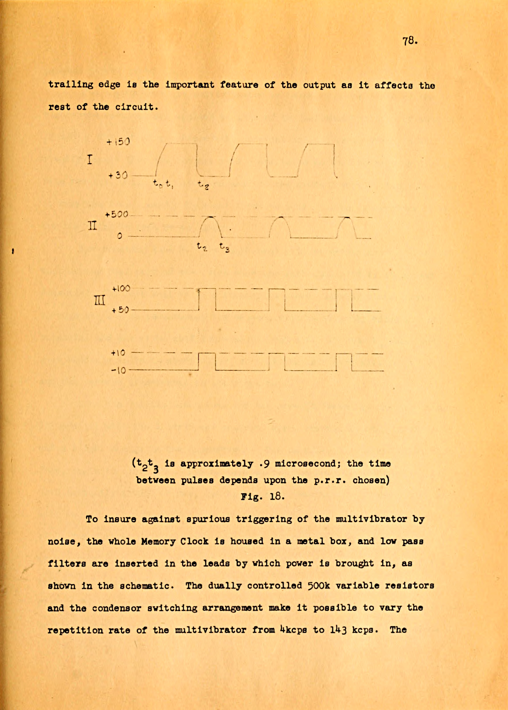
*Fig. 18 — Memory Clock waveforms*

*(This page is the full-page waveform diagram, Fig. 18 — Memory Clock
waveforms — see image above; the page carries no additional body text.)*

<!-- p. 91 -->
present p.r.r. is 40 kc.

The output from the multivibrator is taken from the plate of the
right-hand section, and applied to grid of the left-hand section of tube D
(a 6J6). The coupling network time constant is .001 sec., which is suffi-
ciently larger than the longest period available so that no serious distor-
tion results, while the left-hand half of the diode C merely clamps the top
of waveform I to ground. Thus the input to tube D is again waveform I, but
now the swing is from 0v to -120v.

Now consider tube D. Its right-hand grid is maintained at -10v, so
that during that part of the cycle when the left-hand grid is at ground
potential, the left half is in a conducting state, drawing plate current
through the 2.4 mh inductance; the cathode will be slightly above ground
potential and the right half consequently cut off. At time t₂, the left
grid suddenly falls to about -120v, so that the left half will be cut off,
and the current transferred to the right half.

Thus the initial conditions for the circuit formed by the inductance
in parallel with its distributed capacity are: current flowing in the coil,
and a slight charge in the capacitance. The parallel LC circuit will, there-
fore, begin to oscillate. The voltage across the coil will start at close
to 0 (actually a volt or two, due to the non-0 resistance of the coil), and
will so swing that the voltage of the end of the coil not attached to the
+100v bus will go positive with respect to +100v; this excursion of amplitude
approximately 50 volts, will, of course, be sinusoidal, at the natural fre-
quency of the LC circuit (which is very close to .5 mcps). When, however, the
first half period has ended, and the end of the coil not attached to the bus
begins to swing negative with respect to the bus, the right half of diode C

<!-- p. 92 -->
will begin to conduct: this, together with the 4.7k resistor critically damps
the LC circuit, so that at each fall of voltage at the right-hand plate of the
multivibrator, a single positive half sine wave is transmitted to the grids
of tube F. The d.c. level from which this swing starts is clamped to 0v by
the left section of diode E. The signal applied to the grids of tube F is,
therefore, as shown in waveform II. The interval t₂t₃ is very nearly one
microsecond, and this is clearly independent of the repetition rate of the
multivibrator.

Tubes F and G are both 6J6's each being so connected that it acts as
a single tube. The grids of G are maintained at +10v, so that, as long as the
grids of F are held at ground potential, the cathodes of both tubes, which
are connected together, are held at slightly above +10v, with the consequence
that F is cut off. Now in the interval t₂t₃, during which the grids of F are
driven to approximately +50v, tube F is caused to conduct so that its cathode
follows the grid so high that G is in turn cut off: this causes the plate
voltage of G to rise sharply from about 50v to 100v; of course, it will fall
sharply by a like amount when current switches from G back to F again shortly
before t₃. Thus the plate voltage of tube G is as shown in waveform III.

We now have to consider only the output cathode follower, tube H. With
the left-hand grid held at -10v, and the right at -25v, a condition which per-
sists except in the intervals t₂t₃, the left half will conduct, the right half
will remain cut off, and the cathode potential will remain at very little
above -10v -- which is the output voltage from the Memory Clock in these in-
tervals. When now in intervals t₂t₃ a 50v pulse is emitted by tube G, the
voltage of the right-hand grid of G will rise to +10v, where it will be caught
by the right half of diode E; consequently, the cathode of H will rise to

<!-- p. 93 -->
very slightly above +10v during time intervals t₂t₃, which gives us the out-
put waveform IV.

WILLIAMS TUBE PULSERS

The operation of the Williams Memory requires the availability of a
number of pulses occurring at definite times in the cycle of the Memory
Clock (see Fig. 17). The circuits used to provide these are called "Pulsers".
They are all designed to accept as inputs pulses of essentially rectangular
shape, rising from -10 to +10v, and of duration .5 µs or greater. The
pulser output consists of two pulses. The first is one whose length may be
varied; the leading edge of this pulse occurs at the same time as that of
the input pulse. The second is in all cases of fixed duration -- approxi-
mately .5 µs -- with its leading edge synchronized with the trailing edge of
the first pulse. The second pulse output is of about half the duration and
of the same amplitude as that of the Memory Clock, and can be (and is) used
as an input trigger to other pulsers. Both time durations are established
as one half the period of a parallel LC circuit. In the case of the first
pulse, variation of the values of inductance and capacitance permit vari-
ation of pulse duration over a fairly wide range. A table is given in
DWG No. 1216 which shows the ranges of pulse duration available in the
pulsers of the present machine.

Let us now consider the operation of the circuit (see DWG No. 1216).
Between pulses the right-hand grid of tube A is held at -20v and the left-
hand grid at -10v. Under these circumstances, the cathode of A is slightly
above -10v, the right half of A is cut off, and in tube B, the left- and
right-hand grids of which are at -10v and ground, respectively, only the
right half is in a conducting state, plate current of approximately 4.2 ma

<!-- p. 94 -->
being drawn through the 1 mh inductance. We assume that no transient oscil-
lation is present in either LC circuit: the fact that each LC circuit has
connected across it a diode (consisting of the cathode and one grid of tube C)
and resistance chosen at the critical damping value of the circuit assures us
that no transient will persist essentially beyond one period. Thus both
plates of B are very nearly at +150v (the left grid will be at this voltage,
while the right one will be very slightly below because of the non-0 resist-
ance of the 1 mh inductance). Thus the cathode and both grids of tube C are
at +150v, so that both sections are in a conducting state; the plate poten-
tials turn out to be about +225v. Clearly diodes D and E are now conducting,
while only the right half of tube F is conducting, the cathode, therefore,
being slightly above -10v.

With the arrival of the input pulse at the left grid of tube A, the
cathode will follow the grid to slightly above this voltage: we note that
this is also automatically the leading edge of the "Pulse Out", which is,
therefore, not delayed with respect to the input pulse.

The left-hand grid of tube B is now driven to slightly above +10v, and
the cathode follows it, thus cutting off the right-hand section. This abrupt
switch, of course, sets up transient oscillations in the parallel LC circuits
in the plate leads of tube B. The right-hand plate swings positive with re-
spect to +150v. Thus the left-hand grid of tube C becomes positive with
respect to the cathode; and grid current flows through the 2.2K resistor in
series with the grid: the value of this resistor is chosen so as to assure
that the parallel RLC circuit consisting of the inductance and capacitance,
the grid-to-cathode resistance of the left section of C, and the 2.2K resistor
is critically damped. Of course, the plate current of the left section of C

<!-- p. 95 -->
is increased somewhat and the plate voltage decreased; this change is trans-
mitted to the left grid of tube F, which has already been shown to be below
cut-off. Hence this transient has no effect on the output of the Pulser. On
the other hand, the transient set up in the plate circuit of the left section
of B is such that the plate swings negative with respect to +150v: the exact
amount of this swing, of course, depends on the square root of L/C; for all
the values used it is never less than about 28v. The right section of C cuts
off when the grid is about six volts below the cathode, a level which is
reached in at the most 7% of the half period of the LC circuit. The plate
voltage is not, however, permitted to rise all the way to +300v; it is
"caught" at +260v by the left section of diode D, a level which will obvi-
ously be reached considerably before the grid voltage reaches cut-off, so
that the rise from +225 to +260v is accomplished in a little over 3% of the
half-period of the LC circuit: at the end of the half-period, of course, a
fall of like amount takes place. Thus a pulse of about 35v amplitude is
created at the right-hand plate of C. The right-hand plate of the 30 µµf
condenser is maintained at -20v before the pulse begins, so that since the
cathode of diode E is held at +10v, at this point a pulse rising from -20
to +10v appears: these levels are accurately defined, and it is apparent
that the exact magnitude of the pulse at the right plate of C is unimportant
provided it exceeds 30v. A similar remark applies to the magnitude of the
negative swing of the right grid of C: it needs only to be sufficient to
raise the plate voltage to +260v in a time short compared to the half-
period of the LC circuit. The pulse produced is applied to the right-hand
grid of tube A, which rises to +10v. Thus though the input pulse to the left
grid of A shortly drops from +10 to -10v, the cathode is held at slightly

<!-- p. 96 -->
above +10v for a time determined by the half period of the LC circuit.

At the end of the negative swing of the right-hand grid of C, the
voltage of the right-hand grid of A falls again to -20v; the cathode, how-
ever, is "caught" at -10: this fall marks the end of the "Pulse Out."
This fall also causes a switch in current in tube B: the right-hand half
once more is caused to conduct, and the left is cut off. We must once
more examine the behavior of the LC circuits in the plate leads.

It is now time for the second half cycle of the oscillation of the
circuit in the left plate lead. However, when the lower end of this starts
to go positive with respect to the upper end, the right section of C begins
to draw plate current, and its grid to cathode resistance, in addition to
the 2.7K resistor, critically damps the oscillation. The drop of the plate
voltage of this section below +225v drives the right-hand grid of A below
-20v, but this clearly has no effect upon the cathode voltage of A, and
hence the "Pulse Out" voltage, which remains at slightly above -10v.

However, the 1 mh inductance -- 20 µµf condenser combination now pro-
duces a transient: the end connected to the right-hand plate of B swings
negative with respect to +150v through a half period of a sine wave of
about 28v amplitude. This drives the left half of C below cut-off; the
plate voltage begins to rise toward +300v, but is caught at +260v by the
left section of diode D, and we get a pulse of approximately 35v amplitude
lasting for nearly .5 µs at this point. Note that in determining the period
of oscillation it is necessary to take into account, in addition to the 20 µµf
condenser, any distributed capacity that is present -- this is of sufficient
magnitude to make the resonant frequency close to 1 mcps. Diode E limits the
rise of grid voltage of the left section of F, so that this point rises from

<!-- p. 97 -->
-20v to +10v during the pulse, and hence the cathode rises from slightly
above -10v to slightly above +10v for very nearly .5 µs. This is the
"Pulse End" pulse: as we said before, its leading edge is determined by the
termination of the Pulse Out pulse. As the 1 mc oscillation attempts to
enter its second half cycle, the left half of C draws grid current, and
critical damping again ensues. Thus the circuit is returned to its quies-
cent state, awaiting the arrival of the next input pulse.

There are ten pulsers of the kind just described. One of these, the
"Settling Delay" pulser, is triggered by the Clock pulses; its pulse output
is not used, but its termination pulse triggers the Inspect, TT and HT
pulses. The termination of the HT pulser triggers the TD pulser, and its
termination pulse triggers both the TH and HH pulsers. The TH termination
pulse triggers the Ā pulses, its termination pulse the Cl pulser, and finally
its termination pulse the B pulser. A pulse called the "Strobe" is used in
the Discriminator: it is an inverted and slightly amplified version of I,
dropping from 0 to about -40v for the duration of I. It is generated by a
circuit located in the same chassis that contains the Local Control and the
Pulse Routine Generator and will be described with them.

Fig. 19 shows the actual waveforms observed, together with the timing
actually used in the computer. We will see later how various of these pulses
are combined to give the Discriminator Pulse Routine voltages used in the
Discriminator. We also note that the I pulse is not used directly, but is
first passed through an amplifier and d.c. restorer to produce the negative-
going pulse actually used in the Discriminator. The actual voltage levels
employed are shown in Fig. 19: these are very close to the "nominal" values
of -10v and +10v which we used in the discussion of the pulser circuit:

<!-- p. 98 -->

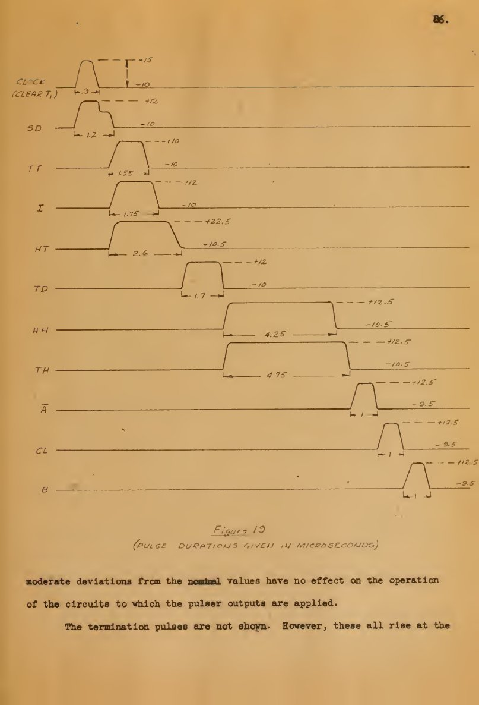
*Figure 19 — Pulse durations (in microseconds)*

*(This page is the full-page waveform diagram, Figure 19 — pulse durations
in microseconds — see image above; the page carries no additional body text.)*

<!-- p. 99 -->
termination of each pulse and last for approximately .5 µs. They are
designated by the letter that describes the pulse at whose termination
they rise with a small "t" subscript, as for example Iₜ, TDₜ, etc.

THE WILLIAMS TUBE OUTPUT AMPLIFIER

The current that flows to or from ground to the cathode ray tube
pickup screen during a reading operation is very feeble. A resistor being
inserted between these points, the resulting voltage must be amplified to
bring the output up to the desired voltage level. Thus each cathode ray
tube in the Williams Memory is provided with an amplifier, the schematic
of which appears in DWG No. 1367. The physical structure of the ampli-
fier is of annular form: it is mounted within the shield that encloses
the cathode ray tube, directly in front of the tube, which minimizes the
length of the lead from the pickup screen to the grid of the first tube
of the amplifier.

The input resistor was chosen as 100,000 ohms, which means that
the maximum amplitude of input voltages are approximately .25 mv and 1 mv
when a 0 or a 1, respectively, is read. A gain of 30,000 provides output
signals of maximum amplitude 7 and 30v, respectively, which are ample for
the purpose for which they are used in the Discriminator.

It was desired to hold to a low value any 60 cycle hum due to
cathode leakage and modulation of the electron stream. Given the chosen
value of grid-leak resistance, the value of 1000 µµf for coupling is
chosen to guarantee that the gain at 60 cps is less than unity. As the
tubes are to be operated at not over half the rated plate and screen
dissipation, the plate decoupling resistor and the screen grid resistor

<!-- p. 100 -->

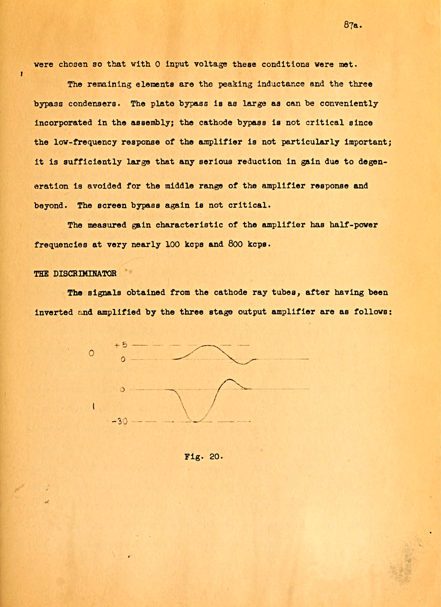
*Fig. 20 — Discriminator output signals*

*(This page is the full-page waveform diagram, Fig. 20 — Discriminator
output signals — see image above; the page carries no additional body text.)*

<!-- p. 101 -->
The Discriminator distinguishes between these two: it contains a toggle
which is set by the amplifier output to the state corresponding to the bit
of information read. The Discriminator is furthermore supplied with four
trains of pulses from the block in Fig. 14 labelled "Discriminator Pulse
Routine Generator", which are of one configuration if reading or regenerat-
ing is called for, but of a second configuration if new information is to
be written over that presently in existence. If reading or regeneration
takes place, the Discriminator causes the electron beam of the cathode ray
tube to be turned on the required time (Normal Dot or Normal Dash) to re-
store the existing state of charge, while if writing is to be accomplished,
the circuitry compares the existing bit of information with that which is
to replace it, and turns on the electron beam in the Normal Dot or Normal
Dash routine if the new information is the same as the present, or in the
Superdot or Superdash routine in case a 0 is to replace a 1, or vice versa.

We will now describe the operation of the Discriminator, referring
to DWG No. 1241.

The lower row of tubes in the drawing consists of one toggle ("T₁")
and associated gates, used to present information to the toggle and to ex-
tract information from it. This toggle is the first element of the circuit
affected in each cycle of the Memory: at the time of each Clock pulse, it
is cleared to 0, i.e., to the state in which the left half of the 6J6 is
conducting. This is accomplished by a clear driver and clear driver-driver
circuit, just as in the case of the register toggles.

The next operation in the memory cycle is to turn on the electron
beam of the cathode ray tube to inspect the contents of the particular loca-
tion in the memory tube which is currently of interest. In the "read

<!-- p. 102 -->

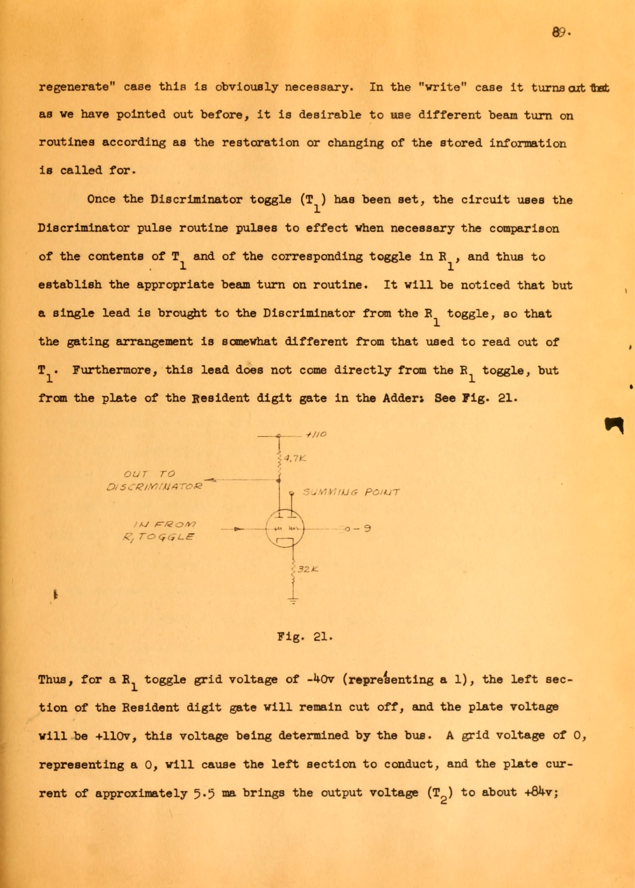
*Fig. 21 — Digit Resolver input circuit*

*(This page is the full-page circuit diagram, Fig. 21 — Digit Resolver
input circuit — see image above; the page carries no additional body text.)*

<!-- p. 103 -->
actually this voltage can vary as much as 5 volts either way owing to the
resistor tolerance of 10% without causing any difficulty.

The connection to the CRT control grid is made as shown in the upper
right-hand corner of DWG No. 1241. The cathode of the CRT is maintained at
+318v, so that if the cathode of the 6AL5 is held at or above +288v, the
CRT grid is held at +288v, and the electron beam is on. Dropping the grid
to +280v is sufficient to cut the beam off, and clearly this can be done by
dropping the 6AL5 cathode voltage to slightly below this level. The volt-
age of the 6AL5 cathode is determined by the 5687 shown in the upper left-
hand corner of the schematic. If the right-hand section of this tube draws
no current, the grid of the left section will be at +300v and the cathode
slightly above this value: this is obviously sufficient to hold the 6AL5
in a non-conducting state and thus permit the CRT electron beam to stay
"on". On the other hand, if the right-hand section of the 5687 carries a
current of 6 ma, the grid of the left section will drop to +255v: the
cathode will be slightly above this, and, therefore, the CRT control grid
will fall safely below the cut-off level. Actually about 3 ma would suf-
fice if all the values of resistors in the circuit were precisely as given
in the schematic, and not subject to tolerances.

It is, therefore, necessary in all cases to assure that no current
is drawn by any of the gates which read out from T₁ or from T₂ at the begin-
ning of the Inspect pulse.

We shall now establish the waveforms of the pulse trains SO₁, SA₁,
SO₂, SA₂ which are needed.

First consider the "read-regenerate" case. Here SO₁, ..., SA₂ must
be such that the beam turn on corresponds to the "normal" cases, TT and HH.

<!-- p. 104 -->
There is no reason to consult T₂, so both gates to which it is connected
must be held in the disabled condition throughout the cycle, which is done
by holding SO₂ at +70v and SA₂ at +120v. This is sufficient to assure us
that the left-hand sections of both the T₂ output gates will remain in a
non-conducting condition.

As far as T₁ is concerned, it is definitely known that it initially
contains a 0; hence the left-hand gate, which reads out from the right-hand
grid of the toggle will not conduct if its cathode is held sufficiently
above -35v to assure cut-off, while the right-hand gate will be non-conducting
if its cathode is held sufficiently above 0v to assure cut-off. Voltage
levels of -10v and +10v are convenient and sufficient for this purpose.

Thus if SA₁ = -10v, SO₁ = +10v, SA₂ = +120v, SO₂ = +75v during the
Inspect pulse, we will be assured that the CRT electron beam is turned on
at the beginning of the pulse time.

During the Inspect time the information stored in the location on
the CRT phosphor to which the beam is directed is made available to the Dis-
criminator as follows: the input to grid 7 of the 12AU7 is held at 0v except
during the Inspect time when it drops for .5 µs to -25v (the pulse that ac-
complishes this is called the Strobe). Note that the grids of the 6J6 are
biased to -20v and -10v, respectively, so that before the Strobe pulse both
sections of the 6J6 are cut off.

During the Strobe we have two possibilities. In case a 0 is read, the
signal from the amplifier rises to +5v during the Inspect period; hence, the
right-hand grid of the 6J6 rises to -5v, and hence the cathode following it,
the left section remains cut-off, and no signal is transmitted to T₁. T₁
having been just previously cleared to 0, continues to hold a 0. In case a 1

<!-- p. 105 -->
is read, the amplifier output drops from 0v to -20v during the Inspect pulse,
thus driving the voltage of the right-hand grid of the 6J6 down to -30v. The
cathode voltage drops also, but will be "caught" in the vicinity of -20v as
the left section begins to conduct. The plate current of this section, flow-
ing through the 15K plate resistor of the right-hand section of the toggle
tube flips the toggle to the 1 condition. Thus by the end of the Strobe pulse,
the information held in T₁ is identical with that stored in the CRT location
that is being read.

Now to continue with the read-regenerate case, there are just two pos-
sibilities: either a 0 or a 1 is stored in the given memory location. If it
is a 0, the toggle T₁ is not flipped during the Strobe time, and hence the
CRT electron beam will stay on as long as the values of SA₁, ..., SO₂ are
maintained. These must, therefore, be maintained a length of time correspond-
ing to the Normal Dot. It is convenient to take the quiescent values as fol-
lows: SA₁ = -10v, SO₁ = -10v, SA₂ = +120v, SO₂ = +70v. Then for Normal Dot
(TT) SO₁ rises to +10v at the beginning of the Inspect pulse, and returns to
-10v at the end of Normal Dot time, which occurs slightly before the end of
the Strobe pulse. The other possibility is that the memory location in ques-
tion holds a 1. Suppose the voltages SA₁, ..., SO₂ are as determined above.
Shortly after beam turn-on, the toggle T₁ is flipped. The grid voltage of the
left-hand section of the toggle tube now becomes -35v, while that of the right
section becomes 0v. As SA₁ is -10v and SO₁ is +10v, right gate is unaffected
while the right-hand section of the left gate now draws plate current of ap-
proximately 300/44 ≈ 6.82 ma, which is more than enough to turn off the CRT
electron beam. Actually, we would prefer not to turn on the beam at all in
the A position, but clearly this must be done in order to ascertain the state

<!-- p. 106 -->

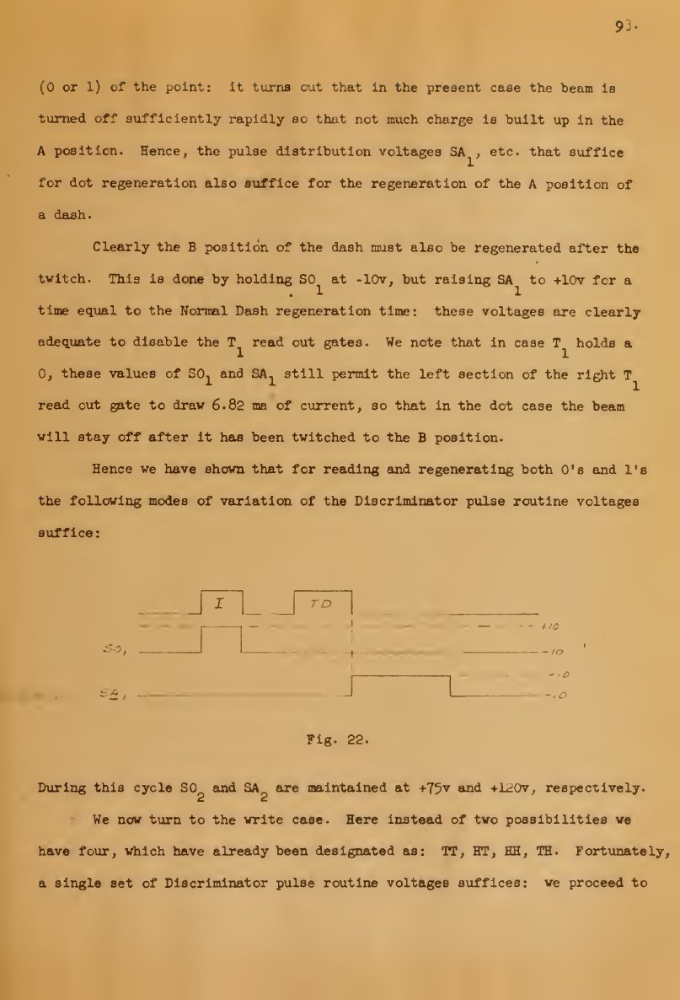
*Fig. 22 — Discriminator pulse routine voltages (read/regenerate)*

(0 or 1) of the point: it turns out that in the present case the beam is
turned off sufficiently rapidly so that not much charge is built up in the
A position. Hence, the pulse distribution voltages SA₁, etc. that suffice
for dot regeneration also suffice for the regeneration of the A position of
a dash.

Clearly the B position of the dash must also be regenerated after the
twitch. This is done by holding SO₁ at -10v, but raising SA₁ to +10v for a
time equal to the Normal Dash regeneration time: these voltages are clearly
adequate to disable the T₁ read out gates. We note that in case T₁ holds a
0, these values of SO₁ and SA₁ still permit the left section of the right T₁
read out gate to draw 6.82 ma of current, so that in the dot case the beam
will stay off after it has been twitched to the B position.

Hence we have shown that for reading and regenerating both 0's and 1's
the following modes of variation of the Discriminator pulse routine voltages
suffice:

During this cycle SO₂ and SA₂ are maintained at +75v and +120v, respectively.

We now turn to the write case. Here instead of two possibilities we
have four, which have already been designated as: TT, HT, HH, TH. Fortunately,
a single set of Discriminator pulse routine voltages suffices: we proceed to

<!-- p. 107 -->
derive these.

As before, the CRT electron beam must be turned on in synchronism with
the Inspect pulse. The TT case requires, therefore, that SO₁ be raised to
+10v, and maintained at that level during the time required for dot restora-
tion (Normal Dot). During this time, the level of SA₁ is clearly of no con-
sequence, as either of the possible levels will keep the left section of the
gate in a non-conducting state. The same is true of SA₂. SO₂ must be held
at +75v during the Normal Dot time.

Now consider the TH case. As in the TT case, the left grid of the
toggle tube is at 0v and the right at -35v, while the voltage of the T₂ lead
is +110v. The CRT beam must be turned on at the beginning of the Inspect
pulse, turned off at the expiration of the time required to write the A part
of the dash, turned on again at the end of the twitch settling delay, and
turned off again at the expiration of the TH pulse (Superdash). SA₂ must,
therefore, be raised to +120v at the beginning of the Inspect pulse, and
dropped back to +100v at the end of the time required to write the A part
of the dash. At the expiration of the twitch settling delay, SO₁ must be
raised to +10v, and SA₂ to +120v to assure beam turn on. One, at least, of
these voltages must be dropped again at the expiration of the time required
for Superdash. We do this to SO₁; SA₂ can be dropped any time before the
beginning of the next cycle. The values of SA₁ and SO₂ in this case clearly
are of no importance: all we have so far determined (from the TT case) is
that SO₂ must be held at +75v during Normal Dot; it certainly must be raised
to +100v at the end of TD, and held there at least until the fall of SO₁ for
otherwise no current would be drawn from the summing bus during that interval
and Normal Dot restoration could not be accomplished.

<!-- p. 108 -->

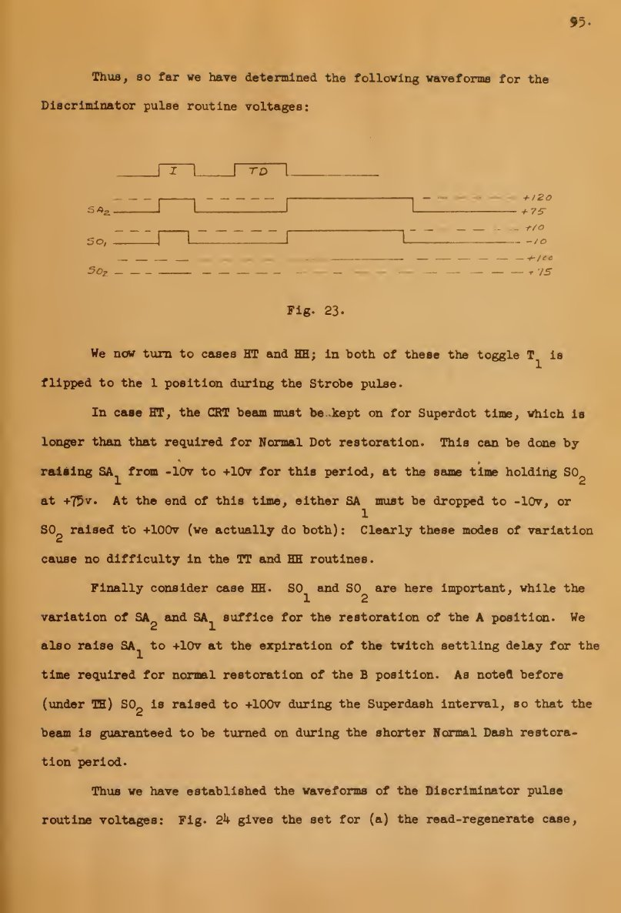
*Fig. 23 — Discriminator pulse routine voltages (continued)*

Thus, so far we have determined the following waveforms for the
Discriminator pulse routine voltages:

We now turn to cases HT and HH; in both of these the toggle T₁ is
flipped to the 1 position during the Strobe pulse.

In case HT, the CRT beam must be kept on for Superdot time, which is
longer than that required for Normal Dot restoration. This can be done by
raising SA₁ from -10v to +10v for this period, at the same time holding SO₂
at +75v. At the end of this time, either SA₁ must be dropped to -10v, or
SO₂ raised to +100v (we actually do both): Clearly these modes of variation
cause no difficulty in the TT and HH routines.

Finally consider case HH. SO₁ and SO₂ are here important, while the
variation of SA₂ and SA₁ suffice for the restoration of the A position. We
also raise SA₁ to +10v at the expiration of the twitch settling delay for the
time required for normal restoration of the B position. As noted before
(under TH) SO₂ is raised to +100v during the Superdash interval, so that the
beam is guaranteed to be turned on during the shorter Normal Dash restora-
tion period.

Thus we have established the waveforms of the Discriminator pulse
routine voltages: Fig. 24 gives the set for (a) the read-regenerate case.

<!-- p. 109 -->

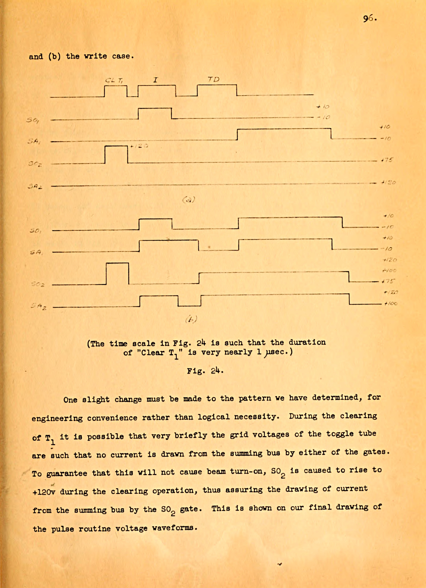
*Fig. 24 — Pulse routine voltage waveforms, read and write cases*

*(This page is the full-page waveform diagram, Fig. 24 — pulse routine
voltage waveforms, read and write cases — see image above; the page carries
no additional body text.)*

<!-- p. 110 -->

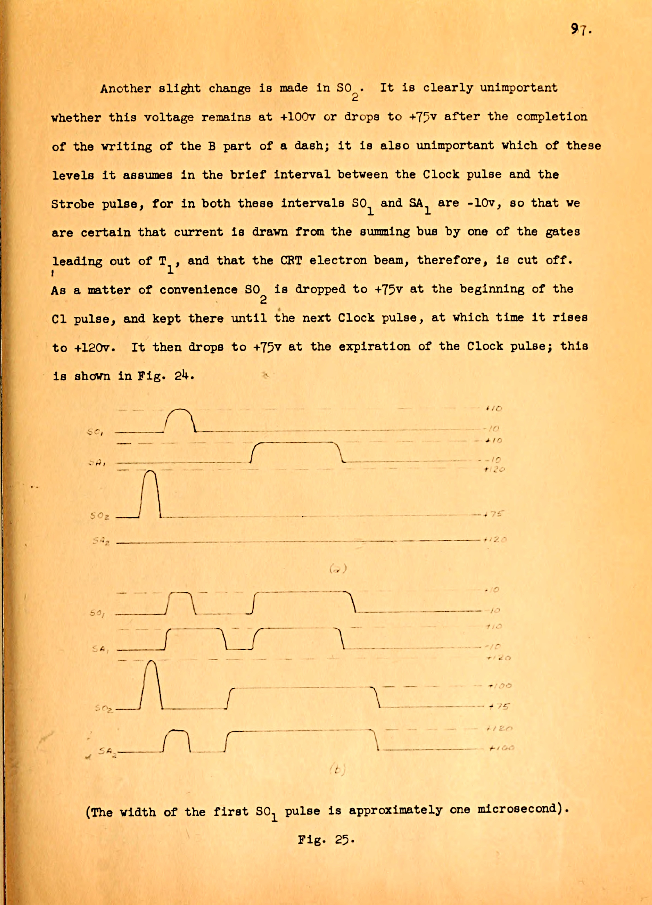
*Fig. 25 — Final pulse routine voltage waveforms*

*(This page is the full-page waveform diagram, Fig. 25 — final pulse
routine voltage waveforms — see image above; the page carries no additional
body text.)*

<!-- p. 111 -->
The circuits used to develop the pulse routine voltages which we
have been discussing are described in the next section on the Pulse Rou-
tine Generator. In Fig. 25 are shown the actual waveforms obtained.

PULSE ROUTINE GENERATOR

We will now show how the outputs of the pulsers are combined to
produce the pulse routine voltages which were shown to be needed for the
operation of the Discriminator. The circuits are quite straight forward;
a schematic is given in DWGS. No. O-1470 and B-2002.

The inputs to the generator are: TT, TH, HT, HH, Clear T₁, I, Cl, TD,
and two voltages one of which is -20v for read-regenerate and +10v for write,
the other +10v for read-regenerate, -20v for write. The outputs are: SA₁,
SO₁, SA₂, and SO₂ to the Discriminator, and the twitch pulse, which rises
from -20v to +10v with the leading edge of TD, and falls back to -20v with
the leading edge of Cl, to the Deflection Generator. The twitch pulse is
generated by the toggle labelled "twitch" in the schematic. An output is
taken via a cathode follower to the SA₂ generator, while the use of the in-
puts Cl and TD in triggering the toggle are clear from the schematic.

We will now consider the generators of SO₁, SA₁, SA₂, SO₂ in order
as they appear in the drawing. Reference is made to Fig. 24 where the
desired waveforms are shown.

In the write case, the 6.8k resistor being supplied with +10v and
the diode cathode varying with TH, the left grid of the 6J6 is held at
-10v except during the TH pulse, when it is raised to +10v. The input to
the right grid of the 6J6 is TT, which stays at -10v except during the TT
pulse time. The 5687 is, of course, merely a cathode follower. Hence the
SO₁ output is -10v except during the TT and TH pulses, when it rises to +10v.

<!-- p. 112 -->
During the read-regenerate case, the diode plate is constantly held at -20v,
as TH never falls below this level, and hence the cathode of the 6J6 fol-
lows the higher grid, which is at all times the right one. Thus, the output
is -10v except during the TT pulse, when it rises to +10v.

The operation of the SA₁ generator is the same. In the write case
the voltage of the left grid of the 6J6 is -10v except during HT, when it
rises to +10v, and that of the right grid is -10v except during HH, when it
rises to +10v. Hence the output is -10v except during the HT and HH pulses
when it is +10v. During a read-regenerate cycle the left grid of the 6J6
is constantly held at -20v, so the output follows the variation of HH, being
-10v except during HH, when it rises to +10v.

In the SA₂ generator we note that the cathodes of the two 6J6's to
which the inputs are applied are connected together, and that the right grid
of the right tube is grounded. Thus this section will be cut off if the cath-
ode voltage is above about +5v, under which circumstance the grid voltage of
the 5687 is "bumped" at +120v by the right section of the 6AL5; on the other
hand, if the right section of the right 6J6 conducts, the input to the 5687
is bumped at +100v by the left section of the 6AL5. In the write case, the
right section of the right 6J6 will, therefore, conduct except during I and
the time from the beginning of TD to the beginning of Cl when the twitch
voltage rises to +10v. Hence the SA₂ output in the write case is +100v
except during I and the time the twitch voltage is +10v, when it rises to
+120v. In the read-regenerate case the right section of the right triode is
constantly non-conducting, so the output is constantly +120v.

Finally, we have the SO₂ generator; we note that the inputs are applied
to a 6J6 at the left and to one at the right, which appears just above the

<!-- p. 113 -->
5687 cathode follower in the schematic. This second 6J6 is so arranged that
its left section conducts except while the Discriminator toggle T₁ is being
cleared: thus, the voltage of the right grid of the center 6J6 is held at
somewhat below +60v except during Clear T₁ when it rises to +120v. We ob-
serve that the voltage of the left grid of the 6J6 in the center is con-
strained by the 6AL5 bumper to lie between +75v and +100v. Hence in all
cases the output voltage SO₂ must rise to +120v during the Clear T₁ (or
Clock) pulse, and at no other time can it exceed +100v. Now consider the
left 6J6. During a write cycle its left section is obviously held in a cut-
off condition, while its right grid is held at -20v from the beginning of TD
to the beginning of Cl, when it rises to +10v, where it remains until the
beginning of the next TD pulse. Thus from the beginning of TD to that of Cl,
the voltage of the left grid of the center is +100v, while the rest of the
time it is +75v. Thus SO₂ is +120 during Cl T₁, at the end of which it falls
to +75v where it remains until TD, when it rises to +100, falling again to
+75v at the beginning of Cl.

Comparison with the waveforms deduced as necessary for the operation
of the Discriminator (Fig. 24) shows that the circuits we have been discuss-
ing should produce these subject to finite times of rise and fall of the
pulses. The actual waveforms obtained are shown in Fig. 25. The rise times
of the pulses are approximately .25 µs in all cases; no serious distortion is
present, but a delay of approximately .05 µsec is introduced by the circuits
which is obviously too small to show in the drawings.

WILLIAMS TUBE DEFLECTION GENERATOR

We have seen that each storage tube holds an array of 32 x 32 bits of

<!-- p. 114 -->
information. The address of a bit consists of two numbers, each being one
of the integers 0, 1, ..., 31 (each, of course, expressed in binary notation)
which specify the horizontal and vertical coordinates of the bit.

An address is presented to the memory organ as the contents of a ten
stage binary register, the stages 2⁰, 2¹, ..., 2⁴ specify the horizontal co-
ordinate, and 2⁵, ..., 2⁹ the vertical one. These binary numbers must be
converted into the voltages needed to deflect the electron beam: this is
the function of the Deflection Generator, a schematic of which appears in
DWG. No. 1284 and DWG No. 1285. Before going on to a description of the
operation of this circuit, it should be mentioned that the twitch is treated
as an extra digit column in the horizontal coordinate: 2⁰ is treated as the
highest order column, 2¹ the next and so on, with the twitch of order lower
than 2⁴.

The terminals at the bottom of DWG No. 1284 present to the deflection
generator the twitch voltage (a pulse rising from -20v to +10v in synchronism
with the rise of TD, and falling again in synchronism with the leading edge
of Cl), and the digits of the address (+5v for a 0, -30v for a 1). The lat-
ter values are due to the fact that connections to the input terminals come
from the address register by coaxial cable, which is driven by a cathode fol-
lower the input of which is taken from a toggle grid; cathode rise of 5v in
the cathode follower accounts for the values quoted here.

In order to minimize noise that may enter the deflection generator,
the full variation available at each input terminal is not used, the diode
bumper, which is shown as the tube at the bottom of the left column in DWG
No. 1284 restricting the swing to one from 0v to -10v (these are, therefore,
the nominal values for 0 and 1, and for twitch on and twitch off).

<!-- p. 115 -->
Now consider the 6J6 that appears just above the input bumping diode.
As its left grid is held at -5v, the left section will be non-conducting when
the right grid is raised to 0v, but conducting when the right grid is dropped
to -10v. In the former case, the voltage at the right grid of the second 6J6
(fourth tube up) is bumped at +120v by the 6AL5. In the latter, it is bumped
at +100v (we note that the plate current of the left section of the first 6J6
must be somewhat greater than 95/13000 ≈ 7.3 ma, so that the plate voltage
will surely fall below +100v).

The second 6J6 in the column has, therefore, as input to its right grid
+120v for twitch on, +100v for twitch off. As its left grid is held fixed at
+110v, the left section will not conduct in the first case, but will in the
second, drawing a plate current of somewhat over 4.07 ma. As regards the
right section, the situation is reversed: in the first case a plate current
of somewhat over 4.44 ma is drawn, in the second it is cut off.

Hence the voltages of the left and right plates of the 6J6 are, respec-
tively, for twitch on, 400v, 382.7v; for twitch off, 384.1v, 400v.

In the first case the 12AX7 in the upper left-hand corner of the draw-
ing will have its left section on and its right section off; in the second
case the reverse will be true. Thus it will draw a current I = 100/R (where
R is the resistance in the cathode circuit) from summing bus A, and none from
B, while in the second these will be interchanged. In practice the variable
500K resistor is adjusted to maximize the amplitude of the dash output of the
Williams Memory Output Amplifier, which depends upon the magnitude of the dis-
placement between the A and B positions.

The operation of the other columns of tubes, which exactly duplicate
the one we have discussed in detail, except for the tube type and the value of

<!-- p. 116 -->
the cathode resistor of the top tube in the column, is, of course, identical
with that of the first column except as regards the current drawn from the
summing buses A and B. Thus in each case a 0 input to the column results in
the drawing of approximately 100/R amperes from bus A and no current from B,
while for a 1 input these will be interchanged. Taking account of cathode
rise in each of the tubes, the design values of the cathode resistors were
chosen so that the 2⁰ stage would draw i₀ = 6.98 ma; stage 2¹, i₁ = 1/2 i₀ ...;
stage 2⁴, i₄ = 1/2⁴ i₀. These currents are added in the summing buses, the
object being, of course, ultimately to cause them to flow through a resistor,
so that the voltage developed across this will be proportional to the binary
number used as input to the generator.

However, it is desired to make the currents developed available at a
higher voltage level (+1290v). This cannot be done merely by connecting
resistors in series with the summing buses directly to the +1290v voltage as
this would cause the tubes whose plates are connected to the buses to operate
with excessive plate voltage, so a rather simple scheme, consisting of four
triodes in series for each bus, was adopted. This is shown in DWG No. 1285.
Here we have two columns of 5687's, giving, therefore, four columns of tri-
odes; the cathodes of the tubes of the row at the bottom of the drawing are
connected to the four summing buses A, B, C, D of DWG No. 1284. The grid
voltages are held at +400v, +610v, +810v, and +1030v by means of the voltage
divider, consisting of a 40K, three 33K, a 27K, and a 33K resistor connected
between +1290v and ground. Condensers are placed in parallel with the re-
sistors so that when the high voltage is turned on the grids will instanta-
neously assume their correct potentials. The parallel RC circuits between
the points feeding the grids and the heaters, hold the heaters at the d.c.

<!-- p. 117 -->
level of the grids, so that the potential difference between each cathode and
its heater will be small. The condensers guarantee that the heaters assume
the desired potentials instantaneously when the high voltage is turned on.

The top triode in each column is connected through a 4.7K resistor to
the +1290v bus. Each summing bus current flows through one of these, and
hence there is developed across it a voltage proportional to this current.
The voltages at the lower end of these resistors are the deflection voltages:
thus A and B drive the horizontal deflection plates of the CRT's, and C and D
the vertical plates. Each deflection voltage is applied to all forty CRT's
in parallel by means of a deflection bus. The two cathode followers in cas-
cade shown in the upper left-hand corner of DWG No. 1285 provide the low im-
pedance source needed to drive the rather large capacity of this bus.

We observe that a 0 in any digit position of the horizontal address
causes the drawing of current from the A bus, while a 1 causes it to be drawn
from the B bus. For the vertical deflection system, a corresponding remark
is true of C and D. Suppose the horizontal address is 00000. Then i(1 + 1/2
+ 1/4 + 1/8 + 1/16) ≈ 13.52 ma is drawn from the A bus, and 0 ma from the B
bus, and the deflection plate voltages are +1238.6v and 1290v, respectively:
these are, of course, reversed in the case of the address 11111; in both cases
the average value is +1264.3v, or 25.7v below +1290. This condition holds for
all addresses, as the average of the two deflection voltages must always be
1/2 (1290 + 1290 - i(1 + 1/2 + 1/4 + 1/8 + 1/16) x 3.8), where i is in mil-
liamperes; the design criterion here was to hold the point half way between
the deflection plates constantly at the same potential as the second anode.
Clearly, it is necessary that we consider both the horizontal and the vertical
deflection plates: the potential of the point must be the same when referred

<!-- p. 118 -->
to either set of plates. The circuits shown in DWG No. 1284, labelled
"Average Deflection Plate Level Adjustment" permit these potentials to
be equalized. Moreover, these circuits guarantee that some current is
flowing in the buses A, B, C, D, at all times, so that the tubes in the
vertical chain are never operated very close to cut-off.

WILLIAMS MEMORY LOCAL CONTROL

A single chassis holds part of the Pulse Routine Generator, which
has already been described, and the Williams Memory Local Control. It
also includes circuits, shown in DWG No. 1470 and C-1474, for generating
-B, -TD, and the Strobe (which is an inverted and magnified version of
the Inspect pulse (I)). The Local Control schematic is given in DWG No.
C-1474, to which reference is made. A block diagram is given in Figure 26.

Generally speaking, the Local Control receives from the Main Control
signals which signify whether or not the Memory is to be consulted in the
next cycle, and whether information is to be inserted in or extracted from
it. It uses this information to cause the routine generators to emit the
appropriate pulse trains, and to route back to the Main Control properly
timed pulses, originating in the Pulsers, which the Main Control can use
to clear RIII, open gates into RIII, and to gate address information out
of either part of the order counter or from R₃ to the Williams Tube deflec-
tion circuits as may be desired. Local Control also returns to Main Con-
trol signals acknowledging the request to use the Memory, and showing that
the process ordered has been completed. The Local Control serves to co-
ordinate the generally asynchronous operation of the rest of the computer
with the carefully timed operation of the Williams Memory.

<!-- p. 119 -->
The inputs to the Local Control come from two sources: the Main
Control and the Pulsers. Main Control supplies the Yes/No and Read/Write
signals, both outputs assuming levels of -20v and 0v. "Yes" signifies that
the Memory is to be consulted during the next cycle, which is, therefore,
called an "action" cycle, while "No" signifies that the Memory will not be
consulted and that a regeneration cycle will, therefore, ensue. Ordinarily,
action and regeneration cycles follow each other in sequence, the one excep-
tion being in the case of that type of action cycle which we shall call a
"fetch" cycle, which occurs whenever the second order in the word standing
in R₃ has been executed and it becomes necessary to bring the next pair of
orders from the Memory to R₃. In this case it is permitted that a fetch
cycle be followed by a second action cycle. To assure that an action cycle
is to follow a regenerate cycle the Yes signal must be received before the
TDₜ pulse of the regenerate cycle, while the Read/Write information must be
received before the time of the B pulse. We shall see that the Yes/No input
is always set to No by the Acknowledge Yes pulse emitted by the Local Control
at the time of this same B pulse. If an action cycle is to follow a fetch,
it is necessary that a Yes signal be received before the Ā pulse of the
fetch cycle.

The remaining inputs to the Local Control are received from the Pulsers,
or are built up locally from them: thus TDₜ, Ā, Cl, ClT₁ are used directly,
while the other circuits shown in DWG No. C-1474 invert B and TD to provide
inputs of -B and -TD.

The outputs of the Local Control are: A_A, B_A, ACl_A, BCl_A, A_R, B_R, ACl_R,
BCl_R, "Finish", "Acknowledge Yes", ClRIII, "Gate into RIII" to the Main Con-
trol, and a "Write/Read" signal to the Pulse Routine Generator (the first eight
of these are used to operate the Dispatch Counter in the Main Control).

<!-- p. 120 -->
Circuitwise, the Local Control consists of three toggles and a rather
complicated system of gates. The operation of the circuit can best be made
clear by reference to the logical block diagram given in Fig. 26. We use in
it the conventional representations of the toggle as a box and of the gate as
a circle with two arrowhead inputs and one output. An input to a gate from a
grid of a toggle signifies that the gate is enabled when the grid is high, but
disabled when the grid is low. In the actual circuit the arrangement is
slightly different, in order to take advantage of different gating arrangements
needed to give different voltage outputs, but once the logical structure is
understood, the schematic (DWG No. C-1474) will be found readily comprehensible.
Note that the Action and Routine toggles differ slightly from those used
throughout the machine in that the crossover resistors are each replaced by
two resistors in series, the output being taken from the point between them.
This results in an output of +10v from the conducting half of the toggle tube,
and of -20v from the non-conducting half.

Having disposed of these preliminary remarks, we now turn to an explana-
tion of the operation of the Local Control, basing our argument on Fig. 26.

Let us assume that the Synch, Action, and Routine toggles are all in
their 0 states; i.e., the neon bulbs are not glowing.

Suppose that an action cycle is called for, signified by the Yes/No in-
put assuming its Yes level before the arrival of TDₜ. Then the gate into the
Synch toggle is enabled, and TDₜ causes this toggle to assume its "on" state
(neon bulb glowing). This in turn enables the gate into the Action toggle,
which is turned on by the Ā pulse. The grid of the right-hand section of the
Action toggle tube now is high (+10v) while that of the left-hand section is
low (-20v), and the gates connected to the right-hand grid are enabled, while

<!-- p. 121 -->

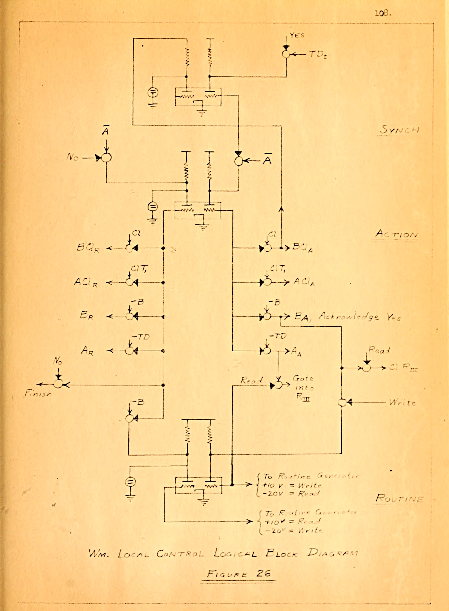
*Figure 26 — Williams Local Control Logical Block Diagram*

*(This page is the full-page logic diagram, Figure 26 — Williams Local
Control Logical Block Diagram — see image above; the page carries no
additional body text.)*

<!-- p. 122 -->
those connected to the left-hand grid are disabled. Thus the following
sequence of events ensues:

1) BCl_A is emitted, and the Synch toggle turned off;

2) B_A and Acknowledge Yes are emitted, the latter returning the
Yes/No toggle in the Main Control to the No condition; furthermore, if Read-
ing is called for, B_A is passed on as ClRIII, and the Routine toggle left in
the Read condition, while if Writing is called for, B_A flips the Routine tog-
gle to the Write condition;

3) ACl_A is emitted in synchronism with ClT₁, at the beginning of the
next memory cycle;

4) A_A is emitted in synchronism with TD of the next memory cycle;
if Reading is called for, A_A also causes "gate into RIII" to be emitted;

5) The Yes/No toggle having been set to No, the left gate into the
Action toggle is open, and the toggle is turned off by Ā, thus enabling the
whole set of gates in the left column;

6) The Finish signal is emitted;

7) BCl_R is emitted;

8) B_R is emitted, and the Routine toggle set to the off (Read) condi-
tion if it is not already in that condition; thus the performance of an en-
suing Regenerate cycle is assured;

9) ACl_R is emitted in synchronism with ClT₁;

10) A_R is emitted in synchronism with TD.

Thus we see that ordinarily a Regenerate cycle follows an Action cycle;
however, in the case of a fetch, the Yes/No toggle is set to Yes before Ā in
the fetch cycle, which prevents the turning off of the Action toggle, and thus
assures that the subsequent cycle will also be one of action. We note that in

<!-- p. 123 -->
our sequence of events, after 3) all the toggles have been set to their
off condition and will remain so at least until after 10), since if an
Action cycle is to be called for, the Synch toggle cannot be turned on
until TDₜ.

Complete diagrams are given in Figures 27 and 28 illustrating
the operations that have just been described. Figure 27 shows the time
variation of the voltage inputs and outputs for the following sequence
of cycles: Regenerate, Write, Regenerate, Read, Regenerate. Figure 28
does the same for the sequence: Regenerate, Fetch, Write, Regenerate.

Finally we observe that the transmission of information from the
Memory into RIII is directed specifically to R³ (number or Work Order)
or R₃ (order or W̄O) by the WO signal from the Main Control.

<!-- p. 124 -->

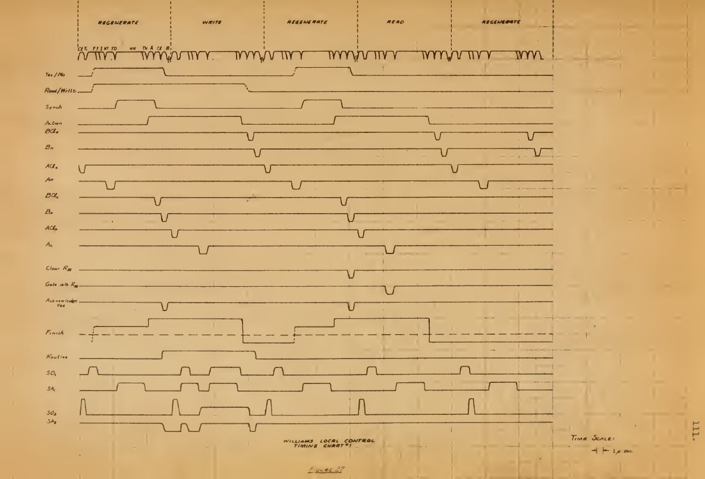
*Figure 27 — Williams Local Control Timing Chart #1*

*(This page is the full-page timing chart, Figure 27 — Williams Local
Control Timing Chart #1 — see image above; the page carries no additional
body text.)*

<!-- p. 125 -->

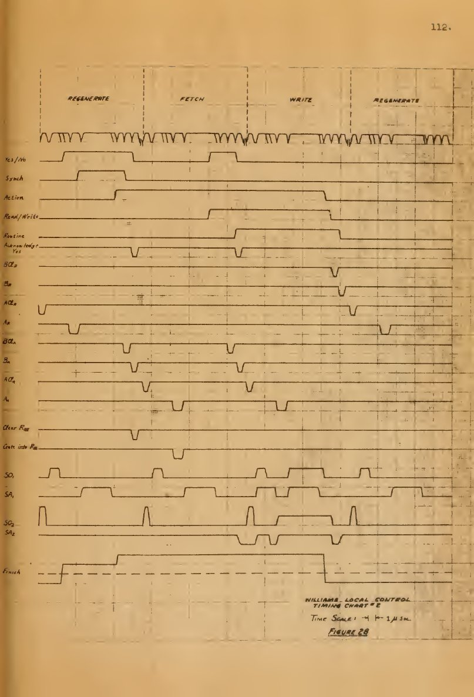
*Figure 28 — Williams Local Control Timing Chart #2*

*(This page is the full-page timing chart, Figure 28 — Williams Local
Control Timing Chart #2 — see image above; the page carries no additional
body text.)*

<!-- p. 126 -->
VI. THE CONTROL

We have described the Williams Memory in some detail, and have
shown how the Local Control regulates its operation subject to informa-
tion received from the Main Control. This information must be of two
kinds. First, it is necessary to specify whether an Action or a Regen-
erate cycle is to be performed, and whether information is to be in-
serted in or extracted from the Memory. Second, it is necessary to sup-
ply to the deflection circuits the address in the Memory of the bits of
information which are to be written, read or regenerated.

Besides supplying orders and address information to the Memory
Organ, the Main Control also must regulate the actions of the Input-
Output Organ and of the Arithmetic Organ. Most of the equipment for
the latter function has been built and installed, and will be described
under the headings: "Gate-Clear Sequencing Chain", "Shift Counter",
and "Recognition Circuits".

THE SHIFT COUNTER

Two types of counter are used in the present machine. These are
the familiar "scaling" type, of which the Shift Counter is an example,
and the "adder" type, which operates as an Adder to which one input is
the last count and the other is a 1 to the lowest order stage. The
Scaling type of counter has the advantage that the more significant
stages can be comparatively slow, and that all the carries resulting
from one count need not be completed before the next count arrives at
the input, whereas in the Adder type, all carries resulting from one

<!-- p. 127 -->
count must be completed before the next count is added. On the other
hand, the Adder type offers the advantage of requiring fewer tubes.
Hence, the character of the particular application indicates the ap-
propriate type of counter. In the Dispatch Counter the complete new
address must be obtained before the counter is stepped again, so that
the Adder type is obviously appropriate, while in the Shift Counter
this is not true, so that the Scaling type is used.

The Shift Counter is part of the equipment used to control the
carrying out of the arithmetical processes. Thus multiplication is per-
formed by the successive additions and shifts. Once the process is
initiated, the Shift Counter counts the successive shifts. The number
of these which must be performed is inserted in the Recognition circuit,
where it is continuously compared with the contents of the Shift Counter;
when coincidence is indicated,

<!-- p. 128 -->
a signal is emitted which terminates the process. A similar situation oc-
curs in the carrying out of division.

Physically the Shift Counter consists of two rows of toggles with
gates permitting information to be transferred up and down vertically and
up diagonally. One row of toggles holds the actual count, the other does
not; these are referred to as the True and False rows, and the numbers they
hold as the True and False counts, respectively. It will appear that the
False count does not proceed monotonically. There are six stages in the
counter, those for 2⁰, 2¹, ..., 2⁵. Since the counter must only count to
forty (the number of additions in the multiplication process) the 2⁵ stage
can be rather simpler in structure than the lower order stages; it is feas-
ible to have but a single toggle in this sixth stage.

Before examining the schematic of the counter, let us consider the
block diagram of a single stage, given in Fig. 29(a). This represents any
of the stages 2⁰ to 2⁴. It has already been remarked that the sixth (2⁵)
stage is of simpler structure; it will be considered later. Here input Eₙ'
enables gates from the True to the False toggle, which are so arranged that
the enabling of the gates causes F to assume the same condition as T. On
the other hand, input Eₙ" enables gates leading from F to T in such a way
that the enabling of the gates causes T to assume the condition opposite to
that of F. At the input to the 2⁰ stage, the levels for E₀' are 0v to dis-
able, -20v to enable, while those for E₀" are +60v to disable, +110v to en-
able; in the following stages the levels of Eₙ' become 0v and -35v, and those
of Eₙ" remain substantially unchanged. We will have more to say on this sub-
ject when we discuss the circuitry.

The input to the lowest order (2⁰) stage of the counter consists of

<!-- p. 129 -->

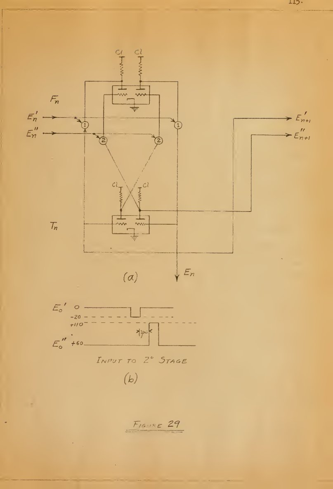
*Figure 29 — Deflection generator stage circuit and input waveform*

*(This page is the full-page circuit diagram, Figure 29 — deflection
generator stage circuit and input waveform — see image above; the page
carries no additional body text.)*

<!-- p. 130 -->
the pair of pulses shown in Fig. 29(b) for each item to be counted. The
number held by the counter is presented to the recognition circuit, which
is physically located on the same chassis, as a set of six voltages, one
for each stage of the counter, the presence of a 0 being signified by 0v,
that of a one by -40v.

Each stage of the counter, therefore, has two inputs and three out-
puts; on Fig. 29(a) the inputs are designated Eₙ' and Eₙ", the outputs Eₙ,
E'ₙ₊₁, E"ₙ₊₁. Of these Eₙ signifies to the recognition circuit the contents
of the stage, while E'ₙ₊₁, E"ₙ₊₁ are inputs to the next stage. In the ac-
tual circuit, DWG No. 1289, let us label the tubes Tᵢⱼ, where i signifies
the row and j the column in the array. The first five columns and the
lower three tubes of the sixth form the actual counter. The upper four
tubes in the sixth column are clear drivers used to clear the two rows of
toggles. Consider the first column. T₁₁ is the F toggle of the block dia-
gram, T₂₁ is the up gate, T₄₁ the down gate, T₃₁ the gate driver, while the
lower three tubes, T₅₁, T₆₁, T₇₁ are the T toggle, which is actually what
we have before termed a Supertoggle. It is used in this instance because
of the speed with which it can be caused to switch from one state to the
other.

The counter is prepared for operation by clearing all the T toggles
to 0 and the F toggles to 01111 (2⁰ holding a 0, the others 1's). Consider
the first column. The first pulse of the input pair clearly does nothing,
for in this case both T and F already hold 0's. On the other hand, the
down gates transmit a 1 to T if F holds a 0. Hence after the reception of
the pair of pulses T holds a 1.

Now let us consider the influence of the n-th column of the counter

<!-- p. 131 -->
upon the (n+1)-th. According to the block diagram of one stage, the gating
voltages (1) and (2) to the next stage are the left grid and right plate
voltages of the Tₙ toggle tube. Hence while this toggle holds a 0, (1) and
(2) are both at their high level with the result that in the next column
the up gates are disabled and the down gates enabled. On the other hand,
when Tₙ holds a 1, the gating voltages are both held at their lower values,
with the result that the up and down gates of the next stage are, respectively,
enabled and disabled.

Thus if Tₙ holds a 0, Tₙ₊₁ must hold a 1 or a 0 if Fₙ₊₁ holds a 0 or a 1,
while if Tₙ holds a 1, the contents of Fₙ₊₁ must coincide with that of Tₙ₊₁.
These facts mean that whenever Tₙ holds a 0 its next change of condition to 1
cannot change Tₙ₊₁, but does cause Fₙ₊₁ to agree with Tₙ₊₁, while whenever
Tₙ holds a 1, its next change of condition to 0 cannot affect Fₙ₊₁, but must
cause a change of condition in Tₙ₊₁. Thus two successive changes of condition
in Tₙ cause a single change of condition in Tₙ₊₁, so that the performance of
the circuit as a binary counter of the scaling type is guaranteed.

We will now consider the actual circuits involved, and in particular
will show how the simplified sixth stage of the counter works, and how its
simplified form restricts the number of items that can be counted without
impairing the usefulness of the counter in its particular application.

The toggles of the False rank and that in the sixth stage of the True
rank are of the type encountered throughout the computer, while the first
five toggles of the true rank are the so-called Supertoggles. The gating
arrangement from T to F is quite straightforward; we describe it for the
first column, the remarks obviously also applying to all others but the sixth.
Each gate consists of one section of T₂₁ and the left section of T₃₁. From

<!-- p. 132 -->
the way in which the grids of the toggle tube T₆₁ are returned to -300v, it
is readily seen that when the voltage of a grid of the toggle tube is 0v,
that of the corresponding grid of the gate tube T₂₁ is approximately -10v,
while when the toggle grid voltage is -40v, that of the gate grid is approxi-
mately -48v. Hence, if the grid of the left section of T₃₁ is held at 0v, it
is clear that the cathode of T₂₁ is held so far above that of either grid
that conduction is impossible, while if the grid voltage of the left section
of T₃₁ is dropped to either -20v or -40v, that section of T₂₁ will conduct,
the grid voltage of which is 0v, while the other section will remain cut off.

Now consider the "down" gates, each composed of the right section of
T₃₁ and one section of T₄₁. The grid voltages of T₄₁ are either 0v or -40v,
while its cathode is returned to ground, and both plates are connected to the
right cathode of T₃₁ through 5.6K resistors. While the voltage of the right
grid of T₃₁ is held at 60v, that of the plate of the conducting half of T₄₁
is substantially below 60v (apart from cathode rise in T₃₁). The plates of
T₄₁ are connected to the left grid of T₅₁ and the right grid of T₇₁, the
other grids of these tubes being connected to the plates of the Supertoggle
tube, T₆₁. Hence, while the gating voltage E₀" is held at 60v, neither plate
of T₄₁ is effective in determining the cathode voltage of T₅₁ or T₇₁, and
the Supertoggle can remain in either condition.

Now suppose the voltage (2) to be raised to +110v, bringing with it
the voltage of the plate of the cut-off section of T₄₁. Let us assume that
F₁ holds a 0, so that this is the right section of T₄₁: the plate voltage
of the left section also rises to about 60v. Suppose now that T₁ holds a 1,
so that the grid voltage of the right section of T₅₁ is about +60v, and that
of the left section of T₇₁ is +110v. The grid voltages of the left section

<!-- p. 133 -->
of T₅₁ is about +60v, and that of the left section of T₇₁ is +110v. The grid
voltages of the left section of T₅₁ and the right section of T₇₁ are also +60v
and +110v, respectively, so clearly nothing happens. On the other hand, if T₁
holds a 0, the grid voltages of the right section of T₅₁ and the left section
of T₇₁ are +110v and +60v, respectively, and, therefore, the cathode voltage of
T₇₁ is raised to +110v, the voltage of the right grid. Clearly this flips the
supertoggle to the 1 position. Similarly, if F₁ holds 1 and T₁ 0, the raising of
the gating voltage E₀" from +60v to +110v does not affect T₁, but if T₁ holds 1,
it causes it to flip to 0.

The discussion just given applies to the columns 2⁰, ..., 2⁴. The 2⁵ col-
umn is simpler in structure, consisting of three 2C51 tubes: T₅₆, T₆₆, T₇₆, of
which T₆₆ is the toggle tube, the other two performing gating functions. Inputs
are: from the left grid of T₆₅ to the left grid of T₇₆, and from the right grid
of T₆₅ to the left grid of T₅₆.

Suppose 0's exist in the 2⁴ and 2⁵ stages. Then the left section of T₅₆
is cut off, and the right conducting, the cathode voltage being -40v. The left
section of T₇₆ is conducting, the cathode being 0v. Now consider the right sec-
tion of T₇₆, which is connected as a diode. The plate is connected through a
4.7K resistor to the cathode of the left section, and the cathode is connected
directly to the cathode of the right section of T₅₆. Hence, the right section
of T₇₆ conducts, and its plate voltage, which is the output from this stage to
the recognition circuit, is not much above -40v.

Now let the 2⁴ stage toggle flip to 1. The cathode of the left section
of T₇₆ now falls to -40v, and as the cathode of the right section cannot fall
below this voltage, the output remains at -40v. The left section of T₅₆ conducts,
and the usual gating action takes place, the toggle being flipped to the 1

<!-- p. 134 -->
condition. Thus flipping the toggle in the 2⁴ stage to 1 automatically flips
the toggle in the 2⁵ stage, but does not affect the output voltage, which re-
mains -40v, signifying a 1.

This condition persists as long as the 2⁴ stage holds a 1, hence, up to
and including the count of 31. On the count of 32, stages 2⁰, ..., 2⁴ must all
return to 0. The left section of T₅₆ is now cut off leaving the toggle in the
1 condition, and the cathode of the right section, and hence the cathode of the
right section of T₇₆, rises to 0v. At the same time the cathode of the left
section of T₇₆ rises to 0v, and we are assured that the right section of T₇₆
will not conduct, and its plate voltage, therefore, becomes 0v, signifying a
1 to the recognition circuit.

The lower order stages now proceed with the count, the 2⁴ stage remain-
ing in the 0 condition until the count of 48, when it flips to 1. We have
already seen, however, that if both the 2⁴ and 2⁵ stage toggles are in the 1
condition, the 2⁵ stage output voltage drops to -40v, signifying a 0 to the
recognition circuit. The shift counter can only count to 47, returning to 32
on the count of 48. However, since the Shift Counter is only required to count
to 40, this is no limitation on its usefulness. The recognition of this fact
permits the simplification of the 2⁵ column, with attendant saving in tubes.
The space thus saved is occupied by the two clear drivers T₁₆, T₃₆, and the
cathode followers T₂₆, T₄₆: T₂₆ permits all the plate current for the F tog-
gles to be drawn from the +240v bus, thus holding this current constant and
preventing any fluctuation of plate voltage due to current fluctuation in the
power supply and bus impedance, while T₄₆ accomplishes the same for the T tog-
gles and the +220v bus.

Fig. 30 shows the contents of the F and T toggles as the counter pro-
ceeds from its quiescent condition to the count of forty. In the T column

<!-- p. 135 -->

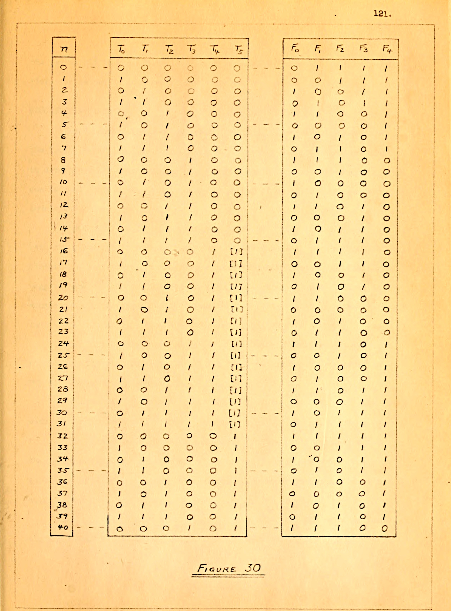
*Figure 30 — Shift-counter / recognition-circuit truth table*

*(This page is the full-page truth table, Figure 30 — shift-counter /
recognition-circuit table — see image above; the page carries no
additional body text.)*

<!-- p. 136 -->
the symbol [1] is used to indicate that, though the toggle is in the 1 condi-
tion, the output is so arranged as to present a 0 to the recognition circuit.

RECOGNITION CIRCUIT

The function of the Recognition Circuit is to compare the number in
the True rank of toggles in the Shift Counter with some predetermined number,
to determine when the two coincide, and at that instant to emit a signal which
can be used to terminate the process the number of steps in which is being
counted.

Since the "number to be recognized" and the number in the counter are
both six place binary numbers, there are twelve inputs to the Recognition
Circuit. Six of these are the output leads from the True rank of Counter
toggles, and six come ultimately from the read-out gates of R₃. There is a
single output, the signal emitted when the number in the counter has increased
until it coincides with the "number to be recognized."

The Shift Counter chassis contains the Recognition Circuit, and also
the Address Dispatch Gates, which will be described later on. We refer to
DWG No. 1289 for the schematic.

The Recognition Circuit itself consists of the last six tubes in
each of the two lowest rows in the drawing: T₆₇, ..., T₆,₁₂, and T₇₇, ...,
T₇,₁₂. The inputs labelled (A) are clearly from the Shift Counter, while
the voltages representing the "number to be recognized" are brought down on
the leads labelled (B), these voltages being developed in the cathode cir-
cuits of the input cathode followers T₂,₈, ..., T₂,₁₂.

Each of the tubes T₂,₈, ..., T₂,₁₂ is a 2C51, the two sections func-
tioning independently as cathode followers. We observe that each grid is

<!-- p. 137 -->
connected to the +110v bus through a 7.5K resistor and to the input lead from
R₃. The 110v bus is the plate supply of the RIII Green gates. Since all ten
cathode follower circuits are identical, let us consider one in detail.

Suppose, for example, that the 2⁰ toggle in R₃ contains a 0. Then
the opening of the RIII read out (Green) gate has no effect on T₂,₈, since
no current is drawn from the +110v bus. The voltage of the left cathode is
+110v, and, if the grid of the left section of T₃,₈ were not connected to the
point between the 15K and the two 22K resistors in the cathode circuit, the
voltage of this point would be approximately +6v. With the grid connected
as shown, a slight grid current is drawn, and the voltage of the point is
reduced nearly to 0v; we consider it to be 0v as this is sufficiently ac-
curate for our purpose.

If we consider the effect of a 5% tolerance in the values of the 15K
and the two 22K resistors, it turns out that without the grid connected, the
voltage at this point, assuming that the cathode of T₂,₈ is +110v, can be as
low as -2v and as high as +13v. Hence with the grid connected, no grid cur-
rent is drawn in the first extreme case, while in the second, about twice
the nominal value is drawn. Thus one would expect considerable variation
in plate voltage from tube to tube for a 0 input: measured values run from
9v up to 14v with the average of 12.8v. This variability, however, is of
no consequence: we will see in our discussion of the Address Dispatch Gates
that the plate voltage under discussion must only fall below about 20v for
satisfactory operation.

On the other hand, if the 2⁰ stage of R₃ contains a 1, the opening of
the RIII read out (Green) gate causes a current of 5 ma. to be drawn from the
+110v bus, which reduces the voltage of the left grid of T₂,₈ to +72.5v. The

<!-- p. 138 -->
voltage of the left grid of T₃,₈ accordingly falls to a nominal value of -22v,
cutting off the left section of the tube. The actual value is, of course, dif-
ferent from the nominal one for two reasons: cathode rise in T₂,₈ and permitted
tolerances in the 15K and the two 22K resistors. Measured values range from
-17.5v to -20.3v at the ten grids of T₃,₈, ..., T₃,₁₂. Actually even -17.5v
is about twice the value needed, as we shall see.

We have seen, therefore, that if a 0 is held in the 2⁰ position of R₃,
the nominal voltage on the corresponding lead (B) is 0v, while if a 1 is held
there, the nominal voltage becomes -22v.

Let us now turn our attention to the Recognition Circuit proper. We
suppose some "number to be recognized" has been chosen, the voltages represent-
ing its digits (0v for 0, -22v for 1) being applied as inputs to the grids of
the right-hand sections of T₇,₇, ..., T₇,₁₂. These inputs are established
with the counter in the quiescent state, all outputs (A) representing 0's.
We assume that the "number to be recognized" is not 0. Therefore, at least
one input (B) is -22v, and this voltage is assumed by at least one of the
cathodes of tubes T₇,₇, ..., T₇,₁₂; hence, at least one section of the 6AL5's
T₆,₈, T₆,₁₀, T₆,₁₂ is in a conducting state, with plate voltage slightly above
-22v, and either the right section of the 2C51, T₆,₇, or one section of the
6J6, T₆,₁₁, is cut off, with plate voltage, therefore, at +110v. From the
tube characteristics it can be seen that for both types used here, with
grounded cathodes, 10K plate load resistors, and +110v plate supply voltages,
cut off occurs when the grid is dropped slightly below -4v. Thus the -22v
available is more than ample, and even -10v would provide an adequate margin
of safety. Therefore, either the left section of T₆,₇ is conducting with
cathode voltage at +110v or one section of T₆,₉ is conducting with cathode

<!-- p. 139 -->
voltage at +110v; in either case the voltage of the point labelled "Out" in
the drawing must be +10v.

Let the counting process now begin. At the count of 1 the cathode of
T₇,₇ must follow the left grid to 0v. If the "number to be recognized" is
10000, then all the remaining cathode voltages are already 0v, and with the
cathode of T₇,₇ also assuming this value, none of the diodes conduct, all
their plate voltages assuming the value 0v. Then the right half of T₆,₇ and
both sections of T₆,₁₁ conduct, their plate voltages falling to about +60v
in all cases, which causes the voltage "out" to fall to -27v.

Now consider an arbitrary "number to be recognized". From the previ-
ous paragraph it is clear that when the number in the counter reaches agree-
ment with it, the voltage "out" assumes the value -27v. We must still show
that the "out" voltage cannot drop to -27v until agreement is reached.

Consider two binary numbers n > m; if they are not of the same number
of digits, we fill in the missing higher order columns of m with 0's -- this
is exactly what occurs in the case under discussion. First we compare the
highest order column: n certainly contains a 1 while m may contain a 1 or
a 0. If m contains a 1 there, we examine the column of next lower order.
Here either both numbers have a 1 or both have a 0, or if there is disagree-
ment, n must have a 1 and m a 0 -- the contrary case is impossible, for then
we have m > n. Hence, as we move from the highest order columns on down, the
first disagreement we meet must always be between a 1 in the larger number
and a 0 in the smaller. In columns of lower order than that in which the
first disagreement is found, obviously anything can happen.

Physically the last paragraph means that as long as the "number to be
recognized" exceeds the number in the True rank of the counter, at least one

<!-- p. 140 -->
of the tubes T₇,₇, ..., T₇,₁₂ will have its left grid held at -40v and
its right grid at -22v, thus assuring a voltage of +10v at "out".

If the counter were permitted to count beyond the "number to be
recognized" the voltage "out" could assume either the -27v or the +10v
level in different cases, resulting in complete ambiguity. However,
there is obviously no trouble here, as there is no point in continuing
the count beyond the number to be recognized which will not exceed forty,
and the "out" voltage is available to terminate the process, the number
of steps in which is being counted, as soon as agreement is reached.

THE ADDRESS DISPATCH GATES

These are the tubes T₄,₈, ..., T₄,₁₂ and T₅,₈, ..., T₅,₁₂ in DWG
No. 1289. It has been shown in the discussion of the Recognition Circuit
that, for example, if 2⁰ in R₃ is 0, the left grid of T₅,₈ assumes a value
between +9v and +14v, while if 2⁰ in R₃ is 1, this must become +110v. The
right-hand grid of T₅,₈ is driven by the left cathode of the 2C51 cathode
follower T₄,₇, to the grids of which is applied a voltage of +110v, which
is caused to drop to +15v when it is desired to enable the gates. Thus
a 0 is signified to the Dispatch Counter by +15v, and a 1 by +110v.

THE GATE-CLEAR SEQUENCING CHAIN

We have seen that the Adder and Digit Resolver form the sum of the
contents of R³ (or the complement of this number) and R₁ and transmit this
sum by way of a set of gates (the Green gates of RI) to Rᴵ. As the Green
gates transmit 0's, it is necessary first to clear Rᴵ to 1's before opening
the gates, so that it is essential that these clear and gate operations
should proceed in the proper time sequence.

<!-- p. 141 -->
should proceed in the proper time sequence.

The contents of Rᴵ can now be transferred to R₁. We recall that
the "shift down" operations shift the contents of Rᴵ either one place to
the left or one to the right. In each case R₁ must be prepared to receive
the information transmitted by Rᴵ by the appropriate clearing operation.
Thus, for the left shift we clear R₁ to 1's and "shift down left" 0's
(Green clear and Red gate), while for the right shift we clear R₁ to 0's
and "shift down right" 1's.

The performance of multiplication and division are facilitated by
the structure of the registers. In multiplication the multiplicand is
placed in R³ and the multiplier in R₂, R₁ being cleared to 0. Then if
the lowest order digit in R₂ (i.e., the contents of 2⁻³⁹R₂) is 1, we add
the multiplicand to the contents of R₁, shift this sum one place to the
right, and put it back into R₁. We then shift the multiplier one place
to the right and repeat the process if the new lowest order digit is a 1,
while if it is 0, we merely shift the contents of R₁ one place to the
right and do the same with that of R₂: we are then ready for another step.

Similarly division is performed by a sequence of subtractions
and shifts.

Each of these recording and shifting operations requires the follow-
ing sequence: clear, gate, clear, gate: we refer to such a sequence as a
"cycle" of the Arithmetic Unit, and to a single sequence of clear and gate
as a half cycle. For convenience we record the possible operations:

  Record (Accept): Red Clear, Green Gate
  Shift up (Reject): Black Clear, Yellow Gate
  Shift down left: Green Clear, Red Gate

<!-- p. 142 -->
Shift down right: Yellow Clear, Black Gate

Obviously the first half cycle is either a "Record" or a "Shift Up", while
the second is either "Shift Down Left" or "Shift Down Right".

The proper sequencing of these clearing and gating operations is the
function of the "Gate-Clear Sequencing Control", of which a schematic appears
in DWG No. 1287. We note that it consists of five main chassis, labelled
"CT Bot.", "CG Bot.", etc. For simplicity we number these 1 to 5. Any tube
will be referred to as Tᵢⱼ where i signifies the number of the chassis, and
j the number attached to that tube in the schematic. There is also a small
chassis "CX" containing two dual triodes and a dual diode. Normally the
switch in the lead to cathode (1) of T₂₁ is set in the position which con-
nects this cathode to cathode (7) of T₂₅. The single pole single throw
switches in the leads to cathode (7) of T₄₁ and to cathode (5) of the diode
on chassis "CX" are normally closed.

Inputs to the Sequencing Control are the gate and clear voltages from
RI and the Counter Stop voltage, which is that labelled "Out" on the schematic
(DWG No. 1289) of the Shift Counter and Recognition Circuit. This voltage has
two levels: it remains at +10v until the counter contents agree with the
"number to be recognized", at which time it falls to -27v. Outputs are the
four voltages shown to the cathodes of the clear selector tubes and the four
voltages to the gate driver-drivers in RI and RII.

Thus, it appears that the circuit generates signals which initiate gat-
ing and clearing operations, the results of which are fed back to it. One
will expect, therefore, that an action once initiated will be self-perpetu-
ating, and this is indeed the case. The Counter Stop signal serves to initi-
ate and to terminate the process, as will be shown.

<!-- p. 143 -->
We first describe in detail the quiescent state of the circuit.
Suppose that the gate and clear inputs are all at their upper levels, that
the toggles in chassis 1 and 5 have been set in the 1 position (neon lamp
glowing), and that the Counter Stop voltage is at its lower level of about
-27v; which guarantees that grid (6) of T₄₁ is held far below cut-off and
consequently that the voltage of plate (1) is high (+110v).

Since the toggle in chassis 1 is in its 1 condition, the voltage of
grid (5) of T₁₄ is approximately 0v, so that the voltage of plate (2) is
slightly less than 50v, while grid (6) is far below cut-off, and hence the
voltage of plate (1) is +110v. The plates of T₁₄ are connected to the grids
of T₁₆, both sections of which are connected as cathode followers. From the
cathode circuit of the left section, outputs are taken to the grid of the
left section of T₁₅, and to the grid of the left section of T₂₆; similar
connections are made from the cathode circuit of the right section to the
grid of the right section of T₁₅ and that of the left section of T₄₆. The
voltage divider network from which these outputs are taken are so designed
that when the cathode voltage assumes its high value (approximately +110v),
a slight grid current is drawn by T₁₅ and the grid is held approximately
at 0v, and consequently the voltage at the other end of the 1K resistor
becomes approximately 7v. On the other hand, when the cathode assumes its
low level of voltage, the corresponding section of the T₁₆ is cut off, the
grid voltage becoming approximately -35v, while that at the other end of the
1K resistor becomes -29v. Now consider the effect on T₁₅. Its grid volt-
ages are either -35v or 0v; hence, with a 5.6K plate resistor, the plate
voltages are either +110v or approximately +60v. The circuit in chassis 5
is exactly the same and so needs no further discussion.

<!-- p. 144 -->
The outputs of the supertoggle consisting of T₄₁ and the tube mounted
in the chassis "CX" are very simple: from the cathode (2) of the left sec-
tion of the latter to the grid (6) of T₃₄ and grid (5) of T₃₅, and from the
cathode (8) of the right section to grid (6) of T₃₆ and grid (5) of T₃₅.
These cathodes can assume two levels: when the toggle holds a 1 the voltage
of cathode (2) is approximately +60v and that of cathode (8) is +110v. We
assume that the Counter Stop voltage is at its lower level of about -27v,
which guarantees that the left half of the Supertoggle tube T₄₁ is cut off.
We shall see presently that the other section is also held off under these
circumstances.

We can now summarize the approximate voltages presented to the re-
mainder of the circuit by the tubes in chassis 1 and 5 and the supertoggle:

| Tube | grid (3) | grid (7) | cathode (2) | cathode (8) |
|---|---|---|---|---|
| T₂₆ | -29v | -29v | -29v | -29v |
| T₄₆ | +7v | +7v | +7v | +7v |

| Tube | grid (5) | grid (6) | cathode (7) |
|---|---|---|---|
| T₃₃ | +110v | +60v | +110v |
| T₃₄ | +60v | +110v | +110v |
| T₃₅ | (see below) | +110v | +110v |
| T₃₆ | +110v | (see below) | +110v |

These tubes are all cathode followers; in T₂₆ and T₄₆ the sections
are independent, but in each of the rest the cathode is common to both sections
so that the cathode voltage is in each case equal to that of the higher grid.
The voltage dividers in the cathode circuits of T₃₃, ..., T₃₆ are so designed
that the output is +8v when one of the grids is high (+110v) and -18v when
both grids are low (60v).

We now list the grid voltages of the tubes driven by the cathode fol-
lowers listed above:

<!-- p. 145 -->
| | grid (5) | grid (6) | cathode (7) |
|---|---|---|---|
| T22 | +8v | +8v | +8v |
| T23 | -29v | +8v | +8v |
| T24 | -29v | +8v | +8v |
| II  T25 | -29v | -29v | -29v |
| T42 | +8v | +8v | +8v |
| T43 | +8v | +7v | +8v |
| T44 | +8v | +7v | +8v |
| T45 | +7v | +7v | +7v |

We also observe that the left section (cathode (1) and plate (7)) of the
diode T21 is in a conducting state. This holds the grid (5) of T41 below
cutoff, so that grid (6) of T36 and grid (5) of T35 are both held at +110v.

The output voltages are now easily obtained:

| | | | |
|---|---|---|---|
| To R1 Clear Selector | +8v | Red Gate | +8v |
| To R1 Clear Selector | +8v | Black Gate | +8v |
| To R2 Clear Selector | +8v | Green Gate | +8v |
| To R2 Clear Selector | +8v | Yellow Gate | +8v |

We recall that a positive input to the gate driver drivers disables the
gates, while a sufficiently negative one enables them. The disabling volt-
age of +8v becomes more positive after cathode rises in the cathode followers
which serve as gate drivers and gate driver drivers; in practice, the volt-
ages of the -300v, +110v, and +220v buses were all dropped five percent,
and the voltage dividers in the cathode circuits of the last four tubes in chassis
3 were then padded until the actual gating voltage was observed to be +10v.

Furthermore, we recall that the clear selector tubes are 6J6's whose
grid voltages are the grid voltages of the appropriate toggle, and are thus

<!-- p. 146 -->
either 0v or -40v, while the cathode of the tube is directly connected to
the Clear Selector output of the Sequencing Chain. With this cathode held
at +8v, obviously both sections of the Clear Selector tube are cut off, and
the clear bus voltage is held at +150v, while when the cathode is dropped
midway between 0v and -40v, the section whose grid is at 0v conducts, while
the other remains cut off.

Hence, the condition of the Sequencing Chain described above is a stable
one: no clears or gates are generated and hence none are fed back to change
the condition of the Sequencing Chain circuitry.

Now let the Counter Stop voltage be raised from -27v to +10v. This
permits grid (6) of T₄₁ to rise in voltage to 0v, beyond which it cannot go
(more than a few tenths of a volt) because of the grid current that starts
to flow. Thus, the supertoggle is put in the 1 condition and the voltage
of cathode (2) of the supertoggle cathode follower falls to +60v, which
brings the voltages of grid (6) of T₃₄ and grid (5) of T₃₃ both down to +60v.
Referring to table I it is clear that this action causes the cathode voltages of
these two tubes also to fall to +60v, and hence grids (5) of T₄₂ and T₄₄, grid
(6) of T₄₂, and grid (5) of T₄₃ all fall from +8v to -18v. Reference to table
II now shows that the cathode voltage of T₄₂ falls to -18v, but those of T₄₃
and T₄₄ are both caught at +7v by the other grids of those tubes. Thus the
net effect so far of the rise in the Counter Stop voltage is to cause the R¹
and R² Clear Selector voltages to fall to -18v: we need only concern our-
selves with the clearing of R¹, as it is this voltage which is fed back to
the Sequencing Control.

Thus we have:

**Table I'**

| Tube | grid (3) | grid (7) | cathode (2) | cathode (8) |
|---|---|---|---|---|
| T₂₆ | -29v | -29v | -29v | -29v |
| T₄₆ | +7v | +7v | +7v | +7v |

| Tube | grid (5) | grid (6) | cathode (7) |
|---|---|---|---|
| T₃₃ | +60v | +60v | +60v |
| T₃₄ | +60v | +60v | +60v |
| T₃₅ | +110v | +110v | +110v |
| T₃₆ | +110v | +110v | +110v |

<!-- p. 147 -->
whence

**Table II'**

| Tube | grid (5) | grid (6) | cathode (7) |
|---|---|---|---|
| T₂₂ | +8v | +8v | +8v |
| T₂₃ | -29v | +8v | +8v |
| T₂₄ | -29v | +8v | +8v |
| T₂₅ | -29v | -29v | -29v |
| T₄₂ | -18v | -18v | -18v |
| T₄₃ | -18v | +7v | +7v |
| T₄₄ | -18v | +7v | +7v |
| T₄₅ | +7v | +7v | +7v |

and the outputs become:

**Table III'**

| | | | |
|---|---|---|---|
| To R¹ Clear Selector | -18v | Red Gate | +8v |
| To R₁ Clear Selector | +8v | Black Gate | +8v |
| To R² Clear Selector | -18v | Green Gate | +7v |
| To R₂ Clear Selector | +8v | Yellow Gate | +7v |

Whether the Red Clear (R¹ to 1) or the Black Clear (R¹ to 0) takes
place now depends upon whether 2⁻³⁹R₂ holds a 1 or a 0, but obviously one of
these must occur. Suppose, for example, that the Black Clear occurs, the
voltage of the Black Clear bus falling from +150v to +50v. Evidently this

<!-- p. 148 -->
also clears the toggle in Chassis 1 to 0, and we must trace the consequences
of this event. It is easiest to show these by another series of tables:

| Tube | grid (3) | grid (7) | cathode (2) | cathode (8) |
|---|---|---|---|---|
| T₂₆ | +7v | -29v | +7v | -29v |
| T₄₆ | +7v | -29v | +7v | -29v |

| Tube | grid (5) | grid (6) | cathode (7) |
|---|---|---|---|
| T₃₃ | +60v | +60v | +60v |
| T₃₄ | +110v | +110v | +110v |
| T₃₅ | +110v | +110v | +110v |
| T₃₆ | +60v | +110v | +110v |

These changes in turn influence the tubes in chassis 2 and 4 as follows:

**Table II"**

| Tube | grid (5) | grid (6) | cathode (7) |
|---|---|---|---|
| T₂₂ | +8v | +8v | +8v |
| T₂₃ | +7v | +8v | +8v |
| T₂₄ | -29v | +8v | +8v |
| T₂₅ | +7v | -29v | +7v |
| T₄₂ | +8v | -18v | +8v |
| T₄₃ | -18v | -29v | -18v |
| T₄₄ | +8v | +7v | +8v |
| T₄₅ | +7v | -29v | +7v |

Thus we have:

**Table III"**

| | | | |
|---|---|---|---|
| To R¹ Clear Selector | +8v | Red Gate | +8v |
| To R₁ Clear Selector | +8v | Black Gate | +8v |
| To R² Clear Selector | +8v | Green Gate | +8v |
| To R₂ Clear Selector | +8v | Yellow Gate | -18v |

Thus the Black Clear is terminated and the Yellow Gate enabled. Lags through
the circuits cause an interval of 1.5 µsec. to elapse between the initiation
and termination of the Black Clear.

<!-- p. 149 -->
The Yellow Gate which is now enabled is fed back to the Sequence
Control: the voltage of grid (6) of T₅₁ drops to about -20v and enables
the other section to draw plate current: this is, of course, the standard
gating procedure for reading into a toggle, and the toggle in chassis (5)
is caused to flip to its 0 state. It is now necessary to trace the conse-
quences of this, which we do again by listing the voltages throughout the
circuit.

| Tube | grid (3) | grid (7) | cathode (2) | cathode (8) |
|---|---|---|---|---|
| T₂₆ | +7v | +7v | +7v | +7v |
| T₄₆ | -29v | -29v | -29v | -29v |

| Tube | grid (5) | grid (6) | cathode (7) |
|---|---|---|---|
| T₃₃ | +60v | +110v | +110v |
| T₃₄ | +110v | +60v | +110v |
| T₃₅ | +110v | +60v | +110v |
| T₃₆ | +60v | +110v | +110v |

Thus the voltages in chassis 2 and 4 are:

**Table II"'**

| Tube | grid (5) | grid (6) | cathode (7) |
|---|---|---|---|
| T₂₂ | +8v | +8v | +8v |
| T₂₃ | +7v | +8v | +8v |
| T₂₄ | +7v | +8v | +8v |
| T₂₅ | +7v | +7v | +7v |
| T₄₂ | +8v | +8v | +8v |
| T₄₃ | +8v | -29v | +8v |
| T₄₄ | +8v | -29v | +8v |
| T₄₅ | -29v | -29v | -29v |

And so we have

**Table III"'**

| | | | |
|---|---|---|---|
| To R¹ Clear Selector | +8v | Red Gate | +8v |
| To R₁ Clear Selector | +8v | Black Gate |

<!-- p. 150 -->
+8v |
| To R² Clear Selector | +8v | Green Gate | +8v |
| To R₂ Clear Selector | +8v | Yellow Gate | +8v |

so that the Yellow Gate has been disabled. Again, due to delays in the cir-
cuitry, the disabling of the Yellow gate occurs about 1.5 µsec. after its
enabling. Another effect is that since the cathode voltage of T₄₅ falls to
-29v, conduction takes place in the left section of the CX diode and in the
right section of diode T₂₁, which causes the grid (6) of supertoggle tube
T₄₁ to fall below cut off. As cathode (1) of T₂₁ is held at +7v, there is
nothing to prevent the flipping of the supertoggle which accordingly assumes
its 0 condition. This in turn raises the voltages of grid (6) of T₃₄ and
grid (5) of T₃₃ to +110v, and lowers those of grid (6) of T₃₆ and grid (5)
of T₃₅ to +60v: thus

| Tube | grid (3) | grid (7) | cathode (2) | cathode (8) |
|---|---|---|---|---|
| T₂₆ | +7v | +7v | +7v | +7v |
| T₄₆ | -29v | -29v | -29v | -29v |

| Tube | grid (5) | grid (6) | cathode (7) |
|---|---|---|---|
| T₃₃ | +110v | +110v | +110v |
| T₃₄ | +110v | +110v | +110v |
| T₃₅ | +60v | +60v | +60v |
| T₃₆ | +60v | +60v | +60v |

and

| Tube | grid (5) | grid (6) | cathode (7) |
|---|---|---|---|
| T₂₂ | -18v | -18v | -18v |
| T₂₃ | +7v | -18v | +7v |
| T₂₄ | +7v | -18v | +7v |
| T₂₅ | +7v | +7v | +7v |
| T₄₂ | +8v | +8v | +8v |
| T₄₃ | +8v | -29v | +8v |

<!-- p. 151 -->
| | grid (5) | grid (6) | cathode (7) |
|---|---|---|---|
| II"" T44 | +8v | -29v | +8v |
| T45 | -29v | -29v | -29v |

the output voltages becoming:

| | | | |
|---|---|---|---|
| To R1 Clear Selector: | +8v | Red Gate: | +7v |
| III"" To R1 Clear Selector: | -18v | Black Gate: | +7v |
| To R2 Clear Selector: | +8v | Green Gate: | +8v |
| To R2 Clear Selector: | -18v | Yellow Gate: | +8v |

Hence, a Yellow or Green Clear is made possible: which is to be performed
is determined by the R1 Clear Selector, which is controlled by the "multiply/
divide" toggle. We also observe that the state of the supertoggle remains
unchanged, since the cathode voltages of T25 and T45 do not change.

We have traced in detail one half cycle of operation of the sequenc-
ing chain. We began with the toggles in chassis 1 and 5 cleared to 1, the
Counter Stop voltage low, and consequently both sections of the supertoggle
tube cut off. This was a stable state of the circuit, which in this condi-
tion permitted no gating or clearing operations to be performed. When the
Counter Stop voltage was raised to its higher value, the supertoggle assumed
its 1 condition. This dropped the voltage output to the R1 and R2 Clear
Selector, which decided, on the basis of the contents of 2^-39 R2, whether to
perform a Black or Red Clear. We assumed that the Black Clear was called for.
The Black Clear being fed back to the Sequencing Chain flipped the toggle in
chassis (1) to 0 which had two consequences: 1) the Black Clear was termin-
ated, and 2) a Yellow Gate was enabled. Again the feeding back of the Yellow
Gate signal flipped the toggle in chassis (5) to 0. This action had again two
consequences: 1) the Yellow Gate was terminated, and 2) the supertoggle was

<!-- p. 152 -->
flipped to 0. This in turn permitted the performance of a Yellow or Green
Clear, depending upon the state of the Multiply/Divide toggle.

If the Red Clear had been called for, the sequence would have been:
flip the toggle in chassis (5) to 0, terminate the Clear, enable the Green
Gate, flip the toggle in chassis (1) to 0, disable the Green Gate, flip the
supertoggle to 0.

By continuing the process, we find that, providing the Yellow Clear
was called for, the signal fed back to the Sequencing Chain flips the tog-
gle in chassis (1) to 1 which terminates the Clear and enables the Black
Gate. This in turn being fed back flips the toggle in chassis (5) to 1,
disables the Black Gate, and flips the supertoggle again to 1. If the
Green Clear is called for, the toggle in chassis (5) is first flipped to 1,
the clear terminated and the Red Gate enabled. This in turn is fed back to
flip the toggle in chassis (1) to 1, disable the gate, and finally to flip
the supertoggle back to 1.

Thus beginning with all three toggles in the 1 condition, first a
Red or Black Clear is performed followed by a Green or a Yellow Gate, respec-
tively, at the end of which all the toggles are in the 0 condition: this is
one half cycle. The second half cycle begins with a Yellow or Green Clear,
depending upon the arithmetical process to be performed. These are respec-
tively followed by Black or Red Gates, at the termination of which all the
toggles are again in the 1 condition, and the circuit is ready for another
cycle of operation.

THE DISPATCH COUNTER

The operation of the Williams Memory requires the periodic regeneration
of the information stored therein. The practical upper bound on the time

<!-- p. 153 -->
between regenerations is about one-tenth of a second; actually it is desir-
able to make this interval shorter, one-thirtieth of a second being satisfac-
tory. The CRT beams must, therefore, be directed in this interval to each
of the memory locations. This requires that in the interval all possible
memory addresses must be generated and presented to the deflection circuits.
Each memory address is specified by a ten binary digit number, one group of
five digits specifying the horizontal coordinate; the remaining five the ver-
tical coordinate. Hence, a ten stage binary counter which starts at 0 and
counts until all the stages hold 1's will generate in the process all memory
locations just once.

Furthermore, using as we do a one-address code, we store orders in
successive locations in the memory and use them in the order in which they
are stored. There is, however, an exception to this in the case where it
becomes necessary to shift control, as for example, when it is desired to
repeat a sequence of instructions using new values of the numerical quanti-
ties.

It appears at first glance that the requirements of the Williams
Memory which have been stated above require two counters. However, these
can be combined into a single device which we call the Dispatch Counter.
This is a double counter of the Adder type, consisting physically of three
ranks of ten toggles each and the necessary gate, clear, and carry circuits.
Each count which arrives at the input causes unity to be added to the lowest
order (2⁰) stage and carries to be propagated as appropriate to the higher
order stages.

The three ranks of toggles are referred to as the "restore", "dispatch",
and "order" toggles (T_R, T_D, T_O): the T_D and T_R toggles form the counter

<!-- p. 154 -->
which generates the memory addresses for the regeneration process, while the
T_O and T_D toggles form the order counter. Leads directly out of the stages
of T_D are taken to the Williams Memory Deflection Generator, while leads into
T_D make it possible, when it is desired to "shift control", to replace the
contents of T_D by an arbitrary number. Inputs are pulses generated in the
Williams Memory Local Control: according as a Regenerate or an Action cycle
is to take place, these are caused to increase the number in T_R or T_O by
unity.

The schematic of the Dispatch Counter is shown in DWG No. 1336: two
typical stages are drawn at the left, while the tubes at the right and in
the upper left corner are gate drivers.

Consider a typical stage of the Counter. The convention here is that
a toggle holds 1 when the left section conducts, as can be seen by the ar-
rangement of the neon lamps. The tube (2C51) directly above T_D provides the
gates between T_D and T_R, the left section being the B_R or "down" gate and
the right section the A_R or "up" gate; the 2C51 directly below T_D provides
the gates between T_D and T_O, the left section being the A_O or "down" gate
and the right the B_O or "up" gate. Observe that the B_R gate guarantees that
T_D will hold the same bit as T_R, while clearing T_D to 1's followed by enabl-
ing the B_O gate guarantees that T_D will hold the same bit as T_O. The opera-
tion of the A gates will be explained later. The grid voltages of T_D drive
cathode followers; these are both sections of a 2C51. From the cathode of
the left hand section an output is taken to the deflection gates in the
Williams Memory; from each section an output is tapped down slightly below
the cathode. We may assume that the values of these voltages are 0v and
-40v for the two states of T_D. The 6J6 directly above T_O will be referred

<!-- p. 155 -->
to as the carry gate, while the function of the double diode will be ex-
plained below.

The "dispatch" rank of toggles operates together with either the
"restore" or the "order" rank as a true adder. Suppose the number held in
the "restore" rank is to be increased by unity. The first step is to clear
the "dispatch" rank to 0, then to open the B_R gates. This puts into T_D the
number held in T_R. To this number 1 is added automatically by introducing
a permanently wired in carry to the lowest order stage. This does not change
the state of the T_D toggles, but sets up the voltages on the grids of the A_R
gates in such a way that when subsequently T_R is cleared to 1's and the A_R
gates opened, T_R receives a number greater by unity than the one previously
held.

As we saw in studying the Williams Memory local control, the decision
as to whether the next memory cycle is to be one of action or regeneration is
made during the Ā pulse. This decision determines whether unity is to be
added to the contents of T_R or T_O. The next pulse, "Cl", then performs the
proper clearing operation in T_D (the "B clear"), then B is used to open the
B gates. At the beginning of the next cycle, "Cl T₁" clears T_R (or T_O as the
case may be) while a pulse coinciding in time with T_D opens the A gates.

Suppose that unity is to be added to the contents of T_R: then this
number is read into T_D by the B_R gates, and we wish to see how the addition
of unity is effected.

In each stage of T_D we can have either a 1 or a 0 held in the toggle
(the Resident Digit), and either a 1 or a 0 as the carry out. This gives us
four cases as shown in the table. In each case we also show the carry from
the preceding stage, the carry which must be passed on to the next stage,

<!-- p. 156 -->
the Resident Digit (D_R), and the "new" Resident Digit (D_R'):

| | C in | D_R | C out | D_R' |
|---|---|---|---|---|
| I | 0 | 0 | 0 | 0 |
| II | 0 | 1 | 0 | 1 |
| III | 1 | 0 | 0 | 1 |
| IV | 1 | 1 | 1 | 0 |

As we said before, the "carry" input to the lowest order stage is
permanently wired to a point of negative voltage (-300v), which is the means
used to introduce a 1 into the first stage in the form of an artificial
carry. A carry of 1 is always given by a negative voltage, while a 0 carry
is signified by a positive voltage. In the actual circuit, the lowest
observed 0 carry voltage was +5v, the highest +26v, while the 1 carry volt-
ages ranged from -23v to -27v.

We will now consider in detail each of the four cases for an arbitrary
stage: of course, only cases III and IV can occur in the first stage.

I. The voltage of the right grid of the carry gate is -40v, while
that of the left grid is positive. The cathode, therefore, follows the
left grid high enough to cut off the right section, causing a positive (0)
carry to be transmitted to the next stage. If all the resistors in the
plate network of the right section of the carry gate had exactly their nominal
values, this carry voltage would be +21.4v; the effect of tolerances is such
that values of from +5v to +26v were observed in the ten stages of the counter,
as noted above. The grid of the AR gate would go far negative, but it is held
up by conduction through the left section of the dual diode to about 0v;
measured values of from 0v to +1v were observed.

<!-- p. 157 -->
Next, the T_R toggle is cleared to 1, and subsequently the A_R gate is
opened by dropping the cathode voltage to -10v. As the grid voltage of the
A_R gate tube is 0v, conduction takes place which flips the T_R toggle back to
0. Hence, D_R' = D_R = 0 and C out = 0.

II. Though here the right grid of the carry gate attains a voltage of
0v, the cathode is still held up sufficiently by the positive voltage of the
left grid that the right section is cut off. Again the carry to the next
stage is a positive voltage. The left plate of the dual diode is now con-
nected to a point below ground, while the cathode of the right section is
positive. Hence, the diode is inoperative, and the grid of the A_R gate
becomes quite negative -- from -28v to -31v in the ten stages of the counter.

This suffices to prevent the enabling signal to the A_R gate from hav-
ing any effect, and, therefore, the T_R toggle, once cleared to 1, will remain
in that condition. Hence, D_R' = 1 and C out = 0.

III. Both grids of the carry gate are negative. We have mentioned that
the highest value of voltage observed for a carry of 1 is -23v. The right
grid of the T_D toggle is high (0v) which permits both diode sections to con-
duct, and thus to hold the carry gate cathode voltage so high that both sec-
tions are cut off. Hence, we obtain a positive carry voltage to the next
stage, while the A_R gate grid voltage is observed to lie between -10v and
-12v.

Thus when the A_R gate is enabled, it does not draw sufficient current
to flip the T_R toggle from 1, to which it has been cleared, back to 0. Hence,
D_R' = 1, C out = 0.

IV. Here the cathode of the carry gate follows the right grid high
enough to cut off the left section, giving a negative (1) carry to the next

<!-- p. 158 -->
stage. The grid of the A_R gate is prevented from going positive by
conduction through the right section of the diode: observed values of
grid voltage range from 0v to -1.5v.

Hence when the A_R gate is enabled, sufficient current is drawn
to flip T_R back to 0, and we have D_R' = 0, C out = 1.

Thus, in the two cases (II and III) in which the "new" digit in
the stage under consideration, resulting from the addition of the carry
from the previous stage to the resident digit, is a 1, the A_R gate grid
voltage is always less than -10v, while in the two cases (I and IV) in
which it is a 0, the A_R gate grid voltage lies in the range from -1.5v
to +1v. Thus we see why it is necessary to clear T_R to 1's before open-
ing the A_R gates; furthermore, it is clear that the A_R gates are kept
closed as long as the cathode voltage is +10v, which is a convenient
level obtained from the Williams Memory Local Control. The opening of
the gates can be accomplished by dropping the cathode below the +1v,
-1.5v range. Faster action is obtained the lower the cathode is dropped,
but it is necessary to keep this level sufficiently high that a grid
voltage of -10v will not result in the drawing of sufficient current to
flip the T_R toggle: a lower value of -6v instead of -10v would appear
to be reasonable here.

THE MAIN CONTROL ORGAN

In attempting to describe in detail the Main Control Organ of the
machine we find it convenient to distinguish first the broad functions it
performs and its over-all interactions both with the subsidiary Memory
and Arithmetic Controls. We intend to proceed in the succeeding pages

<!-- p. 159 -->

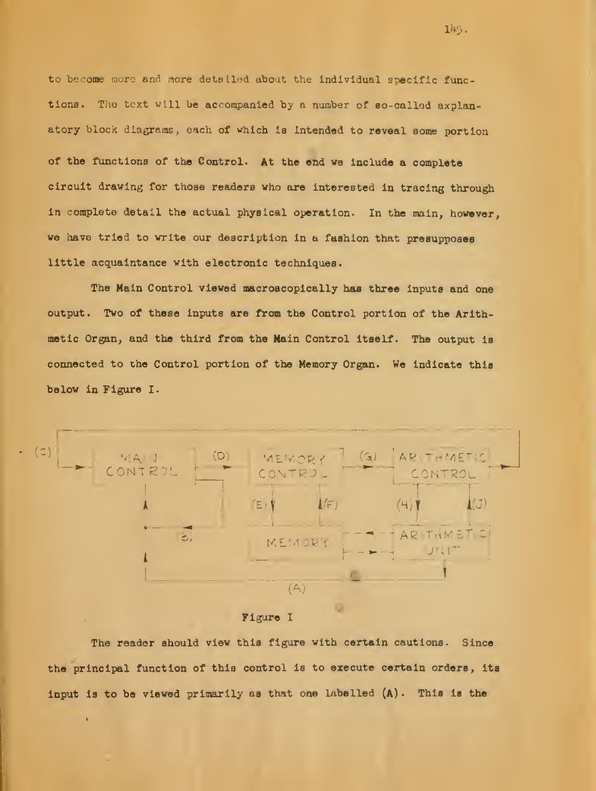
*Figure I — Main Control macroscopic inputs/outputs*

to become more and more detailed about the individual specific func-
tions. The text will be accompanied by a number of so-called explan-
atory block diagrams, each of which is intended to reveal some portion
of the functions of the Control. At the end we include a complete
circuit drawing for those readers who are interested in tracing through
in complete detail the actual physical operation. In the main, however,
we have tried to write our description in a fashion that presupposes
little acquaintance with electronic techniques.

The Main Control viewed macroscopically has three inputs and one
output. Two of these inputs are from the Control portion of the Arith-
metic Organ, and the third from the Main Control itself. The output is
connected to the Control portion of the Memory Organ. We indicate this
below in Figure I.

The reader should view this figure with certain cautions. Since
the principal function of this control is to execute certain orders, its
input is to be viewed primarily as that one labelled (A). This is the

<!-- p. 160 -->
one which conveys to the Control the digits expressing the order now to
be executed. Obviously this input changes as new orders are to be per-
formed.

Each order-word contains actually two distinct orders each of 20
binary digits. This order-word, as we shall see, is placed in R₃ just
prior to being used. The 40 flip-flops in R₃ are symbolized as the single
input (A) above. When both pieces of this order-word have been executed
the Main Control generates a new signal or pseudo-order which appears on
input (B) and causes the next order-word to be brought into R₃. Normally
this next order-word is that one whose Memory location is one greater
than the one just executed. This is not necessarily the case if a trans-
fer of the Control has intervened. (Cf. p. 152.)

The third input (C) to the Main Control is used to notify that
unit that the order under consideration has been executed and that either
inputs (A) or (B) should be examined for the next order.

Before proceeding we describe the temporal order of events at this
point. Clearly since the machine executes orders one after the other
there is a certain cycling nature to the timing. We agree that a period
of time T is begun by the initiation of (A) or (B) and terminated by the
initiation of a signal on (C). (The periods of time are not necessarily
of equal length but this detail is not yet relevant.) This termination
can occur only after a number of other events have been completed. Spe-
cifically a signal (D) is sent to the Memory Control; it initiates an
activity in the Memory by a signal (E) which terminates by a signal (F)
to the Memory Control; this latter unit emits a termination signal (G)
which serves to initiate an activity in the Arithmetic Control; this

<!-- p. 161 -->
control initiates Arithmetic activities (say, an addition operation) by
a signal (H) and receives a notification of completion signal (J) which
serves to generate the final signal (C).

The time order indicated above is dictated by the nature of the
machine's orders. In general, each order requires the specification of
a Memory location and of an operation, one of the operands being stored
in the Memory location. Thus it is natural that the Memory phase of
the Control's activities should precede its Arithmetic phase.

In the block diagram just discussed above we gave a very general
account of the operation of the Main Control. We wish now to look in
somewhat more detail at some aspects. In particular, we shall assume
that an order-word is now in R₃ and that a particular half has been
selected for execution. This order contains a digit which specifies
whether the Memory is to be used in the execution of this order, i.e.
it is one of orders 1 - 19, or is not to be used, i.e. it is one of
orders 20-23. In the former case a signal II.D is emitted to the
Williams Control and in the latter a signal II.D'. (Cf. Figs. I above
and II below.) I.e., the input I.D in Fig. I is in reality two separ-
ate inputs, II.D, II.D'. In either case the Memory Control sends back
to the Main Control an acknowledgment signal II.10.

As we saw earlier the Memory system is a synchronous one whereas
the rest of the machine is asynchronous. Thus the signal II.D may be
emitted at any given phase relative to the Memory cycle. The Memory
must necessarily make use of this signal only at a fixed phase in its
own cycle and must therefore cause the Main Control to delay all other

<!-- p. 162 -->

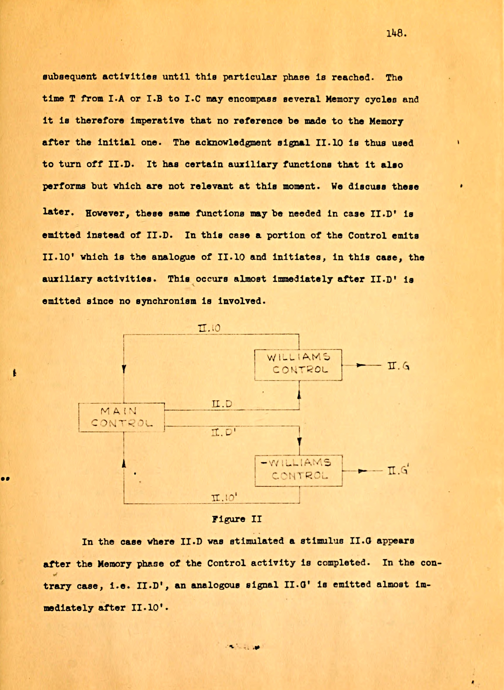
*Figure II — Williams / Non-Williams Control*

*(This page is the full-page block diagram, Figure II — Williams /
Non-Williams Control — see image above; the page carries no additional
body text.)*

<!-- p. 163 -->
We proceed now to discuss the broad uses of II.G and II.G'.
To this end we continue to assume we are executing a particular order
in R₃. The order in question contains a digit which specifies whether
the operation to be performed is arithmetically "trivial", orders 13 -
18, or is "non-trivial", orders 1-12. In the former case the Arith-
metic phase of the Control's activities is of essentially zero duration.
We do not need to discuss the signal II.G' in this case since every
order either is non-trivial or makes reference to the Memory. In the
case of transfer of Control orders, 15 - 18, the signal II.G is directly
converted into the termination signal III.C. In the case of the store
orders, 13 - 14, III.C immediately follows the termination of signal
II.10 (time t₂ in Fig. VIII).

We turn attention now to the non-trivial orders. To this end we
must make mention of the so-called Shift Counter. This is a unit of
the Main Control made necessary by the inclusion of the multiplication
and division orders. Its main function is to keep count of the various
steps involved in these operations. It has an input from the Arithmetic
Unit III.J; an input III.12 which sets up the required count; this may
be implicit as in the case of the multiplication and division orders or
explicit as in the case of the shift orders. It has a single output
III.13 which becomes III.C.

There is a unit of the Main Control called the "Gate Clear Se-
quencing Chain" which controls the gating and clearing functions of
registers RI and RII. It is able under the direction of the Arith-
metic Control to decide the sequence of gates and clears to apply,
e.g. the sequence for a right shift, and in addition it controls the

<!-- p. 164 -->

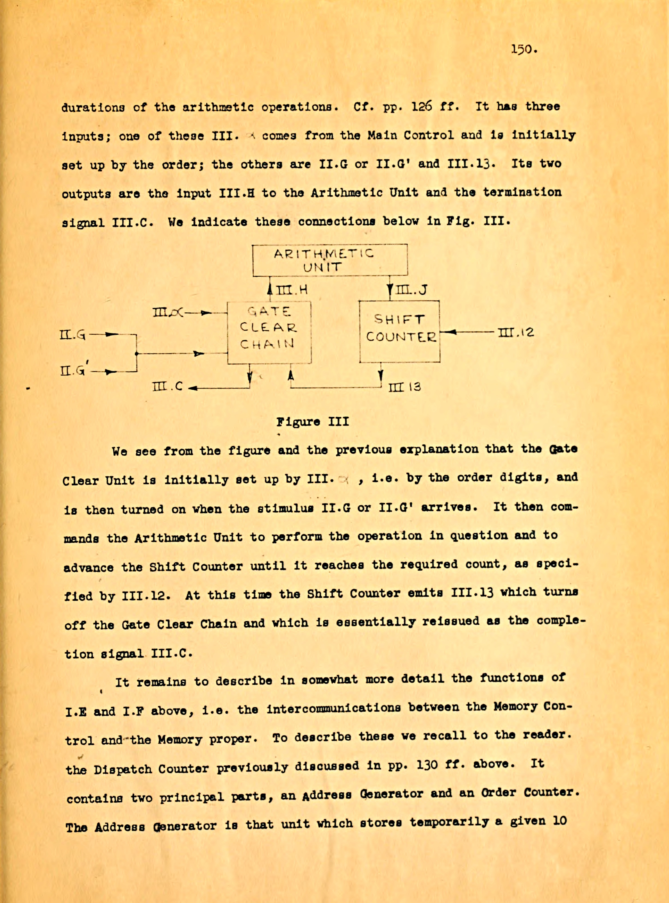
*Figure III — Gate-Clear Chain and Shift Counter*

*(This page is the full-page block diagram, Figure III — Gate-Clear
Chain and Shift Counter — see image above; the page carries no additional
body text.)*

<!-- p. 165 -->
digit address and converts it into appropriate deflection voltages for
the Memory cathode-ray tubes. The Order Counter is that unit which
stores a given 10 digit address. This address is one more than the
address from which the order came. It counts modulo 1024.

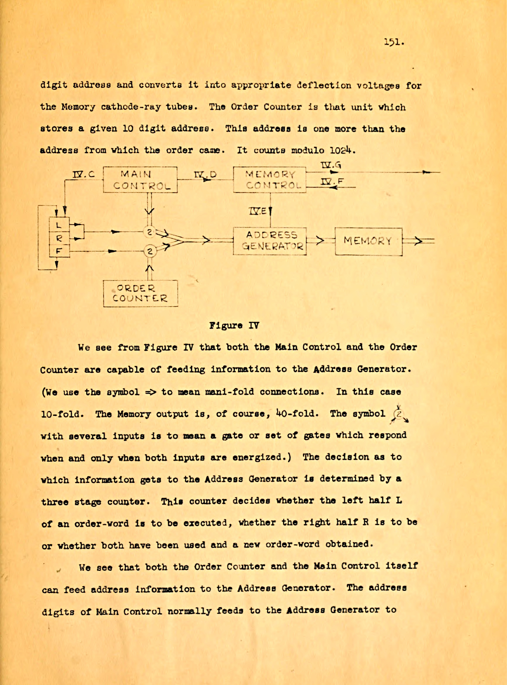
*Figure IV*

We see from Figure IV that both the Main Control and the Order
Counter are capable of feeding information to the Address Generator.
(We use the symbol => to mean mani-fold connections. In this case
10-fold. The Memory output is, of course, 40-fold. The symbol with
several inputs is to mean a gate or set of gates which respond
when and only when both inputs are energized.) The decision as to
which information gets to the Address Generator is determined by a
three stage counter. This counter decides whether the left half L
of an order-word is to be executed, whether the right half R is to be
or whether both have been used and a new order-word obtained.

We see that both the Order Counter and the Main Control itself
can feed address information to the Address Generator. The address
digits of Main Control normally feeds to the Address Generator to

<!-- p. 166 -->
specify the Memory location of the number to be operated on in the
Arithmetic Unit. When, however, both the left- and right-hand halves
of an order-word have been executed the three stage counter advances
to F -- we describe on page 161 how this counter is operated -- the
address information coming from the Main Control is blocked off and
that from the Order Counter is permitted to enter the Address Generator.
In this fashion the Memory location of the next order is specified.

The stimulus IV.E is used to specify the exact time in the Memory
cycle at which a new address can enter the Address Generator. IV.F is
the stimulus which specifies that the Memory contents of the Address
in question have been transferred to the Arithmetic Unit -- in case of
a store order the flow of information is, of course, reversed. Thus
IV.F becomes IV.G.

We remark that the three stage counter is essentially a ring. It
also has certain additional features which are needed to enable trans-
fers of the Control to either the left- or right-hand half of the new
order-word to be effected.

At this point it is convenient to describe the operation of trans-
ferring the Control, Orders 15 - 18. To do this we must show in more
detail the construction and interrelations indicated in the previous
drawing. We do this in Figure V below.

<!-- p. 167 -->

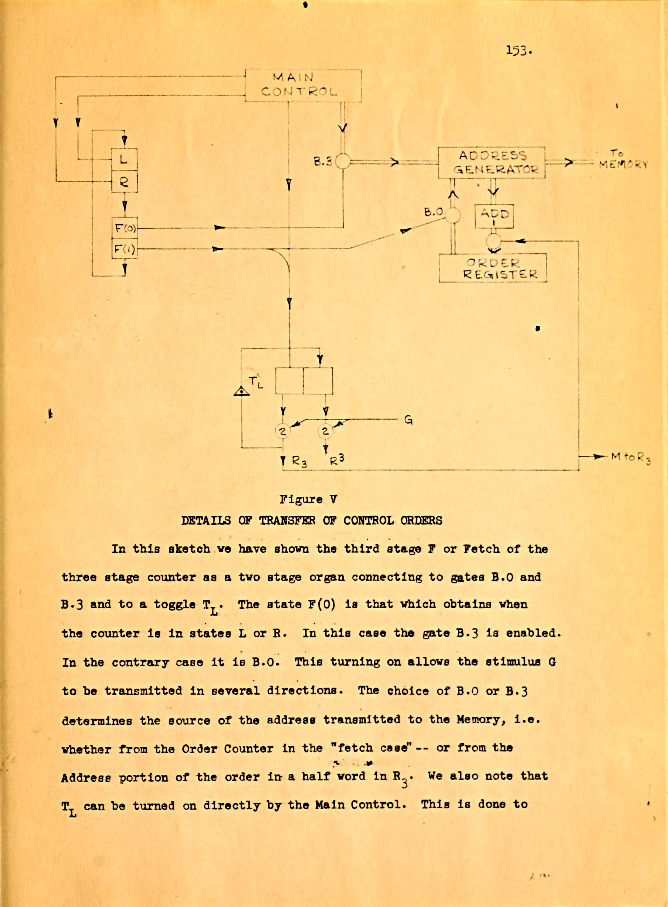
*Figure V — Details of Transfer of Control Orders*

*(This page is the full-page block diagram, Figure V — Details of
Transfer of Control Orders — see image above; the page carries no
additional body text.)*

<!-- p. 168 -->
effect a transfer of the Control.

Before proceeding, we discuss the Dispatch Counter. It consists
of a Regeneration Counter which is used in connection with the "refresh-
ing" of the Memory's contents and which is irrelevant in this discussion;
the Address Generator and the Order Counter. Actually these units are
not completely independent but are interconnected in the following way:
three registers are used, one directly connected to the Deflection Gen-
erator, the contents of which determine at all times the location of the
electron beam in the memory tubes; another to store the address of the
next point to be regenerated; the third to store the address of the next
order to be brought into RIII. Associated with the first register is an
adder circuit with one of its inputs always a 1. The output of this
adder passes through gates into the second or third register. In Fig. V
we have not shown the regeneration register.

It is clear from the figure that when the toggle F is in the
state F(1) the stimulus G is passed through the appropriate gate and
becomes the so-called "Memory to R₃ Gate" which transfers the address
location in the Address Generator augmented by 1 into the Order Register.
Furthermore, this same signal, suitably delayed, is used to reset T_L.

We proceed now to show in considerably more detail how these
orders which make reference to the Memory, orders 1 - 19, are handled.
This is done in Figure VI.

To describe the events indicated in the figure let us suppose
the three state counter is in state L or R. Then the gates G.1, G.2
or G.3, G.4 are enabled. Thus the operation portion of either the
left- or right-hand order is permitted to enter the order interpreter,

<!-- p. 169 -->

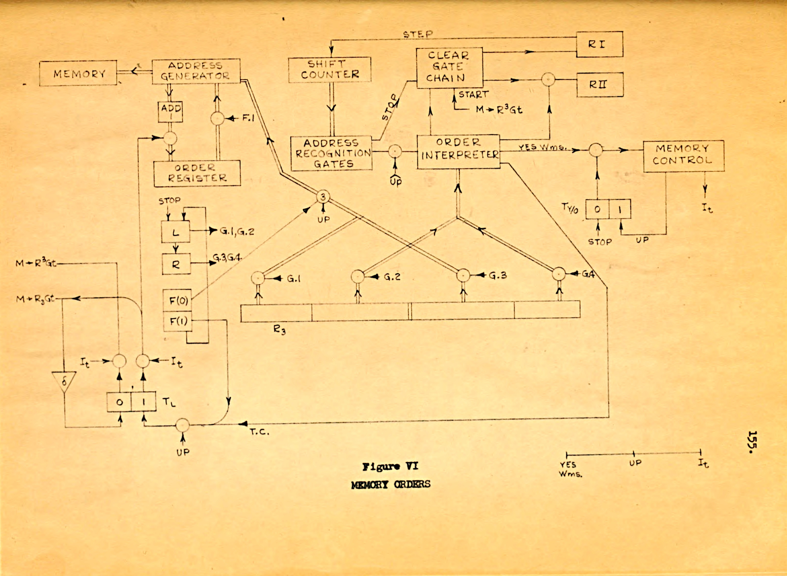
*Figure VI — Memory Orders*

*(This page is the full-page block diagram, Figure VI — Memory Orders —
see image above; the page carries no additional body text.)*

<!-- p. 170 -->
which we describe on page 164. Moreover, the address portion tries
to reach the Address Generator. It is blocked by the thresh-hold 3
gate indicated, until a stimulus leaves the Memory Control. The
Order Interpreter issues a signal called "yes Williams" in Figure VI
and called D in Figure I which will at the beginning of the Memory
phase of the Control's activity be permitted to pass into the Memory
Control. This channel is controlled by the toggle Ty/o which is set
to the zero state by the termination signal of the Control activity.
The Memory Control then issues a pulse called "up" in Figure VI and
II.10 in Figure II, which performs several functions. It puts Ty/o
into the state 1 thereby disabling the communication channel between
the Order Interpreter and the Memory Control; it permits the address
portion of the order being inspected to go to the Address Generator;
finally in case the order is a transfer of the Control then it permits
the stimulus T.C, transfer the Control, to set the toggle T_L into the
1 state.

Then the Memory Control issues a pulse called Iₜ which also per-
forms several functions, which are concerned with the toggle T_L: If
T_L is in the 0 state, then Iₜ produces the so-called Memory to R³ gate
and in the contrary case the Memory to R₃ Gate. The former case is
associated with the arithmetic operations and the latter with fetching
a new order-word. When the operation of bringing in a new order-word
is being executed, i.e. when the state F(1) or transfer of the Control
obtains then the gating of the order-word into R₃ (M --> R₃ Gate) com-
pletes the order. Accordingly after a suitable delay T_L is returned to
the 0 state by the M --> R₃ Gate. Also this gate pulse is used to store

<!-- p. 171 -->
in the Order Register the next address after that of the order-word
just brought into R₃.

When the M --> R³ Gate is issued the Memory phase is complete
and the Arithmetic phase can begin. Prior to this event the signal
not-Up, Up, has impressed on the address recognition gates the re-
quired number of shifts for the operation in question, e.g. 2 for
the additive orders, 40 for the multiplication, 39 for the division.
Next after a suitable delay -- equal to the duration of the M --> R³
Gate -- the M --> R³ Gate starts the Clear Gate Chain to operate. This
unit has already been instructed as to its functions by the Order
Interpreter, i.e. to shift right or left or a combination of these.
The Clear Gate Chain in turn commands the appropriate clears and
gates in RI and possibly RII. The execution of these in RI is sig-
nalled back to the Shift Counter. This unit then queries the Address
Recognition Gates as to whether the current shift count is equal to
that called for by the Order Interpreter. When equality first occurs,
the Recognition Gates issue a stop signal which stops the Clear Gate
Chain and then brings about the termination of the order in that it
causes Ty/o to be reset and the three state counter to be advanced to
the next state.

The case in which the three stage counter is in the state F(1)
has previously been indicated on page 152 above. We summarize here
what occurs. When this case occurs both halves of the existing order-
word in R₃ have been executed and therefore G.1, ..., G.4 are disabled.
It is desired to bring a new order-word into R₃ to replace this one.
This is the immediate successor of the order just executed. Therefore,

<!-- p. 172 -->

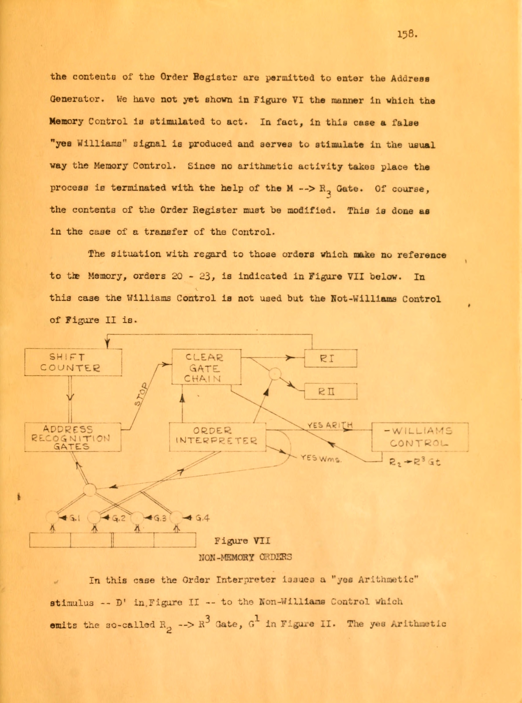
*Figure VII — Non-Memory Orders*

*(This page is the full-page block diagram, Figure VII — Non-Memory
Orders — see image above; the page carries no additional body text.)*

<!-- p. 173 -->
stimulus also causes the address portion of the order in question to
be received by the Address Recognition Gates. In all these orders the
Shift Counter automatically will count up to the Address presented to
these gates. This is in contrast to all Williams orders where the
shift count is specified by the Order Interpreter. The R₂ --> R³ Gate
from the Non-Williams Control is analogous to the M --> R³ Gate in that
it starts the Clear Gate Chain, which in turn controls the operations of
RI, RII. As in the Williams case a signal from RI advances the Shift
Counter; and when the terminal count is reached the Clear Gate Chain is
turned off.

Note that the contents of R₂ are always transferred to R³ at the
beginning of a Non-Williams order. In case of orders 20 - 22, this
transfer is irrelevant but harmless; the function of the Gate is here
only to start the Clear Gate Chain. But in the case of order RII to
RI, the data are fed into RI via R³. This arrangement permits the
RII to RI order to have all the variants of orders 1 - 8, the Addition
Orders.

The reader will find in pp. 113 ff. detailed expositions of the
functions and operations of the Shift Counter, Address Recognition
Gates and the Clear Gate Chain. We accordingly make no further refer-
ences to these units. Instead we take up the three stage counter and
consider it in some more detail. To do this we first indicate the time
relations between the stimuli previously called Up and Ûp (Cf. Figure
VI).

<!-- p. 174 -->

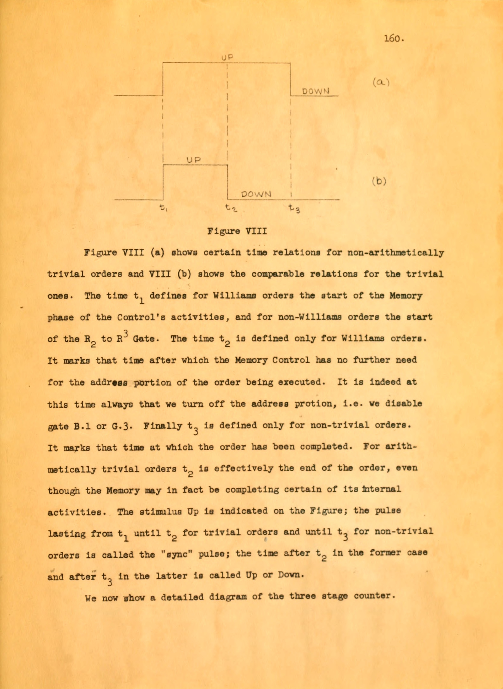
*Figure VIII — Timing relations for trivial/non-trivial orders*

*(This page is the full-page timing diagram, Figure VIII — timing
relations for trivial/non-trivial orders — see image above; the page
carries no additional body text.)*

<!-- p. 175 -->

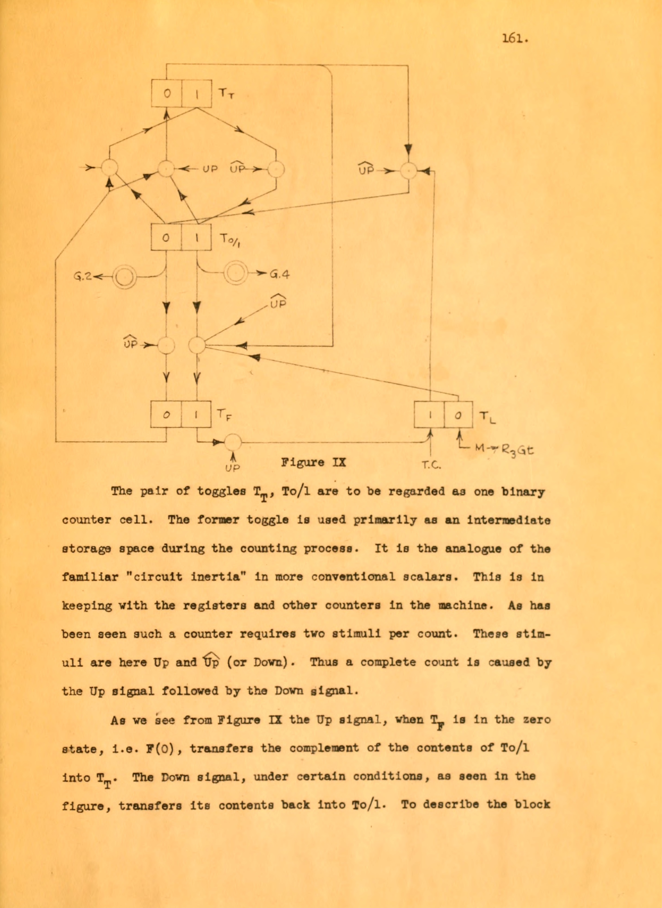
*Figure IX — Three-stage counter detail*

*(This page is the full-page circuit diagram, Figure IX — three-stage
counter detail — see image above; the page carries no additional body
text.)*

<!-- p. 176 -->

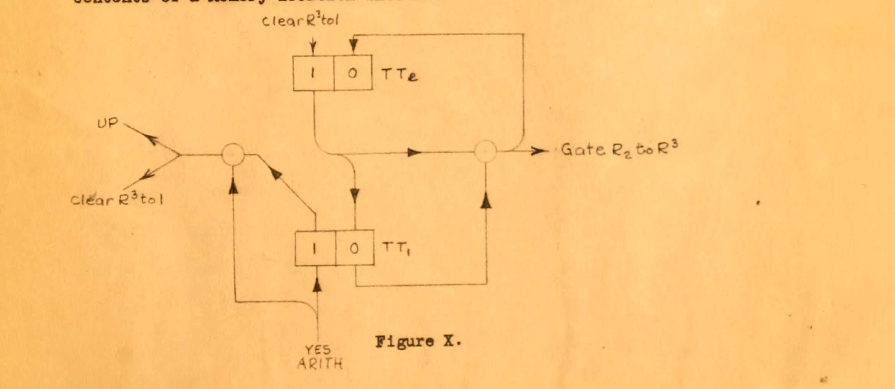
*Figure X — Non-Williams Control (R2 to R3 transfer)*

diagram it is helpful to note the following Table:

| | To/1 | T_T | T_F | T_L |
|---|---|---|---|---|
| Down | 0 | 0 | 0 | 0 |
| 1st Half Up | 0 | 1 | 0 | 0 |
| Down | 1 | 1 | 0 | 0 |
| 2nd Half Up | 1 | 0 | 0 | 0 |
| Down | 1 | 0 | 1 | 0 |
| Fetch Up | 1 | 0 | 1 | 1 |
| Down | 0 | 0 | 0 | 1 |
| M --> R₃ Gate | 0 | 0 | 0 | 0 |

This Table shows the states of the relevant toggles as indicated.
With the help of this the reader should have no difficulty in following
the details of Figure IX.

We next show the contents of the Non-Williams Control. This is
a quite simple unit whose function it is to perform the transfer from
R₂ to R³. It is the complete analog of the one for transferring the
contents of a Memory location into R³.

<!-- p. 177 -->

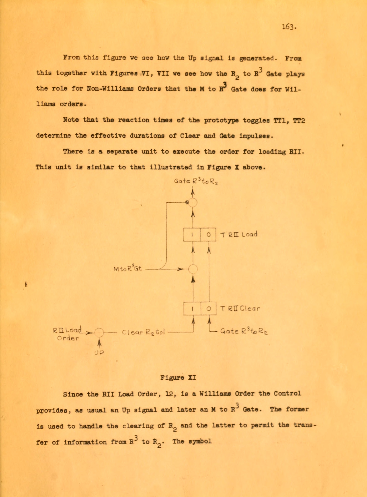
*Figure XI — RII Load order control*

*(This page is the full-page circuit diagram, Figure XI — RII Load
order control — see image above; the page carries no additional body
text.)*

<!-- p. 178 -->
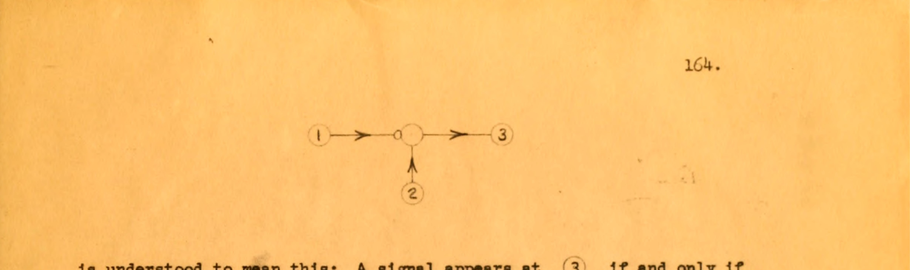

is understood to mean this: A signal appears at (3) if and only if
one appears at (2) but none appears at (1). In terms of this we
see that the transfer from R3 to R2 is not permitted until just after
the transfer from the Memory to R3.

We next show in Figure XII the Order Interpreter. The presenta-
tion is in terms of dichotomies determined by the order digits in ap-
proximate time sequence of choice. Each digit of the order is con-
sidered as having a "0" state or a "1" state. In the diagram the
digit, expressed as 0 --- 9 corresponding to positions 10 - 19 or
30 - 39 depending on the order phase, is denoted by the number enclosed
in a circle. The "1" choice corresponding to this digit is always the
right branch; the "0" choice is always the left. Specific orders result-
ing from the various digit possibilities are denoted by their list
number enclosed in a square.

A few special remarks: the internal orders, determined by
D1 = 1, are initiated by the state of D2 being either "0" or "1" as
distinct from "off". The necessity for this feature may be verified
by observing that R3 contains two orders of which one must be selected
by turning its gates "on" and the other necessarily has its gates "off".
Again, in the change from an old order to a new one, a period must
intervene in which the changing order is, as seen by the Main Control,
"off", and it is essential that this "off" state be unable to initiate
any Main Control activities.

<!-- p. 179 -->

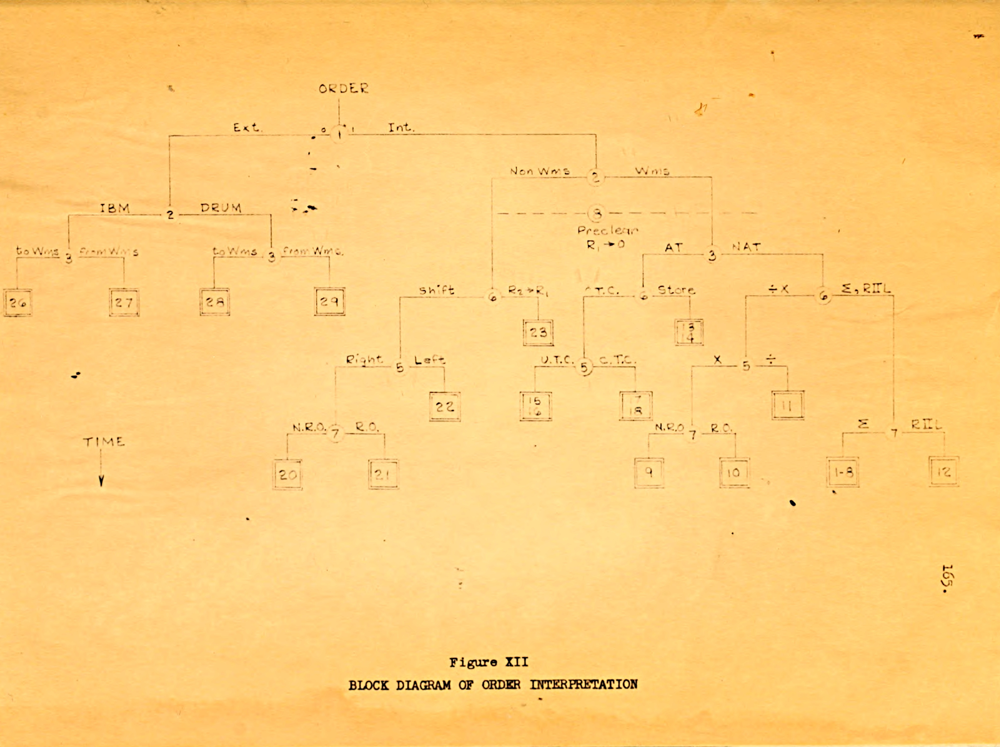
*Figure XII — Block Diagram of Order Interpretation*

*(This page is the full-page block diagram, Figure XII — Block Diagram
of Order Interpretation — see image above; the page carries no additional
body text.)*

<!-- p. 180 -->
Also, not all digits are represented on this diagram. As an
example, the magnitude/number digit, D₄, enters only into the setting of
the Complement Gates and has no direct effect on order timing. Simi-
larly the minus left/plus right digit, D₅, in the case of summation
orders affects only the Complement Gates and again does not determine
a true dichotomy in time.

Finally, the terminal process to an order is usually the "step"
to the next order. For most orders this "step" may be suppressed and
computation stopped by setting the step digit, D₀, to a "0". This
final choice of step or stop is not shown on the diagram.

<!-- p. 181 -->
*(This final page is the library's inside-back-cover catalog card —
Institute for Advanced Study, Math. & Nat. Sci. Library, Princeton, N.J. —
not part of the report's content.)*